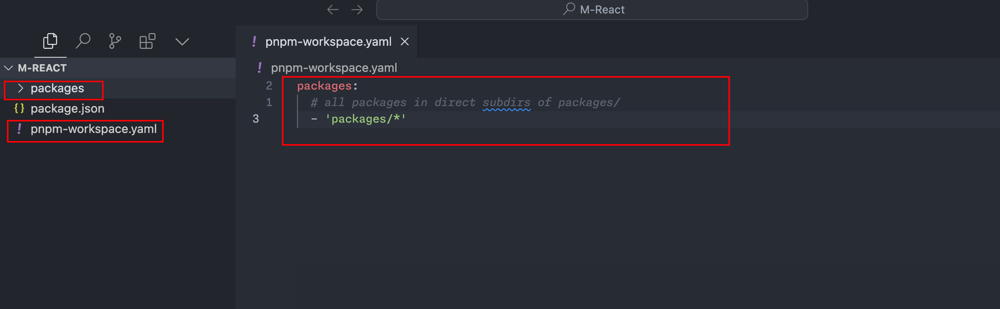

## 项目结构
	- `Mono-repo`：可以很方便的协同管理不同独立的库的生命周期，相对应的，会有更高的操作复杂度。
	- monorepo 工具：pnpm workspace
		- 初始化项目：`pnpm init`
		- 新建 `pnpm-workspace.yaml`:
			- ```
			  packages:
			    # all packages in direct subdirs of packages/
			    - 'packages/*'
			  ```
	- 
- ## 定义开发规范
	- ### 代码规范 lint工具
	- [[#blue]]==**eslint**==
	- 安装：`pnpm i eslint -D -w`
	- 初始化：`npx eslint --init`
	- 配置eslint config文件：
		- 注意：[[#red]]==ESLint 8.21.0== 之前，`.eslintrc.json` 是传统的配置方式；[[#green]]==ESLint 8.21.0== 及以后 `eslint.config.mjs` 是 ESLint 的新"扁平化配置"系统
		- ```
		  ```
		- ```
		  import globals from "globals";
		  import pluginJs from "@eslint/js";
		  import tseslint from "typescript-eslint";
		  import prettierPlugin from "eslint-plugin-prettier";
		  import prettierConfig from "eslint-config-prettier";
		  
		  /** @type {import('eslint').Linter.Config[]} */
		  export default [
		    {
		      files: ["**/*.{js,mjs,cjs,ts}"],
		      languageOptions: {
		        globals: {
		          ...globals.browser,
		          ...globals.es2021,
		          ...globals.node
		        },
		        parserOptions: {
		          ecmaVersion: "latest",
		          sourceType: "module"
		        }
		      },
		      plugins: {
		        "@typescript-eslint": tseslint,
		        prettier: prettierPlugin
		      },
		      rules: {
		        "prettier/prettier": "error",
		        "no-case-declarations": "off",
		        "no-constant-condition": "off",
		        "@typescript-eslint/ban-ts-comment": "off"
		      }
		    },
		    pluginJs.configs.recommended,
		    ...tseslint.configs.recommended,
		    prettierConfig
		  ];
		  ```
	-