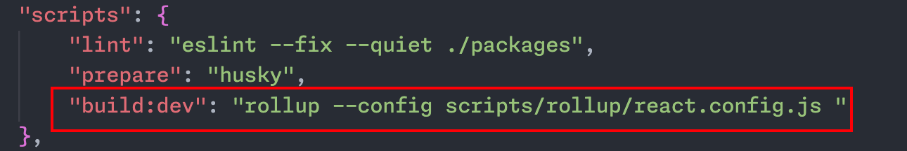
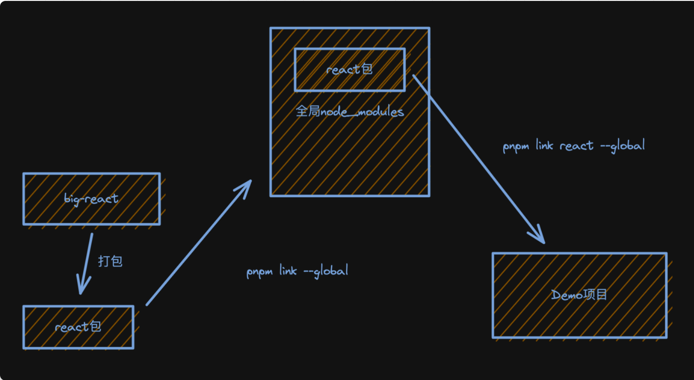

## React 项目结构
	- 1. react
		- *react 基础包, 只提供定义 react 组件(*`ReactElement`*)的必要函数, 一般来说需要和渲染器(*`react-dom`*,*`react-native`*)一同使用. 在编写*`react`*应用的代码时, 大部分都是调用此包的 api.*
	- 2. react-dom
		- *react 渲染器之一, 是 react 与 web 平台连接的桥梁(可以在浏览器和 nodejs 环境中使用), 将*`react-reconciler`*中的运行结果输出到 web 界面上. 在编写*`react`*应用的代码时,大多数场景下, 能用到此包的就是一个入口函数*`ReactDOM.render(<App/>, document.getElementById('root'))`*, 其余使用的 api, 基本是*`react`*包提供的*
	- 3. react-reconciler
		- react 得以运行的核心包(综合协调`react-dom`,`react`,`scheduler`各包之间的调用与配合).
		  管理 react 应用状态的输入和结果的输出. 将输入信号最终转换成输出信号传递给渲染器.
	- 4. scheduler
		- *调度机制的核心实现, 控制由*`react-reconciler`*送入的回调函数的执行时机, 在*`concurrent`*模式下可以实现任务分片. 在编写*`react`*应用的代码时, 同样几乎不会直接用到此包提供的 api.*
	- [[#green]]==JSX转换属于`react`包.==
- ## JSX转换是什么
	- ```
	  import { jsx as _jsx } from "react/jsx-runtime";
	  
	  /*#__PURE__*/_jsx("div", {
	    children: "123"
	  });
	  
	  // 或
	  /*#__PURE__*/React.createElement("div", null, "123");
	  ```
	- 包括两部分：
		- 编译时
		- 运行时：`jsx`方法或`React.createElement`方法的实现（包括dev、prod两个环境）
	- `编译时`由`babel`编译实现，我们来实现`运行时`，工作量包括：
		- 实现`jsx`方法
		- 实现打包流程
		- 实现调试打包结果的环境
	- ### 实现jsx方法
	  background-color:: pink
		- `jsxDEV方法`（dev环境）
		- `jsx`方法（prod环境）
		- `React.createElement`方法
	- ### 实现 jsx 的打包
	  background-color:: pink
		- 对应上述3种 jsx 方法，打包对应文件：
			- `react/jsx-dev-runtime.js`（dev环境）
			- `react/jsx-rumtime.js`（prod环境）
			- `React`
		- 配置 `rollup`打包 config 文件：`react.config.js`
		- 在 `package.json`中添加打包命令:
			- 
		- 打包流程中需要安装的`rollup plugin`与`node`包：
			- ```
			  pnpm i -D -w rimraf rollup-plugin-generate-package-json rollup-plugin-typescript2 @rollup/plugin-commonjs
			  ```
	- ### 调试打包结果
	  background-color:: green
		- 1. pnpm link
			- 
			- ```
			  - cd /dist/node_modules/react
			  - pnpm link --global
			  - npx create-react-app react-demo
			  - cd /react-demo
			  - pnpm link react --global
			  ```
		- 2. jsx 与 jsxDEV的区别
			-