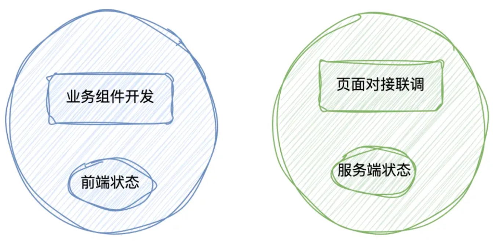

- > `AI 赋能业务组件` 来展开的，主要包括 3 方面：
  >> 1. 设计一套 `AI 友好的整洁业务组件架构`，能够帮助 AI 更好的来生成高质量的业务组件代码
  >> 2. 能够让 AI 生成基于开源组件库的整洁业务组件代码(`ant-design`、`Mui`、`element-plus` 等开源组件库)
  >> 3. 能够让 AI 生成基于公司私有组件库的整洁业务组件代码
- ## 什么是AI 友好的整洁业务组件架构
	- ### **AI 友好**
	  background-color:: pink
		- `核心原则`：前端状态和服务端状态分离
		- {:height 302, :width 593}
		- 在业务组件中只包含前端状态，所有的服务端状态都交给页面对接联调层来处理。
			- 1. 在业务组件中，我们只包含你要用的基础组件，ui 结构和样式，比如说 form 表单和提交按钮，以及一些交互逻辑和业务规则，比如说点击提交按钮，对表单数据进行校验等。
			- 2. 业务组件中不能直接请求服务端的数据结构，比如不能直接 get 组件需要呈现的初始化数据、以及直接调用 post、put、或者 delete 对服务端的数据进行变更。
			- 3. 所有需要请求服务端数据的操作，都通过 props 暴露个外部的页面来进行对接联调。
	- ### **整洁**
	  background-color:: pink
		- `核心原则`：整个团队或者项目需要有明确的业务组件代码文件结构和代码规范
		- ```js
		  app/components/BizComponentExample
		  ├─ index.ts // 仅仅将组件内容暴露给外部
		  ├─ interface.ts // 定义组件内部用到的所有类型，包括 interface、type、enum等
		  ├─ BizComponentExample.stories.tsx // 组件的storybook文档，包含组件不同的使用示例
		  ├─ BizComponentExample.tsx // 组件的主体样式和主体逻辑，如果组件太大(超过500行)可以拆分为其它的文件，样式使用 tailwindcss 编写
		  ├─ helpers.ts // 组件所有的工具函数存放在此 (如有)
		  ```
-