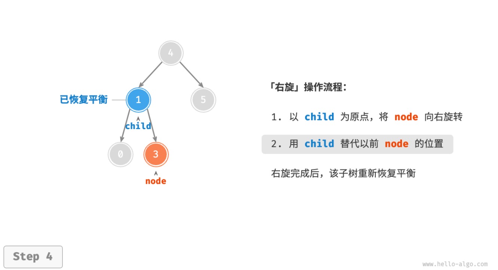

- > https://www.hello-algo.com/chapter_tree/avl_tree/
-
- ## AVL 树常见术语
	- 「AVL 树」既是二叉搜索树也是平衡二叉树，同时满足这两类二叉树的所有性质，因此也被称为**「平衡二叉搜索树」**。
	- ### 节点高度
	  background-color:: blue
		- [[#blue]]==「节点高度」==是指从该节点到最远叶节点的距离，即所经过的“边”的数量。需要特别注意的是，[[#blue]]==叶节点的高度为 0== ，而[[#blue]]==空节点的高度为 -1== 。我们将创建两个工具函数，分别用于获取和更新节点的高度。
		- ```
		  /* AVL 树节点类 */
		  class TreeNode {
		      val; // 节点值
		      height; //节点高度
		      left; // 左子节点指针
		      right; // 右子节点指针
		      constructor(val, left, right, height) {
		          this.val = val === undefined ? 0 : val;
		          this.height = height === undefined ? 0 : height;
		          this.left = left === undefined ? null : left;
		          this.right = right === undefined ? null : right;
		      }
		  }
		  
		  /* 获取节点高度 */
		  height(node) {
		      // 空节点高度为 -1 ，叶节点高度为 0
		      return node === null ? -1 : node.height;
		  }
		  
		  /* 更新节点高度 */
		  updateHeight(node) {
		      // 节点高度等于最高子树高度 + 1
		      node.height =
		          Math.max(this.height(node.left), this.height(node.right)) + 1;
		  }
		  ```
	- ### 节点平衡因子
	  background-color:: blue
		- 节点的[[#blue]]==「平衡因子 Balance Factor」==定义为节点左子树的高度减去右子树的高度，同时规定空节点的平衡因子为 0 。我们同样将获取节点平衡因子的功能封装成函数，方便后续使用。
		- ```
		  /* 获取平衡因子 */
		  balanceFactor(node) {
		      // 空节点平衡因子为 0
		      if (node === null) return 0;
		      // 节点平衡因子 = 左子树高度 - 右子树高度
		      return this.height(node.left) - this.height(node.right);
		  }
		  ```
	- > 设平衡因子为 $f$ ，则一棵 AVL 树的任意节点的平衡因子皆满足 $−1≤f≤1$ 。
- ## AVL 树旋转
	- AVL 树的特点在于「旋转 Rotation」操作，**旋转操作既能保持树的「二叉搜索树」属性，也能使树重新变为「平衡二叉树」**。
	- `失衡节点`：平衡因子绝对值 >1 的节点。
	- 根据节点失衡情况的不同，旋转操作分为四种：`右旋`、`左旋`、`先右旋后左旋`、`先左旋后右旋`。
	- ### 右旋
	  background-color:: blue
		- {:height 360, :width 619}
		- 
	- 
	- 
	-