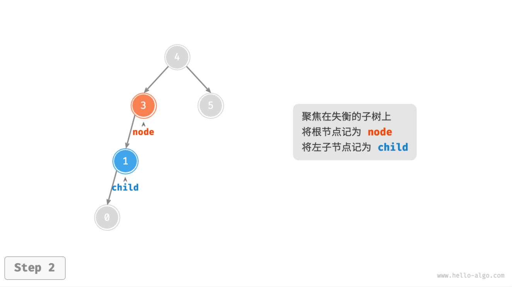
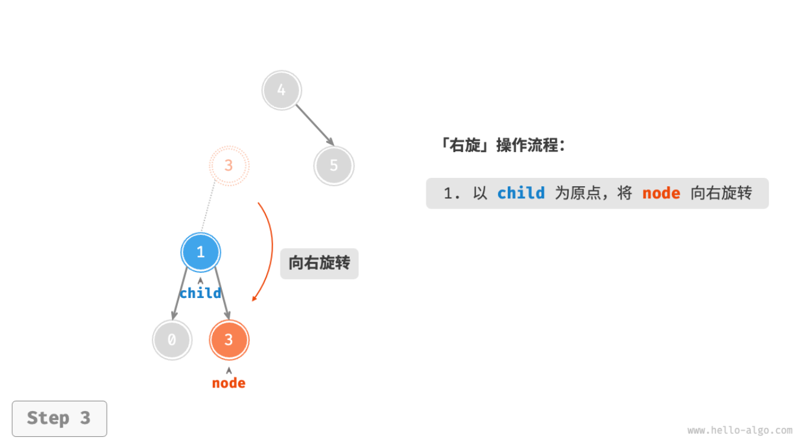

- > https://www.hello-algo.com/chapter_tree/avl_tree/
-
- ## AVL 树常见术语
	- 「AVL 树」既是二叉搜索树也是平衡二叉树，同时满足这两类二叉树的所有性质，因此也被称为**「平衡二叉搜索树」**。
	- ### 节点高度
	  background-color:: blue
		- [[#blue]]==「节点高度」==是指从该节点到最远叶节点的距离，即所经过的“边”的数量。需要特别注意的是，[[#blue]]==叶节点的高度为 0== ，而[[#blue]]==空节点的高度为 -1== 。我们将创建两个工具函数，分别用于获取和更新节点的高度。
		- ```
		  /* AVL 树节点类 */
		  class TreeNode {
		      val; // 节点值
		      height; //节点高度
		      left; // 左子节点指针
		      right; // 右子节点指针
		      constructor(val, left, right, height) {
		          this.val = val === undefined ? 0 : val;
		          this.height = height === undefined ? 0 : height;
		          this.left = left === undefined ? null : left;
		          this.right = right === undefined ? null : right;
		      }
		  }
		  
		  /* 获取节点高度 */
		  height(node) {
		      // 空节点高度为 -1 ，叶节点高度为 0
		      return node === null ? -1 : node.height;
		  }
		  
		  /* 更新节点高度 */
		  updateHeight(node) {
		      // 节点高度等于最高子树高度 + 1
		      node.height =
		          Math.max(this.height(node.left), this.height(node.right)) + 1;
		  }
		  ```
	- ### 节点平衡因子
	  background-color:: blue
		- 节点的[[#blue]]==「平衡因子 Balance Factor」==定义为节点左子树的高度减去右子树的高度，同时规定空节点的平衡因子为 0 。我们同样将获取节点平衡因子的功能封装成函数，方便后续使用。
		- ```
		  /* 获取平衡因子 */
		  balanceFactor(node) {
		      // 空节点平衡因子为 0
		      if (node === null) return 0;
		      // 节点平衡因子 = 左子树高度 - 右子树高度
		      return this.height(node.left) - this.height(node.right);
		  }
		  ```
	- > 设平衡因子为 $f$ ，则一棵 AVL 树的任意节点的平衡因子皆满足 $−1≤f≤1$ 。
- ## AVL 树旋转
	- AVL 树的特点在于「旋转 Rotation」操作，**旋转操作既能保持树的「二叉搜索树」属性，也能使树重新变为「平衡二叉树」**。
	- `失衡节点`：平衡因子绝对值 >1 的节点。
	- 根据节点失衡情况的不同，旋转操作分为四种：`右旋`、`左旋`、`先右旋后左旋`、`先左旋后右旋`。
	- ### 右旋
	  background-color:: blue
		- {:height 360, :width 619}
		- 
		- 
		- 此外，如果节点 `child` 本身有右子节点（记为 `grandChild` ），则需要在「右旋」中添加一步：将 `grandChild` 作为 `node` 的左子节点。
		- 
		- “向右旋转”是一种形象化的说法，实际上需要通过修改节点指针来实现，代码如下所示。
		- ```
		  /* 右旋操作 */
		  #rightRotate(node) {
		      const child = node.left;
		      const grandChild = child.right;
		      // 以 child 为原点，将 node 向右旋转
		      child.right = node;
		      node.left = grandChild;
		      // 更新节点高度
		      this.#updateHeight(node);
		      this.#updateHeight(child);
		      // 返回旋转后子树的根节点
		      return child;
		  }
		  ```
	- ### 左旋
	  background-color:: blue
		- 相应的，如果考虑上述失衡二叉树的“镜像”，则需要执行「左旋」操作。
		- 
		- 
		- ```
		  /* 左旋操作 */
		  #leftRotate(node) {
		      const child = node.right;
		      const grandChild = child.left;
		      // 以 child 为原点，将 node 向左旋转
		      child.left = node;
		      node.right = grandChild;
		      // 更新节点高度
		      this.#updateHeight(node);
		      this.#updateHeight(child);
		      // 返回旋转后子树的根节点
		      return child;
		  }
		  ```
	- ### 先左旋后右旋
	  background-color:: blue
		- 对于下图中的失衡节点 3，仅使用左旋或右旋都无法使子树恢复平衡。此时需要先左旋后右旋，即**先对** `child` **执行「左旋」**，**再对** `node`**执行「右旋」**。
		- 
	- ### 先右旋后左旋
	  background-color:: blue
		- 
	- ### 旋转的选择
	  background-color:: green
		- 下图展示的四种失衡情况与上述案例逐个对应，分别需要采用右旋、左旋、先右后左、先左后右的旋转操作。
		- 
		- 在代码中，我们通过判断失衡节点的平衡因子以及较高一侧子节点的平衡因子的正负号，来确定失衡节点属于上图中的哪种情况。
		- |失衡节点的平衡因子|子节点的平衡因子|应采用的旋转方法|
		  |--|--|--|
		  |$>1$（即左偏树）|$>=0$|右旋|
		  |$>1$（即左偏树）|$<0$|先左旋后右旋|
		  |$<-1$（即右偏树）|$<=0$|左旋|
		  |$<-1$（即右偏树）|$>0$|先右旋后左旋|
		- 为了便于使用，我们将旋转操作封装成一个函数。
		- ```
		  /* 执行旋转操作，使该子树重新恢复平衡 */
		  #rotate(node) {
		      // 获取节点 node 的平衡因子
		      const balanceFactor = this.balanceFactor(node);
		      // 左偏树
		      if (balanceFactor > 1) {
		          if (this.balanceFactor(node.left) >= 0) {
		              // 右旋
		              return this.#rightRotate(node);
		          } else {
		              // 先左旋后右旋
		              node.left = this.#leftRotate(node.left);
		              return this.#rightRotate(node);
		          }
		      }
		      // 右偏树
		      if (balanceFactor < -1) {
		          if (this.balanceFactor(node.right) <= 0) {
		              // 左旋
		              return this.#leftRotate(node);
		          } else {
		              // 先右旋后左旋
		              node.right = this.#rightRotate(node.right);
		              return this.#leftRotate(node);
		          }
		      }
		      // 平衡树，无需旋转，直接返回
		      return node;
		  }
		  ```
- ## AVL 树常用操作
	- ### 插入节点
	  background-color:: blue
		- 「AVL 树」的节点插入操作与「二叉搜索树」在主体上类似。唯一的区别在于，在 AVL 树中插入节点后，从该节点到根节点的路径上可能会出现一系列失衡节点。因此，**我们需要从这个节点开始，自底向上执行旋转操作，使所有失衡节点恢复平衡**。
		- ```
		  /* 插入节点 */
		  insert(val) {
		      this.root = this.#insertHelper(this.root, val);
		  }
		  
		  /* 递归插入节点（辅助方法） */
		  #insertHelper(node, val) {
		      if (node === null) return new TreeNode(val);
		      /* 1. 查找插入位置，并插入节点 */
		      if (val < node.val) node.left = this.#insertHelper(node.left, val);
		      else if (val > node.val)
		          node.right = this.#insertHelper(node.right, val);
		      else return node; // 重复节点不插入，直接返回
		      this.#updateHeight(node); // 更新节点高度
		      /* 2. 执行旋转操作，使该子树重新恢复平衡 */
		      node = this.#rotate(node);
		      // 返回子树的根节点
		      return node;
		  }
		  ```
	- ### 删除节点
	  background-color:: blue
		- 类似地，在二叉搜索树的删除节点方法的基础上，需要从底至顶地执行旋转操作，使所有失衡节点恢复平衡。
		- ```
		  /* 删除节点 */
		  remove(val) {
		      this.root = this.#removeHelper(this.root, val);
		  }
		  
		  /* 递归删除节点（辅助方法） */
		  #removeHelper(node, val) {
		      if (node === null) return null;
		      /* 1. 查找节点，并删除之 */
		      if (val < node.val) node.left = this.#removeHelper(node.left, val);
		      else if (val > node.val)
		          node.right = this.#removeHelper(node.right, val);
		      else {
		          if (node.left === null || node.right === null) {
		              const child = node.left !== null ? node.left : node.right;
		              // 子节点数量 = 0 ，直接删除 node 并返回
		              if (child === null) return null;
		              // 子节点数量 = 1 ，直接删除 node
		              else node = child;
		          } else {
		              // 子节点数量 = 2 ，则将中序遍历的下个节点删除，并用该节点替换当前节点
		              let temp = node.right;
		              while (temp.left !== null) {
		                  temp = temp.left;
		              }
		              node.right = this.#removeHelper(node.right, temp.val);
		              node.val = temp.val;
		          }
		      }
		      this.#updateHeight(node); // 更新节点高度
		      /* 2. 执行旋转操作，使该子树重新恢复平衡 */
		      node = this.#rotate(node);
		      // 返回子树的根节点
		      return node;
		  }
		  ```
	- ### 查找节点
	  background-color:: blue
		- AVL 树的节点查找操作与二叉搜索树一致，在此不再赘述。