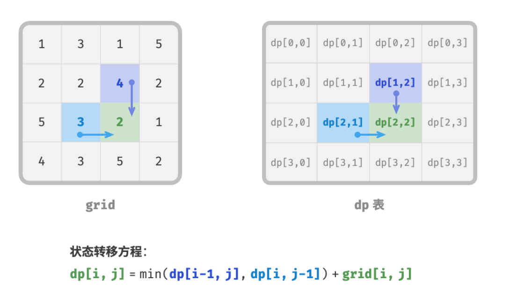

- > https://www.hello-algo.com/chapter_dynamic_programming/dp_solution_pipeline/
-
- > 1. 如何判断一个问题是不是动态规划问题？
  > 2. 求解动态规划问题该从何处入手，完整步骤是什么？
-
- ## 问题判断
	- 总的来说，如果一个问题包含重叠子问题、最优子结构，并满足无后效性，那么它通常就适合用动态规划求解，但我们很难从问题描述上直接提取出这些特性。因此我们通常会放宽条件，[[#blue]]==**先观察问题是否适合使用回溯（穷举）解决**。==
	- **适合用回溯解决的问题通常满足“决策树模型”**，这种问题可以使用树形结构来描述，其中每一个节点代表一个决策，每一条路径代表一个决策序列。
	- 换句话说，如果问题包含明确的**决策概念**，并且解是通过一系列决策产生的，那么它就满足决策树模型，通常可以使用回溯来解决。
	- 在此基础上，还有一些判断问题是动态规划问题的“加分项”，包括：
		- 问题包含最大（小）或最多（少）等[[#green]]==**最优化描述**==；
		- 问题的状态能够使用一个列表、多维矩阵或树来表示，并且一个状态与其周围的状态存在某种递推关系；
	- 而相应的“减分项”包括：
		- 问题的目标是找出所有可能的解决方案，而[[#red]]==不是找出最优解==。
		- 问题描述中有明显的排列组合的特征，需要返回具体的多个方案。
	- 如果一个问题满足决策树模型，并具有较为明显的“加分项“，我们就可以假设它是一个动态规划问题，并尝试求解它。
- ## 问题求解
	- 动态规划的解题流程通常遵循以下步骤：[[#blue]]==描述决策，定义状态，建立dp表，推导状态转移方程，确定边界条件等。==
	- > ❔ **Question**
	  >
	  > 给定一个 $n\times m$ 的二维网格 `grid` ，网格中的每个单元格包含一个非负整数，表示该单元格的代价。机器人以左上角单元格为起始点，每次只能向下或者向右移动一步，直至到达右下角单元格。请返回从左上角到右下角的最小路径和。
	- ### 第一步：思考每轮的决策，定义状态，从而得到 $dp$ 表
	  background-color:: pink
		- [[#blue]]==本题的每一轮的决策就是从当前格子向下或向右一步。==设当前格子的行列索引为 $[i,j]$ ，则向下或向右走一步后，索引变为 $[i+1,j]$ 或 $[i,j+1]$ 。因此，状态应包含行索引和列索引两个变量，记为 $[i,j]$ 。
		- 状态 $[i,j]$ 对应的子问题为：从起始点 [0,0] 走到 $[i,j]$ 的最小路径和，解记为 $dp[i,j]$ 。
		- > 🗒️ Note
		  > 动态规划和回溯通常都会被描述为一个决策序列，而状态通常由所有决策变量构成。它应当包含描述解题进度的所有变量，其包含了足够的信息，能够用来推导出下一个状态。
		  >
		  > 每个状态都对应一个子问题，我们会定义一个 $dp$ 表来存储所有子问题的解，状态的每个独立变量都是 $dp$ 表的一个维度。本质上看，$dp$ 表是子问题的解和状态之间的映射。
	- ### 第二步：找出最优子结构，进而推导出状态转移方程
	  background-color:: pink
		- 状态转移方程：
		- $$dp[i,j]=\min(dp[i-1,j],dp[i,j-1])+grid[i,j]$$
		- {:height 312, :width 519}
		- > 🗒️ Note
		  > 基于定义好的 $dp$ 表，我们思考原问题和子问题的关系，找出如何通过子问题的解来构造原问题的解。
		  最优子结构揭示了原问题和子问题的递推关系，一旦我们找到了最优子结构，就可以使用它来构建出状态转移方程。
	- ### 第三步：确定边界条件和状态转移顺序
	  background-color:: pink
		- 在本题中，当 $i=0$ 或 $j=0$ 时只有一种可能的路径，即只能向右移动或只能向下移动，因此[[#blue]]==首行和首列是边界条件。==
		- 每个格子是由其左方格子和上方格子转移而来，因此我们使用两层循环来遍历矩阵即可，即外循环正序遍历各行、内循环正序遍历各列。
- ## 方法一：暴力搜索
	- 从状态 $[i,j]$ 开始搜索，不断分解为更小的状态 $[i−1,j]$ 和 $[i,j−1]$ ，包括以下递归要素：
		- **递归参数**：状态 $[i,j]$ ；**返回值**：从 $[0,0]$ 到 $[i,j]$ 的最小路径和 $dp[i,j]$ ；
		- **终止条件**：当 $i=0$ 且 $j=0$ 时，返回代价 $grid[0,0]$ ；
		- **剪枝**：当 $i<0$ 时或 $j<0$ 时索引越界，此时返回代价 $+\infty$ ，代表不可行；
	- ```
	  /* 最小路径和：暴力搜索 */
	  function minPathSumDFS(grid, i, j) {
	      // 若为左上角单元格，则终止搜索
	      if (i == 0 && j == 0) {
	          return grid[0][0];
	      }
	      // 若行列索引越界，则返回 +∞ 代价
	      if (i < 0 || j < 0) {
	          return Infinite;
	      }
	      // 计算从左上角到 (i-1, j) 和 (i, j-1) 的最小路径代价
	      const left = minPathSumDFS(grid, i - 1, j);
	      const up = minPathSumDFS(grid, i, j - 1);
	      // 返回从左上角到 (i, j) 的最小路径代价
	      return Math.min(left, up) + grid[i][j];
	  }
	  
	  ```
	- 直观上看，**存在多条路径可以从左上角到达同一单元格**，这便是该问题存在重叠子问题的内在原因。
	- 每个状态都有向下和向右两种选择，从左上角走到右下角总共需要 $n+m−2$ 步，所以最差时间复杂度为 $O(2^{n+m})$。
- ## 方法二：记忆化搜索
	- 为了避免重复计算重叠子问题，我们引入一个和网格 `grid` 相同尺寸的记忆列表 `mem` ，用于记录各个子问题的解，提升搜索效率。
	- ```
	  /* 最小路径和：记忆化搜索 */
	  function minPathSumDFSMem(grid, mem, i, j) {
	      // 若为左上角单元格，则终止搜索
	      if (i == 0 && j == 0) {
	          return grid[0][0];
	      }
	      // 若行列索引越界，则返回 +∞ 代价
	      if (i < 0 || j < 0) {
	          return Infinity;
	      }
	      // 若已有记录，则直接返回
	      if (mem[i][j] != -1) {
	          return mem[i][j];
	      }
	      // 左边和上边单元格的最小路径代价
	      const left = minPathSumDFSMem(grid, mem, i - 1, j);
	      const up = minPathSumDFSMem(grid, mem, i, j - 1);
	      // 记录并返回左上角到 (i, j) 的最小路径代价
	      mem[i][j] = Math.min(left, up) + grid[i][j];
	      return mem[i][j];
	  }
	  ```
	- 时间复杂度取决于状态总数，即网格尺寸 $O(nm)$ 。
- ## 方法三：动态规划
	- 动态规划代码是从底至顶的，仅需循环即可实现。
	- ```
	  /* 最小路径和：动态规划 */
	  function minPathSumDP(grid) {
	      const n = grid.length, m = grid[0].length;
	      // 初始化 dp 表
	      const dp = Array(n).fill(Array.fill(m));
	      dp[0][0] = grid[0][0];
	      // 状态转移：首行
	      for (let j = 1; j < m; j++) {
	          dp[0][j] = dp[0][j - 1] + grid[0][j];
	      }
	      // 状态转移：首列
	      for (let i = 1; i < n; i++) {
	          dp[i][0] = dp[i - 1][0] + grid[i][0];
	      }
	      // 状态转移：其余行列
	      for (let i = 1; i < n; i++) {
	          for (let j = 1; j < m; j++) {
	              dp[i][j] = Math.min(dp[i][j - 1], dp[i - 1][j]) + grid[i][j];
	          }
	      }
	      return dp[n - 1][m - 1];
	  }
	  ```
	- 如果希望进一步节省空间使用，可以考虑进行**状态压缩**。每个格子只与左边和上边的格子有关，因此我们可以只用一个单行数组来实现 $dp$ 表。
	- 由于数组 `dp` 只能表示一行的状态，因此我们无法提前初始化首列状态，而是在遍历每行中更新它。
	- ```
	  /* 最小路径和：状态压缩后的动态规划 */
	  function minPathSumDPComp(grid) {
	      const n = grid.length, m = grid[0].length;
	      // 初始化 dp 表
	  	const dp = new Array(m);
	      // 状态转移：首行
	      dp[0] = grid[0][0];
	      for (let j = 1; j < m; j++) {
	          dp[j] = dp[j - 1] + grid[0][j];
	      }
	      // 状态转移：其余行
	      for (let i = 1; i < n; i++) {
	          // 状态转移：首列
	          dp[0] = dp[0] + grid[i][0];
	          // 状态转移：其余列
	          for (let j = 1; j < m; j++) {
	              dp[j] = Math.min(dp[j - 1], dp[j]) + grid[i][j];
	          }
	      }
	      return dp[m - 1];
	  }
	  
	  ```