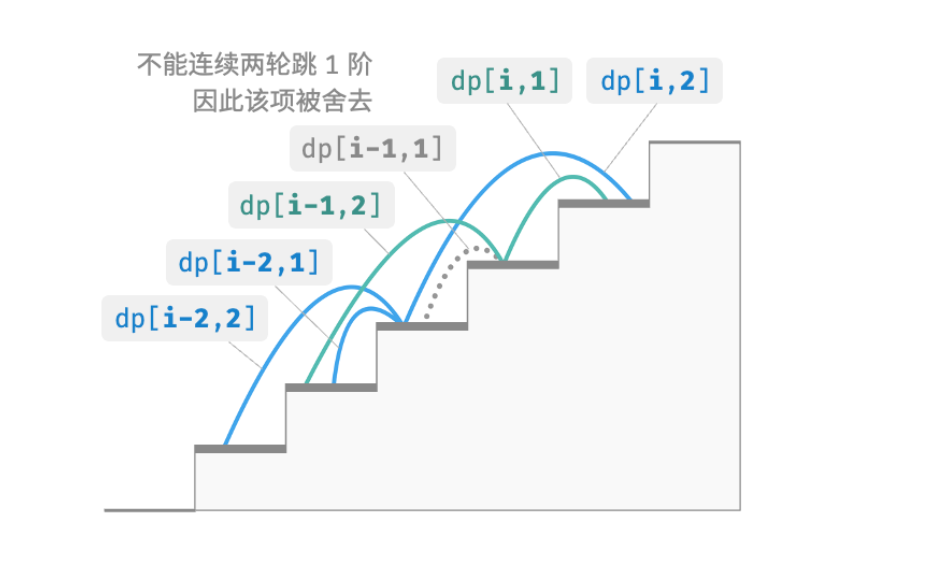

- > https://www.hello-algo.com/chapter_dynamic_programming/dp_problem_features/
-
- **「动态规划」**最常用来求解最优方案问题，例如寻找最短路径、最大利润、最少时间等。**这类问题不仅包含重叠子问题，往往还具有另外两大特性：最优子结构、无后效性**。
- ## 最优子结构
	- > ❓ **爬楼梯最小代价**
	  >
	  > 给定一个楼梯，你每步可以上 1 阶或者 2 阶，每一阶楼梯上都贴有一个非负整数，表示你在该台阶所需要付出的代价。给定一个非负整数数组 $cost$ ，其中 $cost[i]$ 表示在第 $i$ 个台阶需要付出的代价，$cost[0]$ 为地面起始点。请计算最少需要付出多少代价才能到达顶部？
	- 设 $dp[i]$ 为爬到第 $i$ 阶累计付出的代价，由于第 $i$ 阶只可能从 $i-1$ 阶或 $i-2$ 阶走来，因此 $dp[i]$ 只可能等于 $dp[i−1]$+$cost[i]$ 或 $dp[i−2]+cost[i]$ 。为了尽可能减少代价，我们应该选择两者中较小的那一个，即：
	- $$dp[i]=\min(dp[i-1],dp[i-2])+cost[i]$$
	- **「最优子结构」**的含义：**原问题的最优解是从子问题的最优解构建得来的**。
	- 根据以上**状态转移方程**，以及初始状态 $dp[1]=cost[1]$ , $dp[2]=cost[2]$ ，我们可以得出动态规划解题代码。
	- ```
	  /* 爬楼梯最小代价：动态规划 */
	  function minCostClimbingStairsDP(cost = []) {
	      let n = cost.length - 1;
	      if (n == 1 || n == 2)
	          return cost[n];
	      // 初始化 dp 表，用于存储子问题的解
	      cosnt dp = new Array(n + 1);
	      // 初始状态：预设最小子问题的解
	      dp[1] = cost[1];
	      dp[2] = cost[2];
	      // 状态转移：从较小子问题逐步求解较大子问题
	      for (let i = 3; i <= n; i++) {
	          dp[i] = Math.min(dp[i - 1], dp[i - 2]) + cost[i];
	      }
	      return dp[n];
	  }
	  ```
	- 这道题同样也可以进行状态压缩，将一维压缩至零维，使得空间复杂度从$O(n)$降低至$O(1)$
- ## 无后效性
	- **「无后效性」**是动态规划能够有效解决问题的重要特性之一，定义为：**给定一个确定的状态，它的未来发展只与当前状态有关，而与当前状态过去所经历过的所有状态无关**。
	- 以爬楼梯问题为例，给定状态 $i$ ，它会发展出状态 $i+1$ 和状态 $i+2$ ，分别对应跳 1 步和跳 2 步。[[#green]]==在做出这两种选择时，我们无需考虑状态 $i$ 之前的状态，即它们对状态 $i$ 的未来没有影响。==
	- 然而，如果我们向爬楼梯问题添加一个约束，情况就不一样了。
	- > ❓ **带约束爬楼梯**
	  >
	  > 给定一个共有 $n$ 阶的楼梯，你每步可以上 1 阶或者 2 阶，**但不能连续两轮跳 1 阶**，请问有多少种方案可以爬到楼顶。
	- 在该问题中，**下一步选择不能由当前状态（当前楼梯阶数）独立决定，还和前一个状态（上轮楼梯阶数）有关**。如果上一轮是跳 1 阶上来的，那么下一轮就必须跳 2 阶。
	- 不难发现，此问题已不满足无后效性，状态转移方程也失效了，为了解决该问题，我们需要扩展状态定义：**状态** $[i,j]$ **表示处在第** $i$ **阶、并且上一轮跳了** $j$ **阶**，其中 $j\in{1, 2}$ 。
	- 此状态定义有效地区分了上一轮跳了 1 阶还是 2 阶，我们可以据此来决定下一步该怎么跳：
		- 当 $j$ 等于 1 ，即上一轮跳了 1 阶时，这一轮只能选择跳 2 阶；
		- 当 $j$ 等于 2 ，即上一轮跳了 2 阶时，这一轮可选择跳 1 阶或跳 2 阶；
	- 在该定义下，$dp[i,j]$ 表示状态 $[i,j]$ 对应的方案数。由此，我们便能推导出以下的状态转移方程：
	- $$
	  \begin{align*}
	  dp[i,1]&=dp[i-1,2] \\ 
	  dp[i,2]&=dp[i-2, 1]+dp[i-2,2]
	  \end{align*}
	  $$
	- 
	- 最终，返回 $dp[n,1]+dp[n,2]$ 即可，两者之和代表爬到第 $n$ 阶的方案总数。
	- ```
	  /* 带约束爬楼梯：动态规划 */
	  function climbingStairsConstraintDP(n) {
	      if (n == 1 || n == 2) {
	          return n;
	      }
	      // 初始化 dp 表，用于存储子问题的解
	      const dp = new Array[n + 1].fill(new Array(3));
	      // 初始状态：预设最小子问题的解
	      dp[1][1] = 1;
	      dp[1][2] = 0;
	      dp[2][1] = 0;
	      dp[2][2] = 1;
	      // 状态转移：从较小子问题逐步求解较大子问题
	      for (let i = 3; i <= n; i++) {
	          dp[i][1] = dp[i - 1][2];
	          dp[i][2] = dp[i - 2][1] + dp[i - 2][2];
	      }
	      return dp[n][1] + dp[n][2];
	  }
	  ```
	- 实际上，许多复杂的组合优化问题（例如著名的旅行商问题）都不满足无后效性。对于这类问题，我们通常会选择使用其他方法，例如启发式搜索、遗传算法、强化学习等，从而降低时间复杂度，在有限时间内得到能够接受的局部最优解。