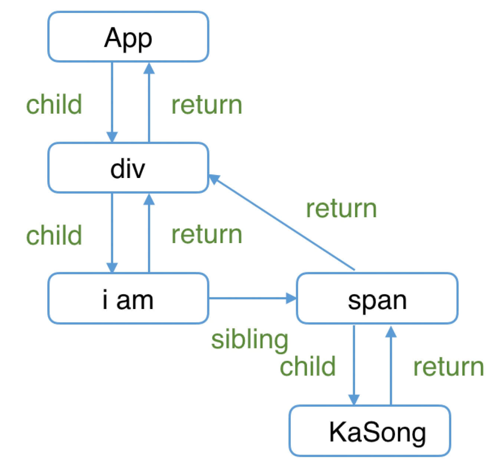

- > https://react.iamkasong.com/process/fiber.html
-
- ## Fiber的含义
	- `Fiber`包含三层含义：
		- 1. 作为架构来说，之前`React15`的`Reconciler`采用递归的方式执行，数据保存在递归调用栈中，所以被称为`stack Reconciler`。`React16`的`Reconciler`基于`Fiber节点`实现，被称为`Fiber Reconciler`。
		- 2. 作为静态的数据结构来说，每个`Fiber节点`对应一个`React element`，保存了该组件的类型（函数组件/类组件/原生组件...）、对应的DOM节点等信息。
		- 3. 作为动态的工作单元来说，每个`Fiber节点`保存了本次更新中该组件改变的状态、要执行的工作（需要被删除/被插入页面中/被更新...）
- ## Fiber的结构
	- [Fiber节点的属性定义](https://github.com/facebook/react/blob/1fb18e22ae66fdb1dc127347e169e73948778e5a/packages/react-reconciler/src/ReactFiber.new.js#L117)
		- ```
		  function FiberNode(
		    tag: WorkTag,
		    pendingProps: mixed,
		    key: null | string,
		    mode: TypeOfMode,
		  ) {
		    // 作为静态数据结构的属性
		    this.tag = tag;
		    this.key = key;
		    this.elementType = null;
		    this.type = null;
		    this.stateNode = null;
		  
		    // 用于连接其他Fiber节点形成Fiber树
		    this.return = null;
		    this.child = null;
		    this.sibling = null;
		    this.index = 0;
		  
		    this.ref = null;
		  
		    // 作为动态的工作单元的属性
		    this.pendingProps = pendingProps;
		    this.memoizedProps = null;
		    this.updateQueue = null;
		    this.memoizedState = null;
		    this.dependencies = null;
		  
		    this.mode = mode;
		  
		    this.effectTag = NoEffect;
		    this.nextEffect = null;
		  
		    this.firstEffect = null;
		    this.lastEffect = null;
		  
		    // 调度优先级相关
		    this.lanes = NoLanes;
		    this.childLanes = NoLanes;
		  
		    // 指向该fiber在另一次更新时对应的fiber
		    this.alternate = null;
		  }
		  ```
	- ### 作为架构来说
	  background-color:: blue
		- 每个Fiber节点有个对应的`React element`，多个`Fiber节点`是如何连接形成树呢？靠如下三个属性：
			- ```
			  // 指向父级Fiber节点
			  this.return = null;
			  // 指向子Fiber节点
			  this.child = null;
			  // 指向右边第一个兄弟Fiber节点
			  this.sibling = null;
			  ```
		- 举个例子，如下的组件结构：
		- ```
		  function App() {
		    return (
		      <div>
		        i am
		        <span>KaSong</span>
		      </div>
		    )
		  }
		  ```
		- 对应的`Fiber树`结构：
		- {:height 462, :width 470}
		- > 这里需要提一下，为什么父级指针叫做`return`而不是`parent`或者`father`呢？因为作为一个工作单元，`return`指节点执行完`completeWork`（本章后面会介绍）后会返回的下一个节点。子`Fiber节点`及其兄弟节点完成工作后会返回其父级节点，所以用`return`指代父级节点。
	- ### 作为静态的数据结构
	  id:: 6481bceb-d0be-43b0-9ec0-1c3b27323af4
	  background-color:: blue
		- 作为一种静态的数据结构，保存了组件相关的信息：
		- ```
		  // Fiber对应组件的类型 Function/Class/Host...
		  this.tag = tag;
		  // key属性
		  this.key = key;
		  // 大部分情况同type，某些情况不同，比如FunctionComponent使用React.memo包裹
		  this.elementType = null;
		  // 对于 FunctionComponent，指函数本身，对于ClassComponent，指class，对于HostComponent，指DOM节点tagName
		  this.type = null;
		  // Fiber对应的真实DOM节点
		  this.stateNode = null;
		  ```
		-