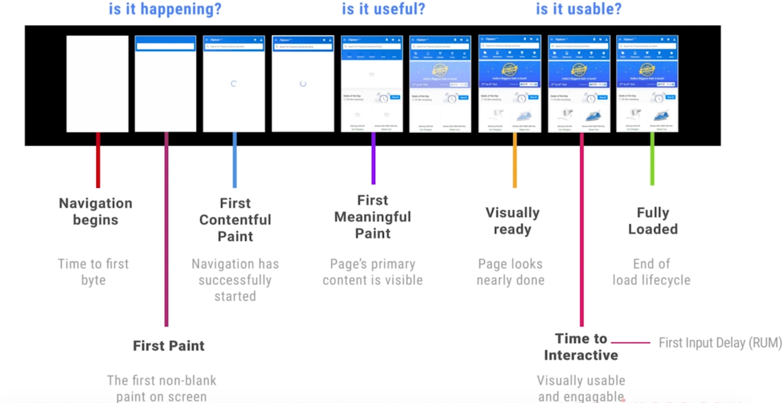
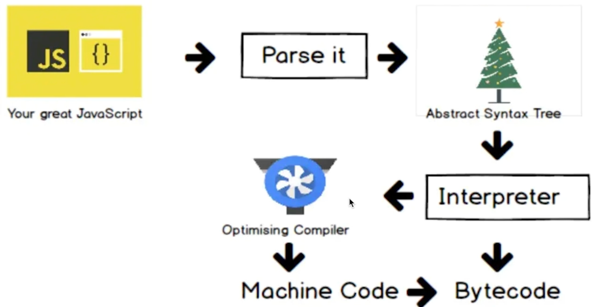

- ## JavaScript 的代码开销和如何缩短解析时间
	- ### 代码开销
	  background-color:: pink
		- 加载
		- 解析和编译 Parse/Compile
		- 执行 Execuiton
	- ### 缩短解析时间方案
	  background-color:: pink
		- #### Code splitting 代码拆分
		- #### Tree shaking 代码减重
		- ### 减少主线程工作量
			- 避免长任务
			- 避免超过 1kb 的行间脚本( inline script)
			- 使用 rAF 和 rIC 进行时间调度
			- Progressive Bootstrapping 渐进式启动首屏
				- 
- ## 配合 V8 引擎，有效优化代码
	- ### V8 编译原理
	  background-color:: pink
		- 
	- ### V8 优化机制
	  background-color:: pink
		- #### 脚本流
		- #### 字节码缓存
		- #### 懒解析
- ## 函数优化
	- ### 函数的解析方式
	  background-color:: pink
		- #### lazy parsing 懒解析
		- #### eager parsing 饥饿解析
			- 立即执行的函数用括号包裹：`const fn = (function() {})`
		- #### 利用 Optimize.js 优化初次加载时间
- ## 对象优化
	- ### 以相同顺序初始化对象成员，避免隐藏类型的调整
	  background-color:: pink
		- 隐藏类型 Hidden Class
		- ```
		  const carl = {color: 'red'}; // HCO
		  carl.seats = 4; // HC1
		  
		  const car2 = {seats: 2}; // HC2
		  car2. color = 'blue'; // HC3
		  ```
	- ### 实例化后避免添加新属性
	  background-color:: pink
		- ```
		  const carl = {color: 'red'}; // In-object 属性
		  carl.seats = 4: // Normal/Fast 属性，需要间接查找
		  ```
	- ### 尽量使用 Array 代替 array-like 对象
	  background-color:: pink
	- ### 避免读取超过数组长度
	  background-color:: pink
	- ### 避免类型转换
	  background-color:: pink
- ## HTML 优化
	- ### 减少 iframes 的使用
	  background-color:: pink
	- ### 压缩空白符、删除注释
	  background-color:: pink
	- ### 避免节点深层次嵌套
	  background-color:: pink
	- ### 避免 table 布局
	  background-color:: pink
- ## CSS 优化
	- ### CSS 对性能的影响
	  background-color:: pink
		-