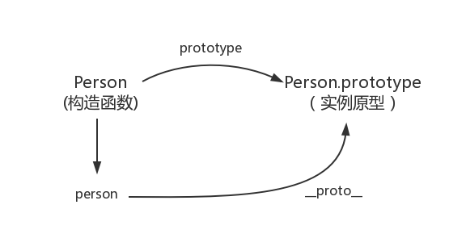
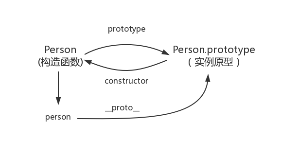
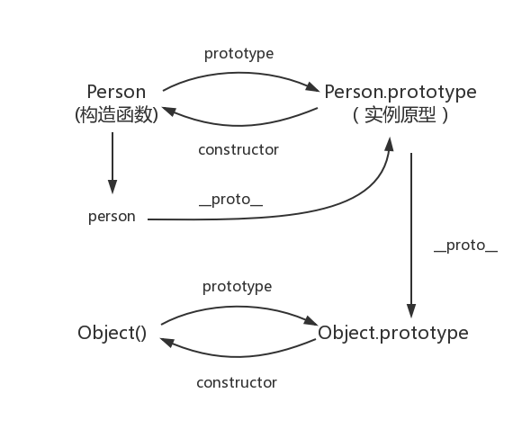
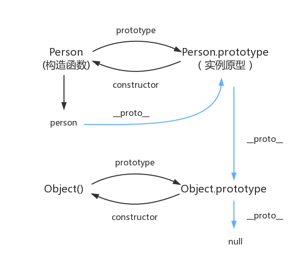

- > [https://github.com/mqyqingfeng/Blog/issues/2](https://github.com/mqyqingfeng/Blog/issues/2)
-
- ## prototype-原型
	- 什么是原型？你可以这样理解：每一个JavaScript对象(null除外)在创建的时候就会与之关联另一个对象，这个对象就是我们所说的原型，每一个对象都会从原型"继承"属性。
	- 
- ## \_proto\_
	- 这是每一个JavaScript对象(除了 null )都具有的一个属性，叫\_proto\_，这个属性会指向 [[#blue]]==该对象的原型==。
	- ```
	  - function Person() {
	  
	  - }
	    var person = new Person();  
	    console.log(person._proto_ === Person.prototype); // true
	  ```
	- 于是我们更新下关系图：
	- 
	- 那么原型是否有属性指向构造函数或者实例呢？
- ## constructor
	- 原型指向构造函数倒是有的，这就要讲到第三个属性：constructor，每个原型都有一个 constructor 属性指向关联的构造函数。
	- ```
	  - function Person() {
	  - }
	    console.log(Person === Person.prototype.constructor); // true
	  ```
	- 所以再更新下关系图：
	- 
	-
- ## 实例与原型
	- 当读取实例的属性时，如果找不到，就会查找与对象关联的原型中的属性，如果还查不到，就去找原型的原型，一直找到最顶层为止。
	- ```
	  - function Person() {
	  - }
	  - Person.prototype.name = 'Kevin';
	  - var person = new Person();
	  - person.name = 'Daisy';
	    console.log(person.name) // Daisy  
	  - delete person.name;
	    console.log(person.name) // Kevin
	  ```
- ## 原型的原型
	- 在前面，我们已经讲了原型也是一个对象，既然是对象，我们就可以用最原始的方式创建它，那就是：
	- ```
	  var obj = new Object();
	  obj.name = 'Kevin'
	  console.log(obj.name) // Kevin
	  ```
	- 其实原型对象就是通过 Object 构造函数生成的，结合之前所讲，实例的 [[#blue]]==\_proto\_ 指向构造函数的 prototype== ，所以我们再更新下关系图：
	- 
- ## 原型链
	- 那 Object.prototype 的原型呢？[[#blue]]==**null**==，我们可以打印：
	- ```
	  - console.log(Object.prototype._proto_ === null) // true
	  ```
	- 所以 Object.prototype.\_proto\_ 的值为 null 跟 Object.prototype 没有原型，其实表达了一个意思。所以查找属性的时候查到 Object.prototype 就可以停止查找了。
	- 最后一张关系图也可以更新为：
	- 
	- 顺便还要说一下，图中由[[#blue]]==相互关联的原型组成的链状结构就是原型链==，也就是蓝色的这条线。
- ## 补充
	- 最后，补充三点大家可能不会注意的地方：
		- **constructor**
			- ```
			  - function Person() {
			  - }
			    var person = new Person();  
			    console.log(person.constructor === Person); // true
			  ```
				- 当获取 person.constructor 时，其实 person 中并没有 constructor 属性,当不能读取到constructor 属性时，会从 person 的原型也就是 Person.prototype 中读取，正好原型中有该属性，所以：
					- ```
					  person.constructor === Person.prototype.constructor
					  ```
		- **\_proto\_**
			- 其次是 \_proto\_ ，绝大部分浏览器都支持这个非标准的方法访问原型，然而它并不存在于 Person.prototype 中，实际上，它是来自于 Object.prototype ，与其说是一个属性，不如说是一个 getter/setter，当使用 obj.\_proto\_ 时，可以理解成返回了 Object.getPrototypeOf(obj)。
		- **真的是继承吗？**
			- 最后是关于继承，前面我们讲到“每一个对象都会从原型‘继承’属性”，实际上，继承是一个十分具有迷惑性的说法，引用《你不知道的JavaScript》中的话，就是：
			- 继承意味着复制操作，然而 JavaScript 默认并不会复制对象的属性，相反，JavaScript 只是在两个对象之间创建一个关联，这样，一个对象就可以通过委托访问另一个对象的属性和函数，所以与其叫继承，**委托**的说法反而更准确些。
		- **关于Function.__proto__ === Function.prototype的问题:**