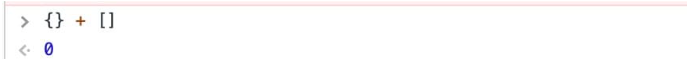

- > https://github.com/mqyqingfeng/Blog/issues/164
-
- ## 一元操作符 +
	- ```
	  console.log(+'1');
	  ```
	- 当 + 运算符作为一元操作符的时候，查看 [ES5规范1.4.6](http://es5.github.io/#x11.4.6)，会调用 `ToNumber` 处理该值，相当于 `Number('1')`，最终结果返回数字 `1`。
	- ```
	  console.log(+[]); // 0
	  console.log(+['1']); // 1
	  console.log(+['1', '2', '3']); // NaN
	  console.log(+{}); // NaN
	  ```
- ## 二元操作符 +
	- ### 规范
	  background-color:: blue
		- 规范地址：[http://es5.github.io/#x11.6.1](http://es5.github.io/#x11.6.1)
		- 当计算 value1 + value2时：
			- id:: 647ee3cc-cabc-4e12-8176-c1180a5ff3f7
			  1. lprim = ToPrimitive(value1)
			  2. rprim = ToPrimitive(value2)
			  3. 如果 lprim 是字符串或者 rprim 是字符串，那么返回 ToString(lprim) 和 ToString(rprim)的拼接结果
			  4. 返回 ToNumber(lprim) 和 ToNumber(rprim)的运算结果
	- ### 1.Null 与数字
	  background-color:: green
		- ```
		  console.log(null + 1); // 1
		  ```
		- 按照规范的步骤进行分析：
			- 1. lprim = ToPrimitive(null) 因为null是基本类型，直接返回，所以 lprim = null
			  2. rprim = ToPrimitive(1) 因为 1 是基本类型，直接返回，所以 rprim = null
			  3. lprim 和 rprim 都不是字符串
			  4. 返回 ToNumber(null) 和 ToNumber(1) 的运算结果
	- ### 2.数组与数组
	  background-color:: green
		- ```
		  console.log([] + []); // ""
		  ```
		- 1. lprim = ToPrimitive([])，[]是数组，相当于ToPrimitive([], Number)，先调用valueOf方法，返回对象本身，因为不是原始值，调用toString方法，返回空字符串""
		  2. rprim类似。
		  3. lprim和rprim都是字符串，执行拼接操作
	- ### 3.数组与对象
	  background-color:: green
		- ```
		  // 两者结果一致
		  console.log([] + {}); // "[object Object]"
		  console.log({} + []); // "[object Object]"
		  ```
		- 1. lprim = ToPrimitive([])，lprim = ""
		  2. rprim = ToPrimitive({})，相当于调用 ToPrimitive({}, Number)，先调用 valueOf 方法，返回对象本身，因为不是原始值，调用 toString 方法，返回 "[object Object]"
		  3. lprim 和 rprim 都是字符串，执行拼接操作
		- ```
		  console.log(1 + true); // 2
		  console.log({} + {}); // "[object Object][object Object]"
		  console.log(new Date(2017, 04, 21) + 1) // "Sun May 21 2017 00:00:00 GMT+0800 (CST)1"
		  ```
	- ### 注意
	  background-color:: blue
		- 如果你直接在 `Chrome` 或者 `Firebug` 开发工具中的命令行直接输入，你也许会惊讶的看到一些结果的不同，比如：
		- 
		- 我们尝试着加一个括号：
		- 
		- 在不加括号的时候，`{}` 被当成了一个[[#blue]]==独立的空代码块==，所以 `{} + []` 变成了 `+[]`，结果就变成了 `0`
		- [[#red]]==问题==：
			- ```
			  > {} + {}
			  // 火狐： NaN
			  // 谷歌： "[object Object][object Object]"
			  ```
			- 如果 `{}` 被当成一个独立的代码块，那么这句话相当于 `+{}`，相当于 `Number({})`，结果自然是 `NaN`，可是 `Chrome` 却在这里返回了正确的值。
				- [原文在这](https://juejin.cn/post/6844903558526009352#heading-23)
				  大概在chrome版本49之前，Chrome控制台上面的输出结果基本和Firefox一致，之后在chrome上有人提出bug，[Issue 499864](https://bugs.chromium.org/p/chromium/issues/detail?id=499864)，大概意思就是说我在控制台输入{a: 4, b: 5}你给我报个错干嘛，我就是想要一个对象而已。Chrome没过多久就修复了，修复的方式也特别666，就是凡是语句以{开头，以}结尾，我解析的时候就包裹一层括号在外面。[git记录](https://chromium.googlesource.com/chromium/src.git/+/4fd348fdb9c0b3842829acdfb2b82c86dacd8e0a%5E!/#F2)，里面的关键代码如下:
				- ```
				  +    if (/^\s*\{/.test(text) && /\}\s*$/.test(text))
				  +        text = '(' + text + ')';
				  ```
				- 故在chrome下{} + {} 即是({} + {})
				  故这里的花括号正确地被解析成了对象
- ## == 相等
	- ### 规范
	  background-color:: blue
		- `"=="` 用于比较两个值是否相等，当要比较的两个值类型不一样的时候，就会发生类型的转换。
		- 当执行x == y 时：
			- 1. 如果x与y是同一类型：
				- i. x是Undefined，返回true
				  ii. x是Null，返回true
				  iii. x是数字：
					-
		-