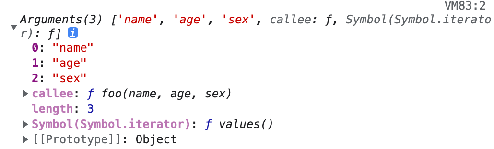

- > https://github.com/mqyqingfeng/Blog/issues/14
-
- ## 类数组对象
	- 类数组对象:
	- > 拥有一个 length 属性和若干索引属性的对象
	- 举个例子：
		- ```
		  var array = ['name', 'age', 'sex'];
		  
		  var arrayLike = {
		      0: 'name',
		      1: 'age',
		      2: 'sex',
		      length: 3
		  }
		  ```
- ## 读写
	- ```
	  console.log(array[0]); // name
	  console.log(arrayLike[0]); // name
	  
	  array[0] = 'new name';
	  arrayLike[0] = 'new name';
	  ```
- ## 长度
	- ```
	  console.log(array.length); // 3
	  console.log(arrayLike.length); // 3
	  ```
- ## 遍历
	- ```
	  for(var i = 0, len = array.length; i < len; i++) {
	     ……
	  }
	  for(var i = 0, len = arrayLike.length; i < len; i++) {
	      ……
	  }
	  ```
- ## 调用数组方法
	- Function.call 间接调用
	- ```
	  var arrayLike = {0: 'name', 1: 'age', 2: 'sex', length: 3 }
	  
	  Array.prototype.join.call(arrayLike, '&'); // name&age&sex
	  
	  Array.prototype.slice.call(arrayLike, 0); // ["name", "age", "sex"] 
	  // slice可以做到类数组转数组
	  
	  Array.prototype.map.call(arrayLike, function(item){
	      return item.toUpperCase();
	  }); 
	  // ["NAME", "AGE", "SEX"]
	  ```
- ## 类数组转数组
	- 在上面的例子中已经提到了一种类数组转数组的方法，再补充三个：
	- ```
	  var arrayLike = {0: 'name', 1: 'age', 2: 'sex', length: 3 }
	  // 1. slice
	  Array.prototype.slice.call(arrayLike); // ["name", "age", "sex"] 
	  // 2. splice
	  Array.prototype.splice.call(arrayLike, 0); // ["name", "age", "sex"] 
	  // 3. ES6 Array.from
	  Array.from(arrayLike); // ["name", "age", "sex"] 
	  // 4. apply
	  Array.prototype.concat.apply([], arrayLike)
	  ```
	- 要说到类数组对象，Arguments 对象就是一个类数组对象。在客户端 JavaScript 中，一些 DOM 方法(document.getElementsByTagName()等)也返回类数组对象。
- ## Arguments对象
	- Arguments 对象只定义在函数体中，包括了函数的参数和其他属性。在函数体中，arguments 指代该函数的 Arguments 对象。
	- 举个例子：
		- ```
		  function foo(name, age, sex) {
		      console.log(arguments);
		  }
		  
		  foo('name', 'age', 'sex')
		  ```
	- 打印结果如下：
		- {:height 142, :width 458}
- ## length属性
	- Arguments对象的length属性，表示实参的长度
- ## callee属性
	- Arguments 对象的 callee 属性，通过它可以调用函数自身。
	- 讲个闭包经典面试题使用 callee 的解决方法：
	- ```
	  var data = [];
	  
	  for (var i = 0; i < 3; i++) {
	      (data[i] = function () {
	         console.log(arguments.callee.i) 
	      }).i = i;
	  }
	  
	  data[0]();
	  data[1]();
	  data[2]();
	  
	  // 0
	  // 1
	  // 2
	  ```
	- 函数也是一种对象，我们可以通过这种方式给函数添加一个自定义的属性。
	  这个解决方式就是给 data[i] 这个函数添加一个自定义属性，这个属性值就是正确的 i 值。
- ## arguments 和对应参数的绑定
	-