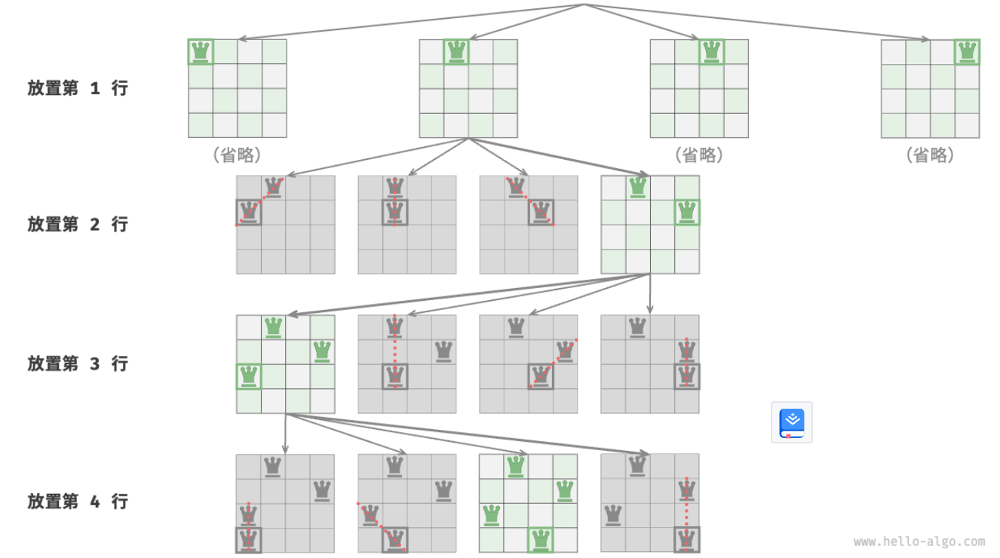

- > https://www.hello-algo.com/chapter_backtracking/n_queens_problem/
-
- > ❓ **Question**
  >
  > 根据国际象棋的规则，皇后可以攻击与之处在同一行或同一列或同一斜线上的棋子。给定 $n$ 个皇后和一个 $n×n$ 大小的棋盘，寻找使得所有皇后之间无法相互攻击的摆放方案。
- 本题共有三个约束条件：**多个皇后不能在同一行、同一列和同一对角线**。值得注意的是，对角线分为主对角线 `\` 和副对角线 `/` 两种。
- 皇后的数量和棋盘的行数都为 $n$ ，因此我们容易得到第一个推论：**棋盘每行都允许且只允许放置一个皇后**。这意味着，我们可以采取逐行放置策略：从第一行开始，在每行放置一个皇后，直至最后一行结束。**此策略起到了剪枝的作用**，它避免了同一行出现多个皇后的所有搜索分支。
- 
-