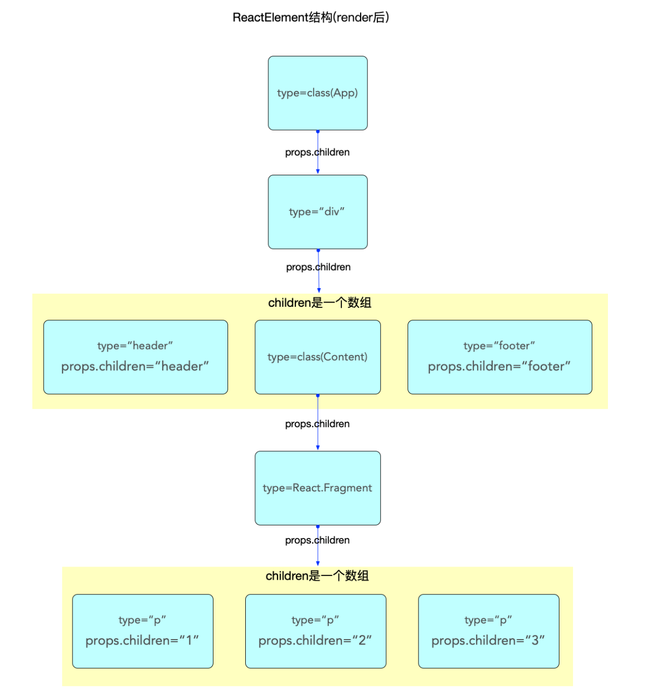
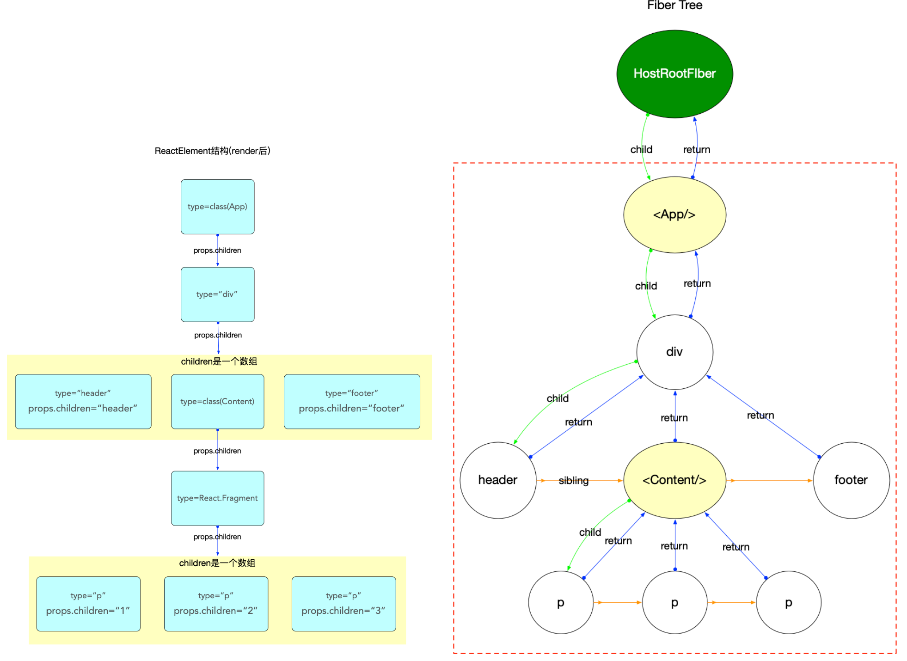
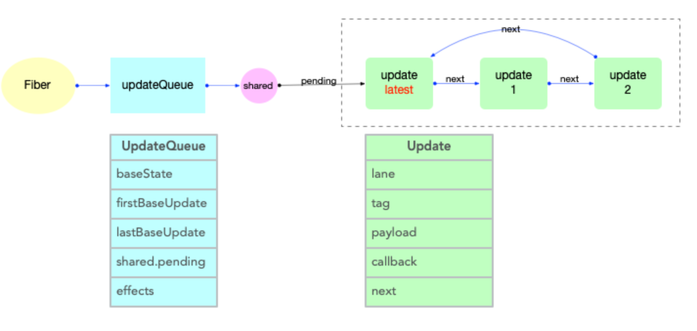
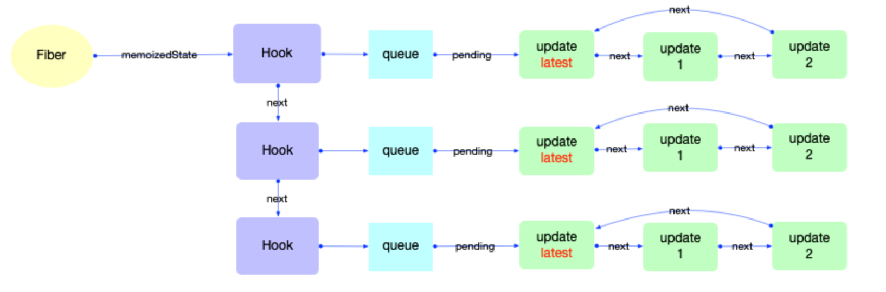

- > 在 React 应用中, 有很多特定的对象或数据结构. 了解这些内部的设计, 可以更容易理解 react 运行原理. 本章主要列举从 react 启动到渲染过程出现频率较高, 影响范围较大的对象, 它们贯穿整个 react 运行时.
- ## react 包
  collapsed:: true
	- 此包定义 react 组件(`ReactElement`)的必要函数, 提供一些操作`ReactElement`对象的 api.
	- 所以这个包的核心需要理解`ReactElement`对象, 假设有如下入口函数:
		- ```
		  // 入口函数
		  ReactDOM.render(<App />, document.getElementById('root'));
		  ```
	- 可以简单的认为, 包括`<App/>`及其所有子节点都是`ReactElement`对象(在 render 之后才会生成子节点, 后文详细解读), [[#green]]==每个`ReactElement`对象的区别在于 type 不同.==
	- ### [ReactElement 对象](https://github.com/facebook/react/blob/v17.0.2/packages/react/src/ReactElement.js#L126-L146)
	  background-color:: pink
	  collapsed:: true
		- > *其 type 定义在*[`shared`包中](https://github.com/facebook/react/blob/v17.0.2/packages/shared/ReactElementType.js#L15)*.*
		- 所有采用`jsx`语法书写的节点, 都会被编译器转换, 最终会以`React.createElement(...)`的方式, 创建出来一个与之对应的`ReactElement`对象.
		- `ReactElement`对象的数据结构如下:
		- ```
		  export type ReactElement = {|
		    // 用于辨别ReactElement对象
		    $typeof: any,
		  
		    // 内部属性
		    type: any, // 表明其种类
		    key: any,
		    ref: any,
		    props: any,
		  
		    // ReactFiber 记录创建本对象的Fiber节点, 还未与Fiber树关联之前, 该属性为null
		    _owner: any,
		  
		    // __DEV__ dev环境下的一些额外信息, 如文件路径, 文件名, 行列信息等
		    _store: {validated: boolean, ...},
		    _self: React$Element<any>,
		    _shadowChildren: any,
		    _source: Source,
		  |};
		  ```
		- 需要特别注意 2 个属性:
			- `key`属性在`reconciler`阶段会用到, 目前只需要知道所有的`ReactElement`对象都有 key 属性(且[其默认值是 null](https://github.com/facebook/react/blob/v17.0.2/packages/react/src/ReactElement.js#L348-L357), 这点十分重要, 在 diff 算法中会使用到).
			  logseq.order-list-type:: number
			- `type`属性决定了节点的种类:
			  logseq.order-list-type:: number
				- 它的值可以是字符串(代表`div,span`等 dom 节点), 函数(代表`function, class`等节点), 或者 react 内部定义的节点类型(`portal,context,fragment`等)；
				  logseq.order-list-type:: number
				- 在`reconciler`阶段, 会根据 type 执行不同的逻辑；
				  logseq.order-list-type:: number
	- ### [ReactComponent](https://github.com/facebook/react/blob/v17.0.2/packages/react/src/ReactBaseClasses.js#L20-L30) 对象
	  background-color:: pink
	  collapsed:: true
		- 对于`ReactElement`来讲, `ReactComponent`仅仅是诸多`type`类型中的一种.
		- 这里用一个简单的示例, 通过查看编译后的代码来说明：
		- ```
		  class App extends React.Component {
		    render() {
		      return (
		        <div className="app">
		          <header>header</header>
		          <Content />
		          <footer>footer</footer>
		        </div>
		      );
		    }
		  }
		  
		  class Content extends React.Component {
		    render() {
		      return (
		        <React.Fragment>
		          <p>1</p>
		          <p>2</p>
		          <p>3</p>
		        </React.Fragment>
		      );
		    }
		  }
		  
		  export default App;
		  ```
		- 编译之后的代码(此处只编译了 jsx 语法, 并没有将 class 语法编译成 es5 中的 function), 可以更直观的看出调用逻辑.
		- `createElement`函数的第一个参数将作为创建`ReactElement`的`type`. 可以看到`Content`这个变量被编译器命名为`App_Content`, 并作为第一个参数(引用传递), 传入了`createElement`.
		- ```
		  class App_App extends react_default.a.Component {
		    render() {
		      return /*#__PURE__*/ react_default.a.createElement(
		        'div',
		        {
		          className: 'app',
		        } /*#__PURE__*/,
		        react_default.a.createElement('header', null, 'header') /*#__PURE__*/,
		  
		        // 此处直接将Content传入, 是一个指针传递
		        react_default.a.createElement(App_Content, null) /*#__PURE__*/,
		        react_default.a.createElement('footer', null, 'footer'),
		      );
		    }
		  }
		  class App_Content extends react_default.a.Component {
		    render() {
		      return /*#__PURE__*/ react_default.a.createElement(
		        react_default.a.Fragment,
		        null /*#__PURE__*/,
		        react_default.a.createElement('p', null, '1'),
		        /*#__PURE__*/
		  
		        react_default.a.createElement('p', null, '2'),
		        /*#__PURE__*/
		  
		        react_default.a.createElement('p', null, '3'),
		      );
		    }
		  }
		  ```
		- 上述示例演示了`ReactComponent`是诸多`ReactElement`种类中的一种情况, 但是由于`ReactComponent`是 class 类型, 自有它的特殊性：
			- `ReactComponent`是 class 类型, 继承父类`Component`, 拥有特殊的方法(`setState`,`forceUpdate`)和特殊的属性(`context`,`updater`等).
			  logseq.order-list-type:: number
			- 在`reconciler`阶段, 会依据`ReactElement`对象的特征, 生成对应的 fiber 节点. 当识别到`ReactElement`对象是 class 类型的时候, 会触发`ReactComponent`对象的生命周期, 并调用其 `render`方法, 生成`ReactElement`子节点.
			  logseq.order-list-type:: number
	- ### 其他 `ReactElement`
	  background-color:: pink
	  collapsed:: true
		- 上文介绍了第一种特殊的`ReactElement`(`class`类型的组件), 除此之外`function`类型的组件也需要深入了解, 因为`Hook`只能在`function`类型的组件中使用.
		- 如果在`function`类型的组件中没有使用`Hook`(如: `useState`, `useEffect`等), 在`reconciler`阶段所有有关`Hook`的处理都会略过, 最后调用该`function`拿到子节点`ReactElement`.
		- 如果使用了`Hook`, 逻辑就相对复杂, 涉及到`Hook`创建和状态保存(有关 Hook 的原理部分, 在 Hook 原理章节中详细解读). 此处只需要了解`function`类型的组件和`class`类型的组件一样, 是诸多`ReactElement`形式中的一种.
	- ### `ReactElement` 内存结构
	  background-color:: green
	  collapsed:: true
		- 通过前文对`ReactElement`的介绍, 可以比较容易的画出`<App/>`这个`ReactElement`对象在内存中的结构(`reconciler`阶段完成之后才会形成完整的结构).
		- 
		- 注意:
			- `class`和`function`类型的组件,其子节点是在 render 之后(`reconciler`阶段)才生成的. 此处只是单独表示`ReactElement`的数据结构.
			  logseq.order-list-type:: number
			- 父级对象和子级对象之间是通过`props.children`属性进行关联的(与 fiber 树不同).
			  logseq.order-list-type:: number
			- `ReactElement`虽然不能算是一个严格的树, 也不能算是一个严格的链表. 它的生成过程是自顶向下的, 是所有组件节点的总和.
			  logseq.order-list-type:: number
			- `ReactElement`树(暂且用树来表述)和`fiber`树是以`props.children`为单位`先后交替`生成的(在 fiber 树构建章节详细解读), 当`ReactElement`树构造完毕, fiber 树也随后构造完毕.
			  logseq.order-list-type:: number
			- `reconciler`阶段会根据`ReactElement`的类型生成对应的`fiber`节点(不是一一对应, 比如`Fragment`类型的组件在生成`fiber`节点的时候会略过).
			  logseq.order-list-type:: number
- ## `react-reconciler`   包
	- `react-reconciler`包是`react`应用的中枢, 连接渲染器(`react-dom`)和调度中心(`scheduler`), 同时自身也负责 fiber 树的构造.
	- ### Fiber 对象
	  background-color:: pink
		- 先看数据结构, 其 type 类型的定义在[`ReactInternalTypes.js`](https://github.com/facebook/react/blob/v17.0.2/packages/react-reconciler/src/ReactInternalTypes.js#L47-L174)中:
		- ```
		  // 一个Fiber对象代表一个即将渲染或者已经渲染的组件(ReactElement), 一个组件可能对应两个fiber(current和WorkInProgress)
		  // 单个属性的解释在后文(在注释中无法添加超链接)
		  export type Fiber = {|
		    tag: WorkTag,
		    key: null | string,
		    elementType: any,
		    type: any,
		    stateNode: any,
		    return: Fiber | null,
		    child: Fiber | null,
		    sibling: Fiber | null,
		    index: number,
		    ref:
		      | null
		      | (((handle: mixed) => void) & { _stringRef: ?string, ... })
		      | RefObject,
		    pendingProps: any, // 从`ReactElement`对象传入的 props. 用于和`fiber.memoizedProps`比较可以得出属性是否变动
		    memoizedProps: any, // 上一次生成子节点时用到的属性, 生成子节点之后保持在内存中
		    updateQueue: mixed, // 存储state更新的队列, 当前节点的state改动之后, 都会创建一个update对象添加到这个队列中.
		    memoizedState: any, // 用于输出的state, 最终渲染所使用的state
		    dependencies: Dependencies | null, // 该fiber节点所依赖的(contexts, events)等
		    mode: TypeOfMode, // 二进制位Bitfield,继承至父节点,影响本fiber节点及其子树中所有节点. 与react应用的运行模式有关(有ConcurrentMode, BlockingMode, NoMode等选项).
		  
		    // Effect 副作用相关
		    flags: Flags, // 标志位
		    subtreeFlags: Flags, //替代16.x版本中的 firstEffect, nextEffect. 当设置了 enableNewReconciler=true才会启用
		    deletions: Array<Fiber> | null, // 存储将要被删除的子节点. 当设置了 enableNewReconciler=true才会启用
		  
		    nextEffect: Fiber | null, // 单向链表, 指向下一个有副作用的fiber节点
		    firstEffect: Fiber | null, // 指向副作用链表中的第一个fiber节点
		    lastEffect: Fiber | null, // 指向副作用链表中的最后一个fiber节点
		  
		    // 优先级相关
		    lanes: Lanes, // 本fiber节点的优先级
		    childLanes: Lanes, // 子节点的优先级
		    alternate: Fiber | null, // 指向内存中的另一个fiber, 每个被更新过fiber节点在内存中都是成对出现(current和workInProgress)
		  
		    // 性能统计相关(开启enableProfilerTimer后才会统计)
		    // react-dev-tool会根据这些时间统计来评估性能
		    actualDuration?: number, // 本次更新过程, 本节点以及子树所消耗的总时间
		    actualStartTime?: number, // 标记本fiber节点开始构建的时间
		    selfBaseDuration?: number, // 用于最近一次生成本fiber节点所消耗的时间
		    treeBaseDuration?: number, // 生成子树所消耗的时间的总和
		  |};
		  ```
		- [[#green]]==属性解释：==
		  collapsed:: true
			- - **`fiber.tag`**: 表示 fiber 类型, 根据`ReactElement`组件的 type 进行生成, 在 react 内部共定义了[25 种 tag](https://github.com/facebook/react/blob/v17.0.2/packages/react-reconciler/src/ReactWorkTags.js#L10-L35).
			- - **`fiber.key`**: 和`ReactElement`组件的 key 一致.
			- - `fiber.elementType`: 一般来讲和`ReactElement`组件的 type 一致.
			- - **`fiber.type`**: 一般来讲和`fiber.elementType`一致. 一些特殊情形下, 比如在开发环境下为了兼容热更新(`HotReloading`), 会对`function, class, ForwardRef`类型的`ReactElement`做一定的处理, 这种情况会区别于`fiber.elementType`, 具体赋值关系可以查看[源文件](https://github.com/facebook/react/blob/v17.0.2/packages/react-reconciler/src/ReactFiber.old.js#L571-L574).
			- - `fiber.stateNode`: 与`fiber`关联的局部状态节点(比如: `HostComponent`类型指向与`fiber`节点对应的 dom 节点; 根节点`fiber.stateNode`指向的是`FiberRoot`; class 类型节点其`stateNode`指向的是 class 实例).
			- - `fiber.return`: 指向父节点.
			- - `fiber.child`: 指向第一个子节点.
			- - `fiber.sibling`: 指向下一个兄弟节点.
			- - `fiber.index`: fiber 在兄弟节点中的索引, 如果是单节点默认为 0.
			- - `fiber.ref`: 指向在`ReactElement`组件上设置的 ref(`string`类型的`ref`除外, 这种类型的`ref`已经不推荐使用, `reconciler`阶段会将`string`类型的`ref`转换成一个`function`类型).
			- - `fiber.pendingProps`: 输入属性, 从`ReactElement`对象传入的 props. 用于和`fiber.memoizedProps`比较可以得出属性是否变动.
			- - `fiber.memoizedProps`: 上一次生成子节点时用到的属性, 生成子节点之后保持在内存中. 向下生成子节点之前叫做`pendingProps`, 生成子节点之后会把`pendingProps`赋值给`memoizedProps`用于下一次比较.`pendingProps`和`memoizedProps`比较可以得出属性是否变动.
			- - `fiber.updateQueue`: 存储`update更新对象`的队列, 每一次发起更新, 都需要在该队列上创建一个`update对象`.
			- - `fiber.memoizedState`: 上一次生成子节点之后保持在内存中的局部状态.
			- - `fiber.dependencies`: 该 fiber 节点所依赖的(contexts, events)等, 在`context`机制章节详细说明.
			- - `fiber.mode`: 二进制位 Bitfield,继承至父节点,影响本 fiber 节点及其子树中所有节点. 与 react 应用的运行模式有关(有 ConcurrentMode, BlockingMode, NoMode 等选项).
			- - `fiber.flags`: 标志位, 副作用标记(在 16.x 版本中叫做`effectTag`, 相应[pr](https://github.com/facebook/react/pull/19755)), 在[`ReactFiberFlags.js`](https://github.com/facebook/react/blob/v17.0.2/packages/react-reconciler/src/ReactFiberFlags.js#L10-L41)中定义了所有的标志位. `reconciler`阶段会将所有拥有`flags`标记的节点添加到副作用链表中, 等待 commit 阶段的处理.
			- - `fiber.subtreeFlags`: 替代 16.x 版本中的 firstEffect, nextEffect. 默认未开启, 当设置了[enableNewReconciler=true](https://github.com/facebook/react/blob/v17.0.2/packages/shared/ReactFeatureFlags.js#L93) 才会启用.
			- - `fiber.deletions`: 存储将要被删除的子节点. 默认未开启, 当设置了[enableNewReconciler=true](https://github.com/facebook/react/blob/v17.0.2/packages/shared/ReactFeatureFlags.js#L93) 才会启用.
			- - `fiber.nextEffect`: 单向链表, 指向下一个有副作用的 fiber 节点.
			- - `fiber.firstEffect`: 指向副作用链表中的第一个 fiber 节点.
			- - `fiber.lastEffect`: 指向副作用链表中的最后一个 fiber 节点.
			- - `fiber.lanes`: 本 fiber 节点所属的优先级, 创建 fiber 的时候设置.
			- - `fiber.childLanes`: 子节点所属的优先级.
			- - `fiber.alternate`: 指向内存中的另一个 fiber, 每个被更新过 fiber 节点在内存中都是成对出现(current 和 workInProgress)
			-
		- 最后绘制一颗 fiber 树与上文中的`ReactElement`树对照起来:
		- 
	- ### Update 与 UpdateQueue 对象
	  background-color:: pink
		- 在`fiber`对象中有一个属性`fiber.updateQueue`, 是一个链式队列(即使用链表实现的队列存储结构), 后文会根据场景表述成链表或队列.
		- 首先观察`Update`对象的数据结构([对照源码](https://github.com/facebook/react/blob/v17.0.2/packages/react-reconciler/src/ReactUpdateQueue.old.js#L106-L129)):
		- ```
		  export type Update<State> = {|
		    eventTime: number, // 发起update事件的时间(17.0.2中作为临时字段, 即将移出)
		    lane: Lane, // update所属的优先级
		  
		    tag: 0 | 1 | 2 | 3, //
		    payload: any, // 载荷, 根据场景可以设置成一个回调函数或者对象
		    callback: (() => mixed) | null, // 回调函数
		  
		    next: Update<State> | null, // 指向链表中的下一个, 由于UpdateQueue是一个环形链表, 最后一个update.next指向第一个update对象
		  |};
		  
		  // =============== UpdateQueue ==============
		  type SharedQueue<State> = {|
		    pending: Update<State> | null,
		  |};
		  
		  export type UpdateQueue<State> = {|
		    baseState: State,
		    firstBaseUpdate: Update<State> | null,
		    lastBaseUpdate: Update<State> | null,
		    shared: SharedQueue<State>,
		    effects: Array<Update<State>> | null,
		  |};
		  ```
		- [[#green]]==属性解释:==
			- `UpdateQueue`
			  logseq.order-list-type:: number
				- `baseState`: 表示此队列的基础 state
				  logseq.order-list-type:: number
				- `firstBaseUpdate`: 指向基础队列的队首
				  logseq.order-list-type:: number
				- `lastBaseUpdate`: 指向基础队列的队尾
				  logseq.order-list-type:: number
				- `shared`: 共享队列
				  logseq.order-list-type:: number
				- `effects`: 用于保存有`callback`回调函数的 update 对象, 在`commit`之后, 会依次调用这里的回调函数.
				  logseq.order-list-type:: number
			- `SharedQueue`
			  logseq.order-list-type:: number
				- `pending`: 指向即将输入的`update`队列. [[#green]]==在`class`组件中调用`setState()`之后, 会将新的 update 对象添加到这个队列中来.==
				  logseq.order-list-type:: number
			- `Update`
			  logseq.order-list-type:: number
				- `eventTime`: 发起`update`事件的时间(17.0.2 中作为临时字段, 即将移出)
				  logseq.order-list-type:: number
				- `lane`: `update`所属的优先级
				  logseq.order-list-type:: number
				- `tag`: 表示`update`种类, 共 4 种. [`UpdateState,ReplaceState,ForceUpdate,CaptureUpdate`](https://github.com/facebook/react/blob/v17.0.2/packages/react-reconciler/src/ReactUpdateQueue.old.js#L131-L134)
				  logseq.order-list-type:: number
				- `payload`: 载荷, `update`对象真正需要更新的数据, 可以设置成一个回调函数或者对象.
				  logseq.order-list-type:: number
				- `callback`: 回调函数. `commit`完成之后会调用.
				  logseq.order-list-type:: number
				- `next`: 指向链表中的下一个, 由于`UpdateQueue`是一个环形链表, 最后一个`update.next`指向第一个`update`对象.
				  logseq.order-list-type:: number
		- `updateQueue`是`fiber`对象的一个属性, 所以不能脱离`fiber`存在. 它们之间数据结构和引用关系如下:
			- 
	- ### Hook 对象
	  background-color:: pink
		- > `Hook`用于`function`组件中, 能够保持`function`组件的状态(与`class`组件中的`state`在性质上是相同的, 都是为了保持组件的状态).在`react@16.8`以后, 官方开始推荐使用`Hook`语法, 常用的 api 有`useState`,`useEffect`,`useCallback`等, 官方一共定义了[14 种`Hook`类型](https://github.com/facebook/react/blob/v17.0.2/packages/react-reconciler/src/ReactFiberHooks.old.js#L111-L125).
		- 这些 api 背后都会创建一个`Hook`对象, 先观察[`Hook`对象的数据结构](https://github.com/facebook/react/blob/v17.0.2/packages/react-reconciler/src/ReactFiberHooks.old.js#L134-L140):
		- ```
		  export type Hook = {|
		    memoizedState: any,
		    baseState: any,
		    baseQueue: Update<any, any> | null,
		    queue: UpdateQueue<any, any> | null,
		    next: Hook | null,
		  |};
		  
		  type Update<S, A> = {|
		    lane: Lane,
		    action: A,
		    eagerReducer: ((S, A) => S) | null,
		    eagerState: S | null,
		    next: Update<S, A>,
		    priority?: ReactPriorityLevel,
		  |};
		  
		  type UpdateQueue<S, A> = {|
		    pending: Update<S, A> | null,
		    dispatch: ((A) => mixed) | null,
		    lastRenderedReducer: ((S, A) => S) | null,
		    lastRenderedState: S | null,
		  |};
		  ```
		- [[#green]]==属性解释:==
			- `Hook`
			  logseq.order-list-type:: number
				- `memoizedState`: 内存状态, 用于输出成最终的`fiber`树.
				  logseq.order-list-type:: number
				- `baseState`: 基础状态, 当`Hook.queue`更新过后, `baseState`也会更新.
				  logseq.order-list-type:: number
				- `baseQueue`: 基础状态队列, 在`reconciler`阶段会辅助状态合并.
				  logseq.order-list-type:: number
				- `queue`: 指向一个`Update`队列
				  logseq.order-list-type:: number
				- `next`: 指向该`function`组件的下一个`Hook`对象, 使得[[#green]]==多个`Hook`之间也构成了一个链表.==
				  logseq.order-list-type:: number
			- `Hook.queue`和 `Hook.baseQueue`(即`UpdateQueue`和`Update`）是为了保证`Hook`对象能够顺利更新, 与上文`fiber.updateQueue`中的`UpdateQueue和Update`是不一样的(且它们在不同的文件), 其逻辑会在状态组件(class 与 function)章节中详细解读.
			  logseq.order-list-type:: number
		- [[#blue]]==`Hook`与`fiber`的关系:==
			- 在`fiber`对象中有一个属性[[#green]]==`fiber.memoizedState`==指向`fiber`节点的内存状态. 在`function`类型的组件中, `fiber.memoizedState`就指向`Hook`队列(`Hook`队列保存了`function`类型的组件状态).
			- 所以`Hook`也不能脱离`fiber`而存在, 它们之间的引用关系如下:
			- 
- ## scheduler 包
	- > `scheduler`包负责调度, 在内部维护一个任务队列([taskQueue](https://github.com/facebook/react/blob/v17.0.2/packages/scheduler/src/Scheduler.js#L63)). 这个队列是一个最小堆数组(详见[React 算法之堆排序](https://7km.top/algorithm/heapsort)), 其中存储了 task 对象.
	- ### Task 对象
	  background-color:: pink
		- `scheduler`包中, 没有为 task 对象定义 type, 其[定义是直接在 js 代码](https://github.com/facebook/react/blob/v17.0.2/packages/scheduler/src/Scheduler.js#L316-L326)中:
		- ```
		  var newTask = {
		    id: taskIdCounter++,
		    callback,
		    priorityLevel,
		    startTime,
		    expirationTime,
		    sortIndex: -1,
		  };
		  ```
	-