- > https://coding.imooc.com/learn/list/475.html
- DF65858C75195920
-
- ## 项目规划(需求分析)
  collapsed:: true
	- [[#blue]]==业务规划图==
		- 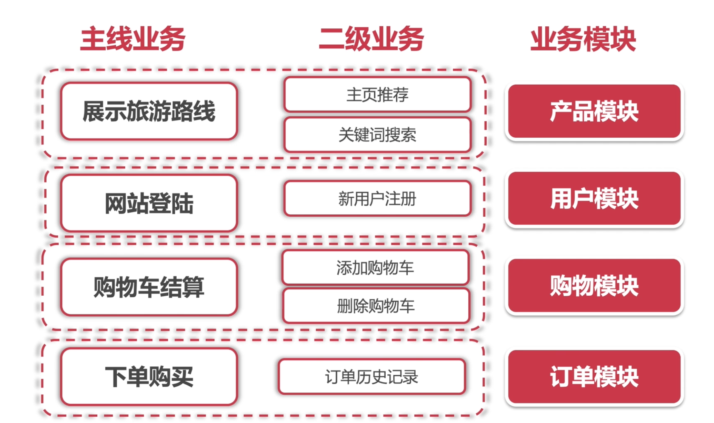
	- [[#blue]]==页面规划==
		- `产品模块`
			- 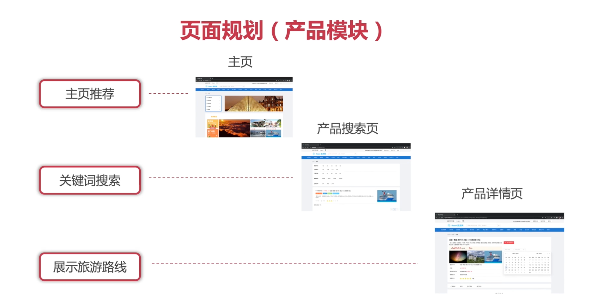
		- `用户模块`
			- 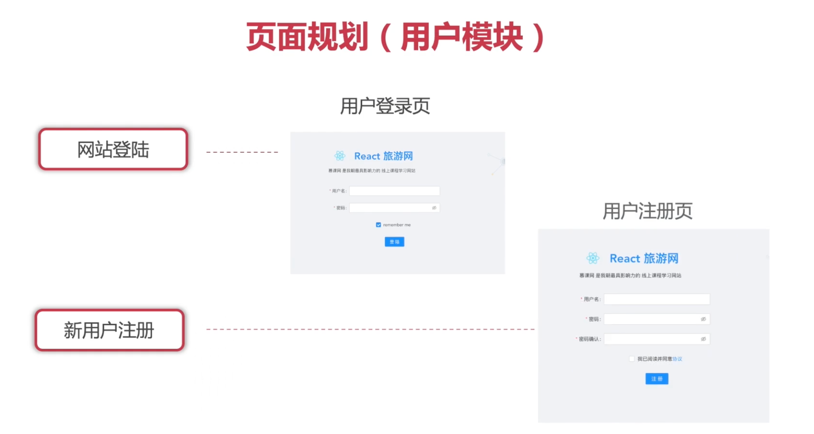
		- `购物模块`
			- 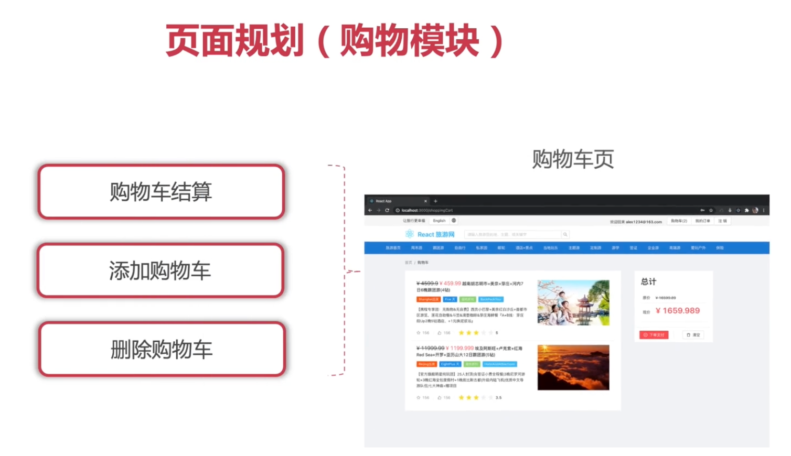
		- `订单模块`
			- 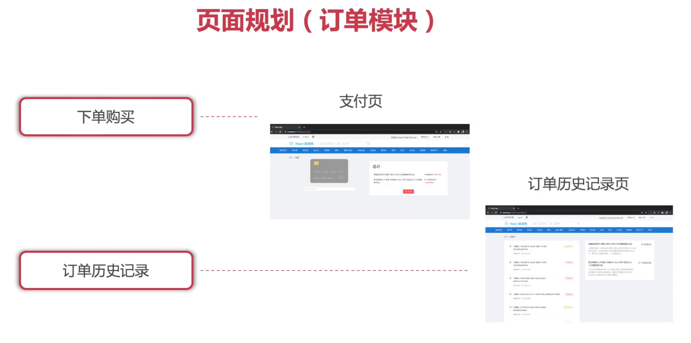
			-
- ## 系统设计与项目初始化
  collapsed:: true
	- [[#blue]]==界面设计==
		- **UI设计规范**
	- [[#blue]]==需求设计==
		- **需求设计规范 (SRS: Software Requirement Specific）**
	- [[#blue]]==项目初始化==
		- `框架`: [[$blue]]==create-react-app==
		- `项目依赖及配置文件`：
			- `npm install typescript-plugin-css-modules --save-dev`
			- `tsconfig.json` 加载css-modules插件plugins
			- ` .vscode` typescript sdk
			- `custom.d.ts` css module
- ## 主页开发
  collapsed:: true
	- [[#blue]]==文件夹结构==
		- 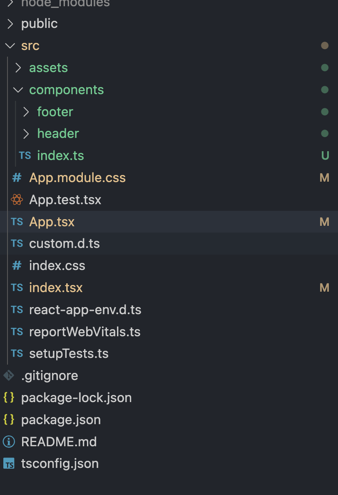{:height 395, :width 257}
		- `index.ts`：导出组件，避免过长的组件引用地址
			- ```
			  import { Header, Footer } from "./components";
			  ```
	-
- ## 路由系统
  collapsed:: true
	- ### 路由与SPA
	  background-color:: pink
		- `SPA`：单页网站应用
			- JS、HTML、CSS文件打包为一个文件，一次性丢给浏览器。
			- JS劫持浏览器路由，生成[[#green]]==虚拟路由==动态渲染页面dom元素。
	- ### React路由解决方案
	  background-color:: pink
		- #### react-router v5
		  background-color:: green
			- [react-router v5 文档](https://v5.reactrouter.com/)
			- `安装`：`npm i react-router-dom@5.3.4`
			- `react-router-dom`：用于浏览器，处理Web App的路由。
			- `react-router-native`：用于React Native，处理手机App的路由。
			- `react-router-redux`：路由中间件，处理redux集成。
			- `react-router-config`：静态配置路由。
			- > 注意⚠️：react-router没有提供TypeScript支持，需要安装react-router类型定义：`@types/react-router-dom`
			- > ⚠️官方或半官方typing支持：`npm install @types/XXXXXX`
			- > `npm install --save-dev`
			  >> `--save`安装依赖时自动添加版本号信息到package-json.js
			  >
			  >> `-dev`安装依赖到devDependencies
			- `<BrowserRouter />`：路由导航与原生浏览器操作行为一致
			- `<Route />`：路由的路径解析原理与原生浏览器一致，可以自动识别url路径，`component`中传递`history`，`location`，`match`的props
			- `<Switch />`：路由的切换以页面为单位，不要页面堆叠
			- `withRouter`：HOC，向页面子组件传递路由props（history、location、match）
			- `useRouter`：Hook，向页面组件传递路由信息
				- ```
				  const history = useHistory()
				  const location = useLocation()
				  const params = useParams()
				  const match = useRouteMatch()
				  ```
			- `<Link to={} />`：代替history.push()
		- #### react-router v6
		  background-color:: green
			- `<BrowserRouter />` `<Routes />` `<Route />`：v6废除了`<Switch />`，使用这三个组件的固定搭配。
			- [[#red]]==~~`withRouter`~~==：v6 全面倒向**函数式组件**，不再支持类组件。
			- `useRouter`：`useLocation`、[[#red]]==~~`useHistory`~~==、[[#green]]==`useNavigate`==、`useParams`
			- `<Link />`
			- [[#blue]]==支持类组件==：HOC
				- ```
				  export const withRouter = (Component) => {
				      const WrappedComponent = (props) => {
				          const navigate = useNavigate()
				          return (
				              <Component navigate={navigate} {...props} />
				          )
				      }
				      return WrappedComponent
				  }
				  ```
- ## Redux-项目架构方案
  collapsed:: true
	- 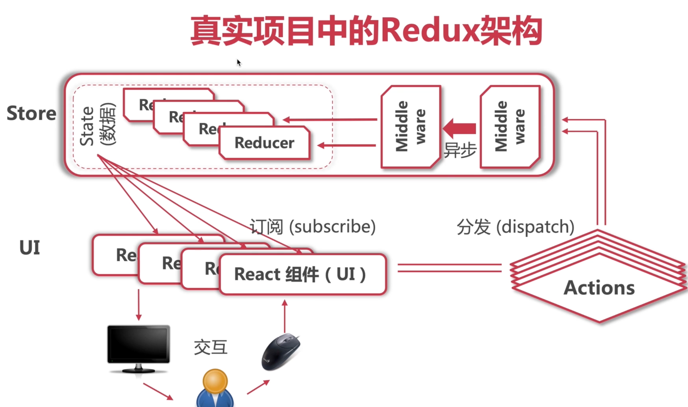
	- 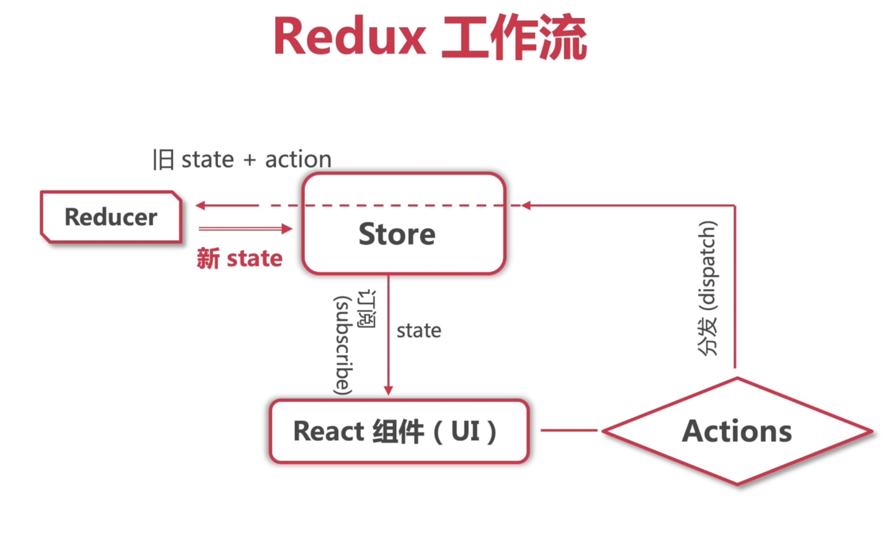
	- ### state和store
	  background-color:: pink
		- 创建state的数据订阅仓库：`createStore(Reducer)`
		- 获取store数据：`store.getState()`
		- 更新state，action与reducer的处理：
			- `dispatch`：`store.dispatch(action)`
			- `reducer`：`(state, action) => {}`
			- `action`: `{ type: string, payload: object }`
			- state的immutable（不可变性）：在`reducer`中处理state要用newState代替state，[[#red]]==不能直接在state上进行修改==。`const newState = {...state}`
		- 订阅state，store的连接与订阅：`store.subscribe(callback)`
	- ### I18n
	  background-color:: pink
		- 原理：语言包作为静态资源单独保存（xml、json），每种语言对应一个文件，切换语言设置时，语言文件也会随之切换。
		- I18n工具：`i18next`
			- `react- i8next`——对应的React插件， [官方文档](https://react.i18next.com)
	- ### redux重构
	  background-color:: pink
		- redux文件夹结构：
		- ```
		  -redux
		  	-feature
		      	-featureReducer.ts
		          -featureActions.ts  //action creator
		  ```
		- 定义常量、传入reducer中action的类型进行强类型限制：
		- ```
		  // featureReducer.ts
		  const featureReducer = (state = defaultState, action: ActionTypes) => {
		  	switch(action.type) {
		      	case TYPE1:...
		      }
		  }
		  
		  // featureActions.ts
		  export const TYPE1 = "..."
		  export type ActionTypes = {
		  	...
		  }
		  ```
	- ### React-redux的使用：
	  background-color:: pink
		- `npm i react-redux`
		- `npm i @types/react-redux`
		- #### Provider()
		  background-color:: green
			- makes the Redux store available to the rest of your app(store全局可用)
			- `<Provider store={store}><APP /></ Provider>`
		- #### Connect()
		  background-color:: green
			- 类组件中使用的HOC，将组件与store相连接
			- `connect(mapStateToProps?, mapDispatchToProps?, mergeProps?, options?)(Component)`
			- `mapStateToProps?: (state, ownProps?) => Object`
			- `mapDispatchToProps?: Object | (dispatch, ownProps?) => Object`
	- ### 在函数组件中使用React-redux：
	  background-color:: pink
		- #### useSelector()
		  background-color:: green
			- 连接组件与store
			- 结合`TypedUseSelectorHook`剥离state类型耦合：
			- ```
			  // hooks.ts
			  export const useSelector: TypedUseSelectorHook<RootState> = useReduxSelector;
			  
			  // Component.ts
			  const stateXxx = useSelectot(state => state.xxx)
			  ```
		- #### useDispatch()
		  background-color:: green
			- 分发action
			- 结合`action creator`：
			- ```
			  const dispatch = useDispatch();
			  ...
			  dispatch(xxxActionCreator(...))
			  ```
- ## Redux进阶-异步AJAX与redux中间件
  collapsed:: true
	- ### RESTful Api
	  background-color:: pink
		- 基本特点：
			- 无状态，一次调用返回结构，不存在打开连接-访问数据库-关闭连接的有状态连接（如websokect）；
			  logseq.order-list-type:: number
			- 面向“资源”，接口地址不使用动词，只使用名词；
			  logseq.order-list-type:: number
			- 使用HTTP动词表示操作：
			  logseq.order-list-type:: number
				- 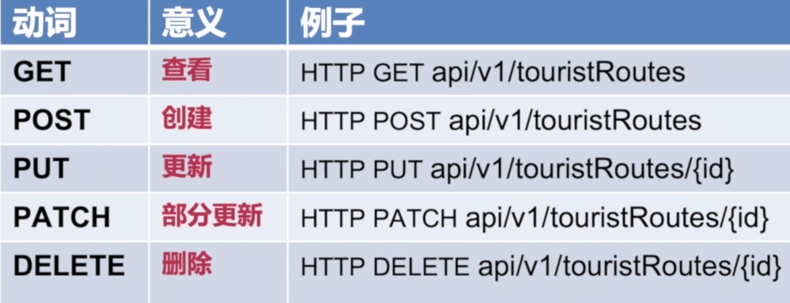
				  logseq.order-list-type:: number
			- HATEOAS，超媒体即应用状态引擎
			  logseq.order-list-type:: number
	- ### AJAX异步获取数据—Axios
	  background-color:: pink
		- 1. **简单易用**，API接近于jQuery，比原生`fetch`简单；
		- 2. **兼容性好**，向下兼容到`IE7`，使用fetch需要自己处理兼容；
		- 3. **通用性好**，能在node和浏览器中使用，API一致；
		- [[#green]]==处理“悬空”数据的方式：==
			- `loading`
			  logseq.order-list-type:: number
	- ### Redux vs MVC
	  background-color:: pink
		- 什么是MVC？
			- 模型（Model）、视图（View）、控制器（Controller）
			- **视图View**：用户交互界面，仅展示数据，不处理数据；
			- **模型Model**：MVC架构核心，表示业务模型或数据模型，业务逻辑如算法实现、数据管理、对象封装等；
			- **控制器Controller**：接受用户输入，调用模型和视图完成用户的输入请求，不处理数据
			- 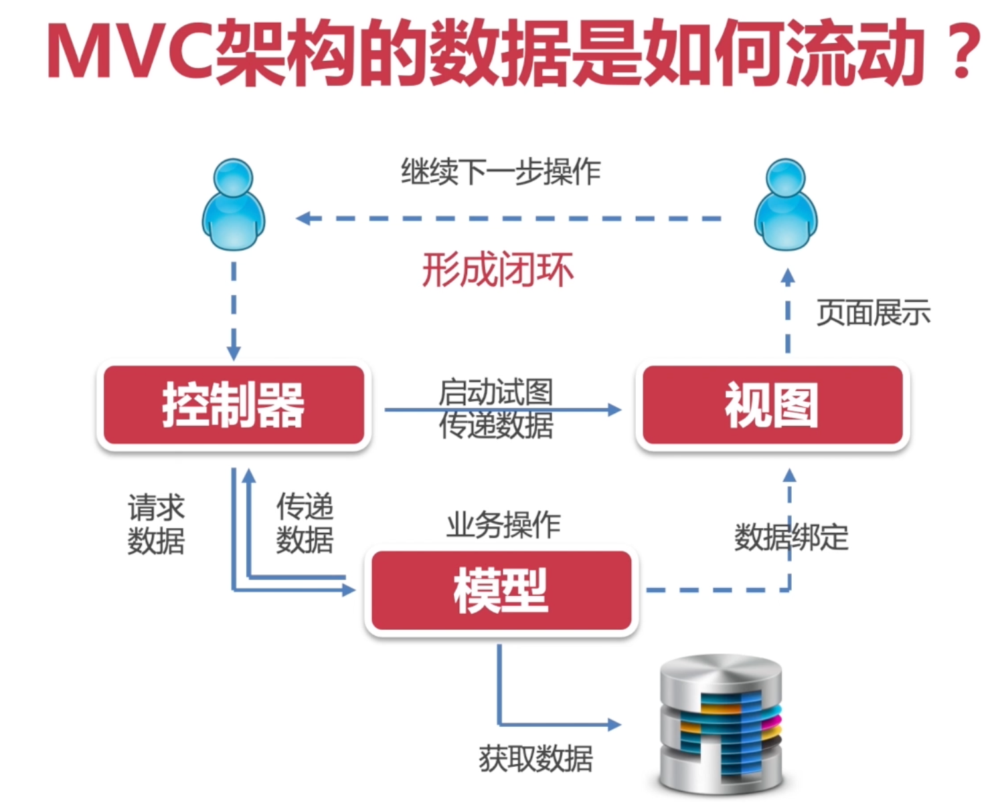
			- [[#red]]==缺点：数据双向流动，React项目不推荐MVC架构==
			- [[#green]]==React—>MVVM==
	- ### reducer管理——combineReducers
	  background-color:: pink
		- 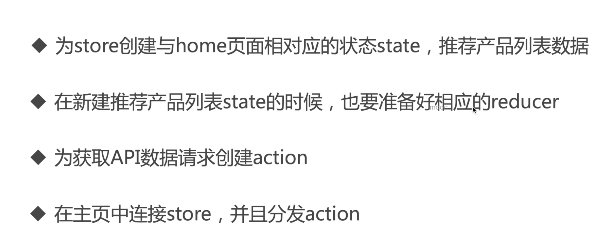
	- ### 中间件——redux-thunk实现异步action
	  background-color:: pink
		- 使用：`const store = createStore(rootReducer, applyMiddleware(thunk));`
		- 通过`ThunkAction type`：
		- ```
		  export const getDataActionCreator = (): ThunkAction<
		      void,
		      RootState,
		      null,
		      RecommendProductsAction
		  > => async(dispatch) => {
		      dispatch(fetchRecommendProductsStartActionCreator());
		      try {
		          const { data } = await axios.get("http://123.56.149.216:8080/api/productCollections")
		          dispatch(fetchRecommendProductsSuccessActionCreator(data));
		      } catch (error) {
		          dispatch(fetchRecommendProductsFailActionCreator(error));
		      }
		  }
		  ```
		- `thunk action`可以返回一个函数，而不一定是一个对象；
		- 在一个`thunk action`中可以完成一系列的action操作；
		- 可以处理异步的逻辑
	- ### 中间件原理
	  background-color:: pink
		- 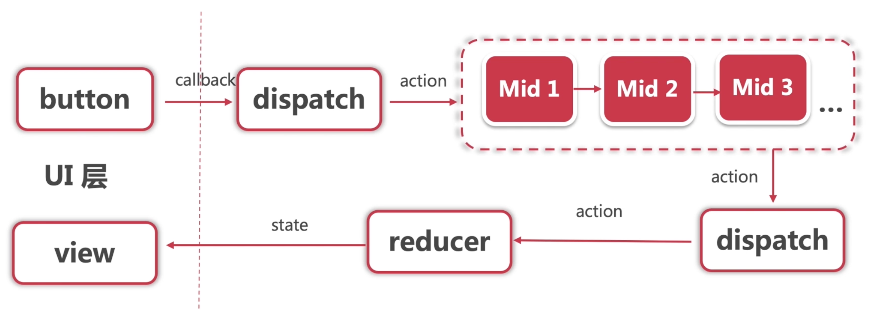
		- redux的异步处理：
			- `redux-thunk`
			- `redux-promise`
			- `redux-saga`
		- [[#blue]]==redux中间件公式：==
			- `const middleware = (store) => (next) => (action)=> { }`
			- `middleware(store)(next)(action)`
-
	-