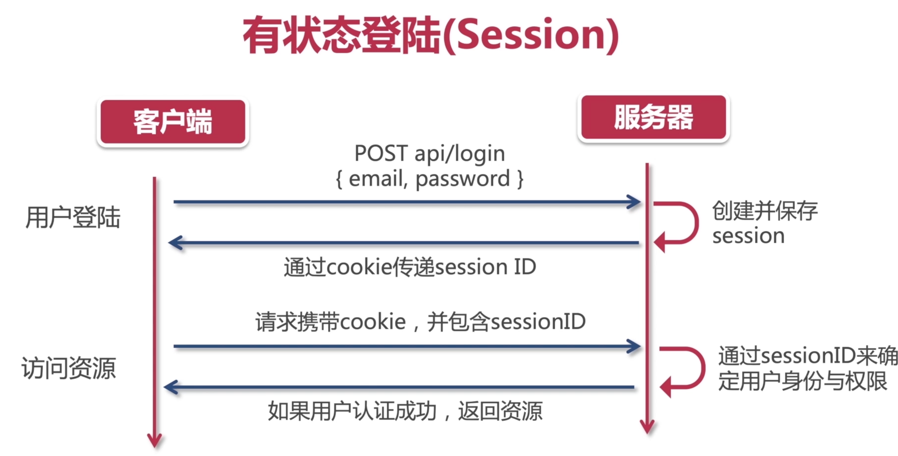
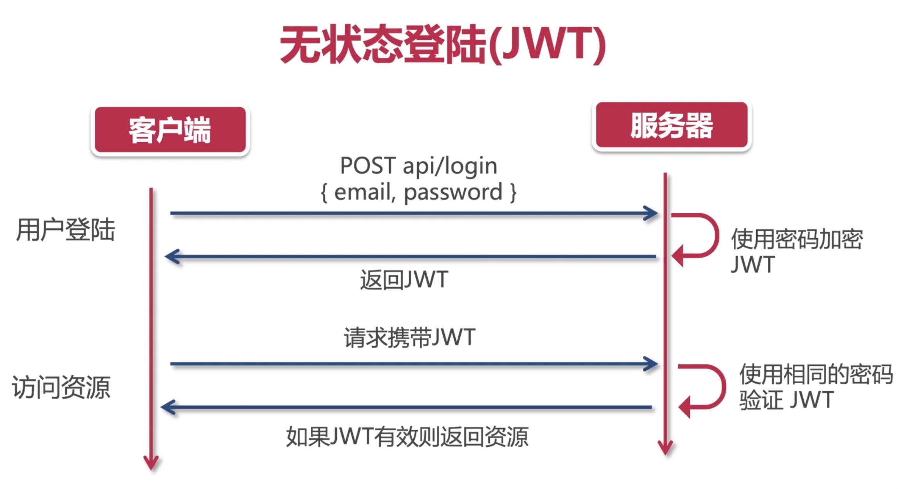
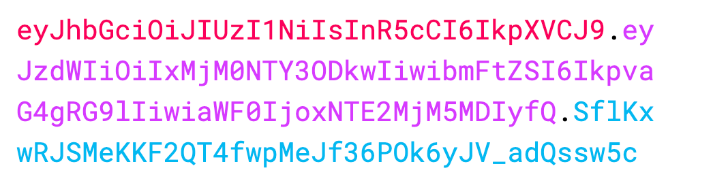

- > https://coding.imooc.com/learn/list/475.html
- DF65858C75195920
-
- ## 项目规划(需求分析)
  collapsed:: true
	- [[#blue]]==业务规划图==
		- 
	- [[#blue]]==页面规划==
		- `产品模块`
			- 
		- `用户模块`
			- 
		- `购物模块`
			- 
		- `订单模块`
			- 
			-
- ## 系统设计与项目初始化
  collapsed:: true
	- [[#blue]]==界面设计==
		- **UI设计规范**
	- [[#blue]]==需求设计==
		- **需求设计规范 (SRS: Software Requirement Specific）**
	- [[#blue]]==项目初始化==
		- `框架`: [[$blue]]==create-react-app==
		- `项目依赖及配置文件`：
			- `npm install typescript-plugin-css-modules --save-dev`
			- `tsconfig.json` 加载css-modules插件plugins
			- ` .vscode` typescript sdk
			- `custom.d.ts` css module
- ## 主页开发
  collapsed:: true
	- [[#blue]]==文件夹结构==
		- {:height 395, :width 257}
		- `index.ts`：导出组件，避免过长的组件引用地址
			- ```
			  import { Header, Footer } from "./components";
			  ```
	-
- ## 路由系统
  collapsed:: true
	- ### 路由与SPA
	  background-color:: pink
		- `SPA`：单页网站应用
			- JS、HTML、CSS文件打包为一个文件，一次性丢给浏览器。
			- JS劫持浏览器路由，生成[[#green]]==虚拟路由==动态渲染页面dom元素。
	- ### React路由解决方案
	  background-color:: pink
		- #### react-router v5
		  background-color:: green
			- [react-router v5 文档](https://v5.reactrouter.com/)
			- `安装`：`npm i react-router-dom@5.3.4`
			- `react-router-dom`：用于浏览器，处理Web App的路由。
			- `react-router-native`：用于React Native，处理手机App的路由。
			- `react-router-redux`：路由中间件，处理redux集成。
			- `react-router-config`：静态配置路由。
			- > 注意⚠️：react-router没有提供TypeScript支持，需要安装react-router类型定义：`@types/react-router-dom`
			- > ⚠️官方或半官方typing支持：`npm install @types/XXXXXX`
			- > `npm install --save-dev`
			  >> `--save`安装依赖时自动添加版本号信息到package-json.js
			  >
			  >> `-dev`安装依赖到devDependencies
			- `<BrowserRouter />`：路由导航与原生浏览器操作行为一致
			- `<Route />`：路由的路径解析原理与原生浏览器一致，可以自动识别url路径，`component`中传递`history`，`location`，`match`的props
			- `<Switch />`：路由的切换以页面为单位，不要页面堆叠
			- `withRouter`：HOC，向页面子组件传递路由props（history、location、match）
			- `useRouter`：Hook，向页面组件传递路由信息
				- ```
				  const history = useHistory()
				  const location = useLocation()
				  const params = useParams()
				  const match = useRouteMatch()
				  ```
			- `<Link to={} />`：代替history.push()
		- #### react-router v6
		  background-color:: green
			- `<BrowserRouter />` `<Routes />` `<Route />`：v6废除了`<Switch />`，使用这三个组件的固定搭配。
			- [[#red]]==~~`withRouter`~~==：v6 全面倒向**函数式组件**，不再支持类组件。
			- `useRouter`：`useLocation`、[[#red]]==~~`useHistory`~~==、[[#green]]==`useNavigate`==、`useParams`
			- `<Link />`
			- [[#blue]]==支持类组件==：HOC
				- ```
				  export const withRouter = (Component) => {
				      const WrappedComponent = (props) => {
				          const navigate = useNavigate()
				          return (
				              <Component navigate={navigate} {...props} />
				          )
				      }
				      return WrappedComponent
				  }
				  ```
- ## Redux-项目架构方案
  collapsed:: true
	- 
	- 
	- ### state和store
	  background-color:: pink
		- 创建state的数据订阅仓库：`createStore(Reducer)`
		- 获取store数据：`store.getState()`
		- 更新state，action与reducer的处理：
			- `dispatch`：`store.dispatch(action)`
			- `reducer`：`(state, action) => {}`
			- `action`: `{ type: string, payload: object }`
			- state的immutable（不可变性）：在`reducer`中处理state要用newState代替state，[[#red]]==不能直接在state上进行修改==。`const newState = {...state}`
		- 订阅state，store的连接与订阅：`store.subscribe(callback)`
	- ### I18n
	  background-color:: pink
		- 原理：语言包作为静态资源单独保存（xml、json），每种语言对应一个文件，切换语言设置时，语言文件也会随之切换。
		- I18n工具：`i18next`
			- `react- i8next`——对应的React插件， [官方文档](https://react.i18next.com)
	- ### redux重构
	  background-color:: pink
		- redux文件夹结构：
		- ```
		  -redux
		  	-feature
		      	-featureReducer.ts
		          -featureActions.ts  //action creator
		  ```
		- 定义常量、传入reducer中action的类型进行强类型限制：
		- ```
		  // featureReducer.ts
		  const featureReducer = (state = defaultState, action: ActionTypes) => {
		  	switch(action.type) {
		      	case TYPE1:...
		      }
		  }
		  
		  // featureActions.ts
		  export const TYPE1 = "..."
		  export type ActionTypes = {
		  	...
		  }
		  ```
	- ### React-redux的使用：
	  background-color:: pink
		- `npm i react-redux`
		- `npm i @types/react-redux`
		- #### Provider()
		  background-color:: green
			- makes the Redux store available to the rest of your app(store全局可用)
			- `<Provider store={store}><APP /></ Provider>`
		- #### Connect()
		  background-color:: green
			- 类组件中使用的HOC，将组件与store相连接
			- `connect(mapStateToProps?, mapDispatchToProps?, mergeProps?, options?)(Component)`
			- `mapStateToProps?: (state, ownProps?) => Object`
			- `mapDispatchToProps?: Object | (dispatch, ownProps?) => Object`
	- ### 在函数组件中使用React-redux：
	  background-color:: pink
		- #### useSelector()
		  background-color:: green
			- 连接组件与store
			- 结合`TypedUseSelectorHook`剥离state类型耦合：
			- ```
			  // hooks.ts
			  export const useSelector: TypedUseSelectorHook<RootState> = useReduxSelector;
			  
			  // Component.ts
			  const stateXxx = useSelectot(state => state.xxx)
			  ```
		- #### useDispatch()
		  background-color:: green
			- 分发action
			- 结合`action creator`：
			- ```
			  const dispatch = useDispatch();
			  ...
			  dispatch(xxxActionCreator(...))
			  ```
- ## Redux进阶-异步AJAX与redux中间件
  collapsed:: true
	- ### RESTful Api
	  background-color:: pink
		- 基本特点：
			- 无状态，一次调用返回结构，不存在打开连接-访问数据库-关闭连接的有状态连接（如websokect）；
			  logseq.order-list-type:: number
			- 面向“资源”，接口地址不使用动词，只使用名词；
			  logseq.order-list-type:: number
			- 使用HTTP动词表示操作：
			  logseq.order-list-type:: number
				- 
				  logseq.order-list-type:: number
			- HATEOAS，超媒体即应用状态引擎
			  logseq.order-list-type:: number
	- ### AJAX异步获取数据—Axios
	  background-color:: pink
		- 1. **简单易用**，API接近于jQuery，比原生`fetch`简单；
		- 2. **兼容性好**，向下兼容到`IE7`，使用fetch需要自己处理兼容；
		- 3. **通用性好**，能在node和浏览器中使用，API一致；
		- [[#green]]==处理“悬空”数据的方式：==
			- `loading`
			  logseq.order-list-type:: number
	- ### Redux vs MVC
	  background-color:: pink
		- 什么是MVC？
			- 模型（Model）、视图（View）、控制器（Controller）
			- **视图View**：用户交互界面，仅展示数据，不处理数据；
			- **模型Model**：MVC架构核心，表示业务模型或数据模型，业务逻辑如算法实现、数据管理、对象封装等；
			- **控制器Controller**：接受用户输入，调用模型和视图完成用户的输入请求，不处理数据
			- 
			- [[#red]]==缺点：数据双向流动，React项目不推荐MVC架构==
			- [[#green]]==React—>MVVM==
	- ### reducer管理——combineReducers
	  background-color:: pink
		- 
	- ### 中间件——redux-thunk实现异步action
	  background-color:: pink
		- 使用：`const store = createStore(rootReducer, applyMiddleware(thunk));`
		- 通过`ThunkAction type`：
		- ```
		  export const getDataActionCreator = (): ThunkAction<
		      void,
		      RootState,
		      null,
		      RecommendProductsAction
		  > => async(dispatch) => {
		      dispatch(fetchRecommendProductsStartActionCreator());
		      try {
		          const { data } = await axios.get("http://123.56.149.216:8080/api/productCollections")
		          dispatch(fetchRecommendProductsSuccessActionCreator(data));
		      } catch (error) {
		          dispatch(fetchRecommendProductsFailActionCreator(error));
		      }
		  }
		  ```
		- `thunk action`可以返回一个函数，而不一定是一个对象；
		- 在一个`thunk action`中可以完成一系列的action操作；
		- 可以处理异步的逻辑
	- ### 中间件原理
	  background-color:: pink
		- 
		- redux的异步处理：
			- `redux-thunk`
			- `redux-promise`
			- `redux-saga`
		- [[#blue]]==redux中间件公式：==
			- `const middleware = (store) => (next) => (action)=> { }`
			- `middleware(store)(next)(action)`
- ## Redux-Toolkit——产品搜索页面
  collapsed:: true
	- ### [redux-toolkit](https://redux-toolkit.js.org/) APIs:
	  background-color:: pink
		- #### createReducer
		  background-color:: green
			- 简化reducer函数，使用`immer`大大简化state immutable的更新逻辑
			- ```
			  const counterReducer = createReducer(initialState, {
			    increment: (state, action) => state + action.payload,
			    decrement: (state, action) => state - action.payload,
			  })
			  
			  console.log(counterReducer.getInitialState()) // 0
			  ```
		- #### createAction
		  background-color:: green
			- 创建Action函数
			- ```
			  import { createAction } from '@reduxjs/toolkit'
			  
			  const increment = createAction<number | undefined>('counter/increment')
			  ```
		- #### createSlice
		  background-color:: red
			- A function that accepts an[[#green]]==`initial state` , an object of `reducer` functions, and a "`slice name`",== and automatically [[#blue]]==generates `action creators` and `action types` that correspond to the `reducers` and `state`==.
			- 编写redux的标准方式；
			- ```
			  function createSlice({
			      // A name, used in action types
			      name: string,
			      // The initial state for the reducer
			      initialState: any,
			      // An object of "case reducers". Key names will be used to generate actions.
			      reducers: Object<string, ReducerFunction | ReducerAndPrepareObject>
			      // A "builder callback" function used to add more reducers, or
			      // an additional object of "case reducers", where the keys should be other
			      // action types
			      extraReducers?:
			      | Object<string, ReducerFunction>
			      | ((builder: ActionReducerMapBuilder<State>) => void)
			  })
			  ```
			- slice的使用：
				- `reducer`：xxxSlice.reducer
				- `action`: xxxSlice.actions.xxx()
		- #### configureStore
		  background-color:: green
			- 代替`createStore`函数
	- ### RTK与redux代码混合使用
	  background-color:: pink
		- #### combineReducers
		  background-color:: green
			- `combineReducers`支持RTK与redux代码的混用，需要从[[#green]]==`@reduxjs/toolkit`包==引入`combineReducers`，而不再从`redux`引入。
			- ```
			  import { combineReducers } from "@reduxjs/toolkit";
			  const rootReducer = combineReducers({
			      language: languageReducer,
			      recommendProducts: recommendProductsReducer,
			      productDetail: productDetailSlice.reducer, // RTK
			  })
			  ```
	- ### 在RTK中使用redux-thunk处理异步逻辑
	  background-color:: pink
		- #### createAsyncThunk
		  background-color:: green
			- `configureStore`：取代`createStore`使用，`getDefaultMiddleware`避免覆盖默认中间件：
				- ```
				  const store = configureStore({
				      reducer: rootReducer,
				      middleware: (getDefaultMiddleware) => getDefaultMiddleware().concat(actionLog), 
				  })
				  ```
			- `createAction`: 自动返回`pending`, `fulfilled`, and `rejected`reducer函数；
			- `createAsyncThunk`的`payloadCreator`回调函数[[#blue]]==要返回一个promise==，交给extraReducer处理；
				- ```
				  const fetchUserById = createAsyncThunk(
				    'users/fetchByIdStatus',
				    async (userId: number, thunkAPI) => {
				      const response = await userAPI.fetchById(userId)
				      return response.data
				    }
				  )
				  ```
			- 在slice中要定义在`extraReducers`中：
				- ```
				  const reducer3 = createSlice({
				    name: 'users',
				    initialState,
				    reducers: {},
				    extraReducers: {
				    	[fetchUserById.pending]: (state) => state.loading = true,
				      [fetchUserById.fulfilled]: (state, action) => {},
				      [fetchUserById.reject]: (state, action) => {}
				    },
				  })
				  ```
			-
- ## 页面布局Layouts
	- [[#green]]==DRY原则-Don't Repeat Yourself!==
	- 通用页面layouts
- ## 用户登陆
	- ### JWT(JSON Web Token)原理
	  background-color:: pink
		- [[#blue]]==用户授权（Authorization）==，注意区分与[[#red]]==用户认证（Authentication）==的区别：
			- **用户认证**：是指使用用户名、密码来验证当前用户的身份，错误状态码（401 Unauthorized 未授权）；
			- **用户授权**：是指用户登陆后有足够的权限访问特定的资源，错误状态码（403 forbidden 禁止访问）。
		- [[#red]]==传统的Session登陆==：
			- 用户登陆后，服务器保持登陆的Session信息，即[[#blue]]==有状态登陆==；
			- Session ID通过cookie传递给客户端；
			- http请求附带cookie。
		- [[#green]]==JWT登陆==：
			- 替换cookie；
			- JWT信息只保存在客户端，即[[#blue]]==无状态登陆==；
			- 优势：**分布式部署**
		- [[#blue]]==有状态登陆 vs 无状态登陆==：
			- 
			- 
		- #### JWT原理
		  background-color:: green
			- 
			- HEADER：eyJhbGciOiJIUzI1NiIsInR5cCI6IkpXVCJ9
				- ```
				  {
				    "alg": "HS256", // 加密算法
				    "typ": "JWT"
				  }
				  ```
			- PAYLOAD：eyJzdWIiOiIxMjM0NTY3ODkwIiwibmFtZSI6IkpvaG4gRG9lIiwiaWF0IjoxNTE2MjM5MDIyfQ
				- ```
				  // 用户信息
				  {
				    "sub": "1234567890",
				    "name": "John Doe",
				    "iat": 1516239022
				  }
				  ```
			- VERIFY SIGNATURE：SflKxwRJSMeKKF2QT4fwpMeJf36POk6yJV_adQssw5c
				- 数字签名，用于服务器验证
			- [[#green]]==**JWT优点**==：
				- 无状态登陆，简单、方便，完美支持分布式部署；
				- 非对称加密（RSA），Token安全性高；
			- **JWT缺点**：