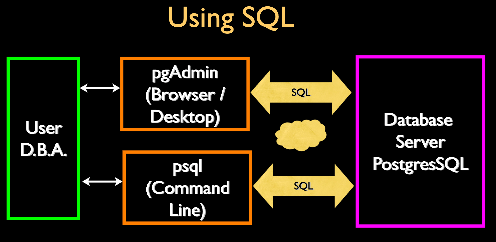

- > SQL 架构解析
- 
- ### 1. 连接 `database sever`
	- ```
	  Host:     pg.pg4e.com 
	  Port:     5432 
	  Database: pg4e_2b4cfbce88 
	  User:     pg4e_2b4cfbce88 
	  Password: pg4e_p_ee29d74e743fc10
	  ```
	- `psql -h pg.pg4e.com -p 5432 -U pg4e_2b4cfbce88 pg4e_2b4cfbce88`
- ### 2. PostgreSQL Commond
	- #### initialize database
		- `psql -U postgres`: Super user
		- `\l`: list of datebase
		- `CREATE USER` [[#blue]]==username== `WITH PASSWORD` [[#blue]]==password==: create role
		- `CREATE DATABASE` [[#blue]]==database== `WITH OWNER` [[#blue]]=='username'==: create datebase
		- `\q`: quit
		- `psql` [[#green]]==database== [[#green]]==username==: connecting to the database with user & password
		- `\dt`: list relations
		- `CREATE TABLE` [[#blue]]==users( name VARCHAR(128), email VARCHAR(128) )==: create table
		- `\d+` [[#blue]]==users==: detail of table 'users'