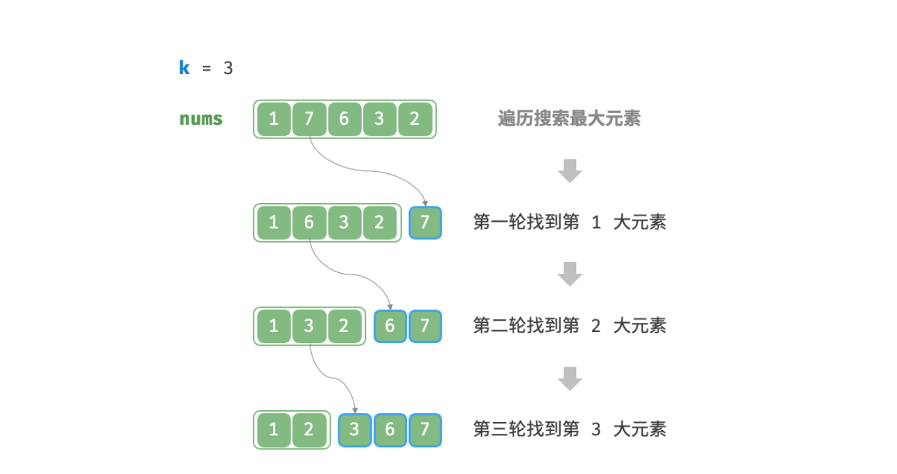
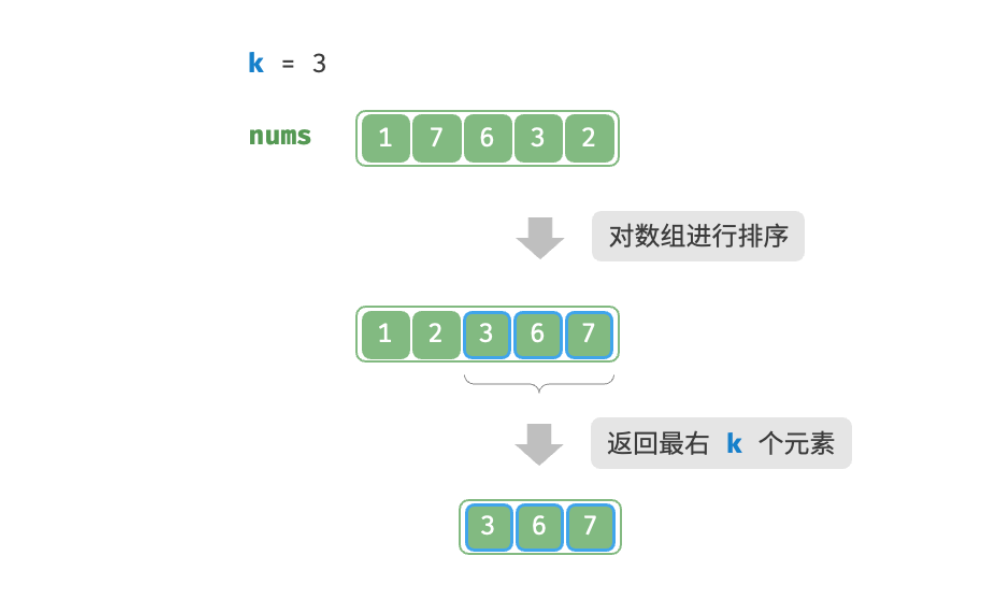

- > https://www.hello-algo.com/chapter_heap/top_k/
-
- > **Question**
  >
  >> 给定一个长度为 $n$ 无序数组 `nums` ，请返回数组中前 $k$ 大的元素。
- ## 方法一：遍历选择
	- 我们可以进行 $k$ 轮遍历，分别在每轮中提取第 1 , 2 , ⋯ , $k$ 大的元素，时间复杂度为 $O(nk)$ 。
	- 该方法只适用于 $k≪n$ 的情况，因为当 $k$ 与 $n$ 比较接近时，其时间复杂度趋向于 $O(n^2)$ ，非常耗时。
	- {:height 297, :width 575}
- ## 方法二：排序
	- 我们可以对数组 `nums` 进行排序，并返回最右边的 $k$ 个元素，时间复杂度为 $O(n\log⁡{n})$ 。
	- 显然，该方法“超额”完成任务了，因为我们只需要找出最大的 $k$ 个元素即可，而不需要排序其他元素。
	- 
- ## 方法三：堆
	- 我们可以基于堆更加高效地解决 Top-K 问题，流程如下：
		- 1. 初始化一个小顶堆，其堆顶元素最小；
		  2. 先将数组的前 $k$ 个元素依次入堆；
		  3. 从第 $k+1$ 个元素开始，若当前元素大于堆顶元素，则将堆顶元素出堆，并将当前元素入堆；
		  4. 遍历完成后，堆中保存的就是最大的 $k$ 个元素；
	- 总共执行了 $n$ 轮入堆和出堆，堆的最大长度为 $k$ ，因此时间复杂度为 $O(n\log{k}⁡)$ 。该方法的效率很高，当 $k$ 较小时，时间复杂度趋向 $O(n)$ ；当 $k$ 较大时，时间复杂度不会超过 $O(n\log{n})$ 。
	- 另外，[[#blue]]==该方法适用于动态数据流的使用场景==。在不断加入数据时，我们可以持续维护堆内的元素，从而实现最大 $k$ 个元素的动态更新。
	-