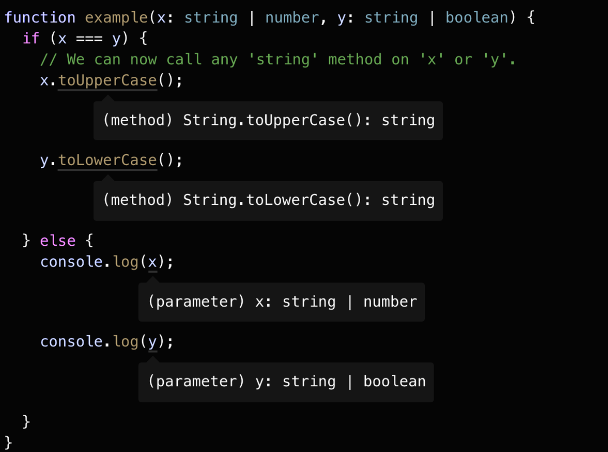

- > https://ts.yayujs.com/handbook/Narrowing.html
-
- ## 类型收窄（Narrowing）
	- TypeScript 的类型检查器会考虑到比如 `if/else` 、三元运算符、循环、真值检查等情况下的类型分析，而这个**将类型推导为更精确类型的过程，我们称之为收窄 (narrowing)**。
- ## typeof 类型保护（type guards）
	- 在 TypeScript 中，检查 `typeof` 返回的值就是一种**类型保护**。TypeScript 知道 `typeof` 不同值的结果，看下面这个例子：
	- ```
	  function printAll(strs: string | string[] | null) {
	    if (typeof strs === "object") {
	      for (const s of strs) {
	  		  // Object is possibly 'null'.
	        console.log(s);
	      }
	    } else if (typeof strs === "string") {
	      console.log(strs);
	    } else {
	      // do nothing
	    }
	  }
	  ```
	- 在这个 `printAll` 函数中，我们尝试判断 `strs` 是否是一个对象，原本的目的是判断它是否是一个数组类型，但是[[#red]]==在 JavaScript 中，`typeof null` 也会返回 `object`==。而这是 JavaScript 一个不幸的历史事故。
	- 熟练的用户自然不会感到惊讶，但也并不是所有人都如此熟练。不过幸运的是，[[#green]]==TypeScript 会让我们知道 `strs` 被收窄为 `strings[] | null` ，而不仅仅是 `string[]`。==
- ## 真值收窄（Truthiness narrowing）
	- 在 JavaScript 中，[[#green]]==我们可以在条件语句中使用任何表达式，比如 `&&` 、`||`、`!` 等==，举个例子，像 `if` 语句就不需要条件的结果总是 `boolean` 类型。
	- 这是因为 JavaScript 会做**隐式类型转换**，像 `0` 、`NaN`、`""`、`0n`、`null` `undefined` 这些值都会被转为 `false`，其他的值则会被转为 `true`。
	- 当然你也可以使用 `Boolean` 函数强制转为 `boolean` 值，或者使用更加简短的`!!`。
	- 但还是要注意，[[#red]]==在基本类型上的真值检查很容易导致错误==，比如，如果我们这样写 `printAll` 函数：
	- ```
	  function printAll(strs: string | string[] | null) {
	    // !!!!!!!!!!!!!!!!
	    //  DON'T DO THIS!
	    //   KEEP READING
	    // !!!!!!!!!!!!!!!!
	    if (strs) {
	      if (typeof strs === "object") {
	        for (const s of strs) {
	          console.log(s);
	        }
	      } else if (typeof strs === "string") {
	        console.log(strs);
	      }
	    }
	  }
	  ```
	- > 我们把原本函数体的内容包裹在一个 `if (strs)` 真值检查里，这里有一个问题，就是我们无法正确处理**空字符串**的情况。如果传入的是空字符串，真值检查判断为 `false`，就会进入错误的处理分支。
- ## 等值收窄（Equality narrowing）
	- Typescript 也会[[#green]]==使用 `switch` 语句和等值检查比如 `===` `!==` `==` `!=` 去收窄类型。==比如：
	- {:height 364, :width 458}
- ## in 操作符收窄
	- JavaScript 中有一个 `in` 操作符可以判断一个对象是否有对应的属性名。TypeScript 也可以通过这个收窄类型。
- ## instanceof 收窄
	- `instanceof` 也是一种类型保护，TypeScript 也可以通过识别 `instanceof` 正确的类型收窄。
- ## 赋值语句（Assignments）
	- TypeScript 可以根据赋值语句的右值，正确的收窄左值。
- ## 控制流分析（Control flow analysis）
	- 现在我们看看在 `if` `while`等条件控制语句中的类型保护，基于**可达性**(**reachability**) 的代码分析就叫做控制流分析(control flow analysis)。
- ## 类型判断式(type predicates)
	- 所谓 `predicate` 就是一个返回 `boolean` 值的函数。
	- 如果你想直接通过代码控制类型的改变， 你可以自定义一个类型保护。实现方式是定义一个函数，这个函数返回的类型是类型判断式，示例如下：
	- ```
	  function isFish(pet: Fish | Bird): pet is Fish {
	    return (pet as Fish).swim !== undefined;
	  }
	  ```
	- `pet is Fish`就是我们的**类型判断式**，[[#green]]==一个类型判断式采用 `parameterName is Type`的形式，但 `parameterName` 必须是当前函数的参数名。==
- ## 可辨别联合（Discriminated unions）
	- 让我们试想有这样一个处理 `Shape` （比如 `Circles`、`Squares` ）的函数，`Circles` 会记录它的半径属性，`Squares` 会记录它的边长属性，我们使用一个 `kind` 字段来区分判断处理的是 `Circles` 还是 `Squares`，这是初始的 `Shape` 定义：
	- ```
	  interface Shape {
	    kind: "circle" | "square";
	    radius?: number;
	    sideLength?: number;
	  }
	  ```
	- 现在我们写一个获取面积的 `getArea` 函数，而圆和正方形的计算面积的方式有所不同，我们先处理一下是 `Circle` 的情况：
	- ```
	  function getArea(shape: Shape) {
	    if (shape.kind === "circle") {
	      return Math.PI * shape.radius ** 2;
	  		// Object is possibly 'undefined'.
	    }
	  }
	  ```
	- > 在 `strictNullChecks` 模式下，即便我们判断 `kind` 是 `circle` 的情况，但由于 `radius` 是一个可选属性，TypeScript 依然会认为 `radius` 可能是 `undefined`。
	- 此时 `Shape`的问题在于[[#red]]==类型检查器并没有方法根据 `kind` 属性判断 `radius` 和 `sideLength` 属性是否存在==，而这点正是我们需要告诉类型检查器的，所以我们可以这样定义 `Shape`:
	- ```
	  interface Circle {
	    kind: "circle";
	    radius: number;
	  }
	   
	  interface Square {
	    kind: "square";
	    sideLength: number;
	  }
	   
	  type Shape = Circle | Square;
	  ```
	- [[#green]]==当联合类型中的每个类型，都包含了一个共同的字面量类型的属性，TypeScript 就会认为这是一个**可辨别联合（discriminated union）**，然后可以将具体成员的类型进行收窄。==
- ## never 类型
	- 当进行收窄的时候，如果你把所有可能的类型都穷尽了，TypeScript 会使用一个 `never` 类型来表示一个不可能存在的状态。
- ## 穷尽检查（Exhaustiveness checking）
	-
	-
-