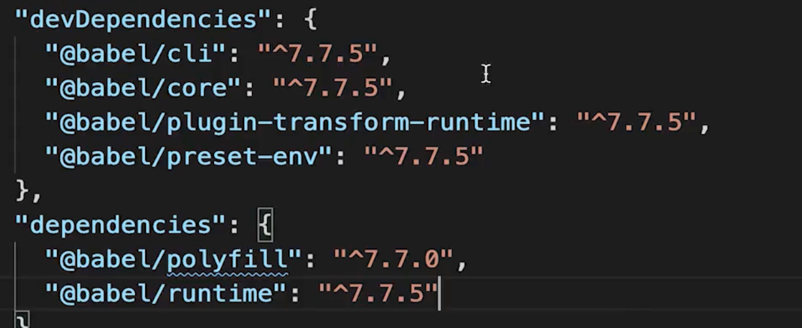

- ## Webpack基础
	- ### 拆分配置和 merge
	  background-color:: pink
		- 不同环境对应不同的webpack配置文件**拆分**：
			- - webpack.common.js 通用配置
			- - webpack.dev.js 只在dev开发环境配置，如dev-server
			- - webpack.prod.js 在生成环境的配置，如contentHash、图片引入base64
		- **merge**：
			- ```
			  const { smart } = require('webpack-merge')；
			  const webpackCommonConf = require('./webpack.common.js');
			  
			  module.exports = smart(webpackCommonConf, {
			      ....
			  })
			  ```
	- ### 启动本地服务 dev-server
	  background-color:: pink
		- `webpack serve --open`：cli 启动dev-server
		- `contentBase`：指定[[#green]]==根目录==或者用`static`指定[[#green]]==静态资源==
	- ### 处理 ES6
	  background-color:: pink
		- `babel-loader`
		- `.babelrc`
	- ### 处理 CSS
	  background-color:: pink
		- `style-loader`
		- `css-loader`
		- `postcss-loader`：给 CSS 自动加前缀、使用下一代 CSS 语法
	-
- ## Webpack 高级配置
	- ### webpack 如何配置多入口
	  background-color:: pink
		- `entry: './app/entry'`：只有1个入口，入口只有1个文件
		- `entry: ['./app/entry1', './app/entry2']`： 只有1个入口，入口有2个文件
		- `entry: { a: './app/entry-a', b: ['./app/entry-b1', './app/entry-b2']}`：有2个入口
		- 对应输出output：
			- ```
			  output: {
			    // 输出文件的名称
			    filename: 'bundle.js', // 完整的名称
			    filename: '[name].js', // 当配置了多个 entry 时，通过名称模版为不同的 entry 生成不同的文件名称
			    filename: '[chunkhash].js', // 根据文件内容 hash 值生成文件名称，用于浏览器长时间缓存文件
			  ```
		- 多入口生成html：
			- ```
			  const { WebPlugin } = require('web-webpack-plugin');
			  
			  new WebPlugin({
			  	filename: 'index.html',
			  	// html template file path（full path relative to webpack.config.js）
			  	template: './template.html',
			  	requires: ['A', 'B'],
			  }),
			  ```
	- ### webpack 抽离CSS 文件
	  background-color:: pink
		- dev环境：配置不变，`style-loader`、`css-loader`、`postcss-loader`
		- 生产环境：
			- `MiniCssExtractPlugin.loader`：不再使用style- loader，抽离css到单独文件；
			- `css-loader`
			- `postcss-loader`
			- [[#green]]==抽离文件并压缩==：
				- ```
				  plugins: [
				  	new MiniCssExtractPlugin({
				      	filename: 'css/main.[contentHash:8].css'
				      })
				  ];
				  
				  optimization: [
				  	minimizer: [
				      	new CssMinimizerPlugin(),
				          // or 
				          // new TerserPlugin(), new OptimizeCssAssetsPlugin()
				      ]
				  ]
				  ```
	- ### webpack 抽离公共代码
	  background-color:: pink
	  id:: 64ec22c5-2fe4-420e-a7d5-6efd81c010d3
	  collapsed:: true
		- 公共代码包括：**公共的引用**和**第三方依赖包**。
		- webpack 4.0 之前的方案：[[#green]]==CommonsChunkPlugin==；4.0 之后的方案：[[#green]]==optimization.splitChunks==
		- optimization
			- splitChunks
				- chunks: `all`、`initial`、`async`
				- cacheGroup 缓存分组
					- vendor 第三方模块
						- name: 'vendor',  // chunk 名称
						- priority: 1, // 权限更高，优先抽离，重要！！
						- test: \/node_modules\/,
						- miniSize: 0, // 大小限制
						- minChunks: 1, // 最少复用次数
					- common 公共模块
						- name: 'common',
						- priority: 0,
						- miniSize: 0,
						- minChunks: 2,
	- ### webpack 处理JSX
	  background-color:: pink
		- `.babelrc`
		- ```
		  {
		  	"presets": ["@babel/preset-react"]
		  }
		  ```
	- ### module chunk bundle 的区别
	  background-color:: pink
		- `module`：各个源码文件，webpack 中一切皆模块；
		- `chunk`：多模块合并的代码块，如 entry、import()、splitChunk；
		- `bundle`：最终输出打包文件
- ## Webpack 性能优化
	- ### 构建速度优化
	  background-color:: pink
		- [[#green]]==优化 babel-loader==
			- ```
			  {
			  	test: /.js$/,
			      use: ['babel-loader?cacheDirectory'], // 开启缓存
			      include: path.resolve(_dirname, 'src'), // 明确作用范围
			      // or exclude
			  }
			  ```
		- [[#green]]==IgnorePlugin 避免引入无用模块==
			- `new webpack.IgnorePlugin(/\.\/locale/,  /moment/)`
		- [[#green]]==noParse 避免重复打包==
		  id:: 6524c21a-c261-4aae-86bc-134735734da1
			- 类似 xxxx.min.js 已经压缩打包的，避免重复打包
			- ```
			  module: {
			  	// 忽略对'react.min.js'文件的递归解析处理
			      noParse: [/react\.min\.js$/],
			  }
			  ```
		- [[#blue]]==* happyPack 多进程打包==
			- JS 单线程，开启**多进程**打包，提高构建速度
			- 适合大项目，较多文件时开启；
			- ```
			  const HappyPack = require('happypack');
			  
			  module.export = {
			  	...,
			      module: {
			      	rules: [
			          	// js
			              {
			              	test: /\.js$/,
			                  // 把对.js文件的处理转交给id为babel的HapptPack实例
			                  use: [happypack/loader?id=babel],
			                  include: ...,
			              }
			          ],
			      },
			      plugins: [
			      	// HappyPack 开启多进程
			          new HappyPack({
			          	id: 'babel',
			              loaders: [babel-loader?cacheDirectory]
			          })
			      ]
			  }
			  ```
		- [[#blue]]==ParallelUglifyPlugin 多进程压缩 JS==
			- ```
			  const ParallelUglifyPlugin = require('webpack-parallel-uglify-plugin')
			  
			  ...
			  	// 使用 ParallelUglifyPlugin 并行压缩输出的 JS 代码
			          new ParallelUglifyPlugin({
			              // 传递给 UglifyJS 的参数
			              // （还是使用 UglifyJS 压缩，只不过帮助开启了多进程）
			              uglifyJS: {
			                  output: {
			                      beautify: false, // 最紧凑的输出
			                      comments: false, // 删除所有的注释
			                  },
			                  compress: {
			                      // 删除所有的 `console` 语句，可以兼容ie浏览器
			                      drop_console: true,
			                      // 内嵌定义了但是只用到一次的变量
			                      collapse_vars: true,
			                      // 提取出出现多次但是没有定义成变量去引用的静态值
			                      reduce_vars: true,
			                  }
			              }
			          })
			  ```
		- [[#green]]==热更新（开发环境）==
			- [[#red]]==自动更新==：整个网页刷新，速度较慢， 状态会丢失；
			- [[#green]]==**热更新**==：新代码生效，网页不刷新，状态不丢失；
			- ```
			  const HotModuleReplacementPlugin = require('webpack/lib/HotModuleReplacementPlugin');
			  
			  ...
			  	entry: {
			          // index: path.join(srcPath, 'index.js'),
			          index: [
			              'webpack-dev-server/client?http://localhost:8080/',
			              'webpack/hot/dev-server',
			              path.join(srcPath, 'index.js')
			          ],
			          ...
			      },
			      ...
			      plugins: [
			      	...,
			          new HotModuleReplacementPlugin()
			      ],
			      devServer: {
			          port: 8080,
			          progress: true,  // 显示打包的进度条
			          contentBase: distPath,  // 根目录
			          open: true,  // 自动打开浏览器
			          compress: true,  // 启动 gzip 压缩
			  
			          hot: true,
			      },
			      ...
			  ```
		- [[#green]]==DllPlugin 动态链接库插件（开发环境）==
		  id:: 6524c21a-8667-4bcb-b15e-27f8061ea778
			- webpack 已内置 DllPlugin 支持；
			- DllPlugin - 打包出 dll 文件：
				- ```
				  const path = require('path')
				  const DllPlugin = require('webpack/lib/DllPlugin')
				  const { srcPath, distPath } = require('./paths')
				  
				  module.exports = {
				    mode: 'development',
				    // JS 执行入口文件
				    entry: {
				      // 把 React 相关模块的放到一个单独的动态链接库
				      react: ['react', 'react-dom']
				    },
				    output: {
				      // 输出的动态链接库的文件名称，[name] 代表当前动态链接库的名称，
				      // 也就是 entry 中配置的 react 和 polyfill
				      filename: '[name].dll.js',
				      // 输出的文件都放到 dist 目录下
				      path: distPath,
				      // 存放动态链接库的全局变量名称，例如对应 react 来说就是 _dll_react
				      // 之所以在前面加上 _dll_ 是为了防止全局变量冲突
				      library: '_dll_[name]',
				    },
				    plugins: [
				      // 接入 DllPlugin
				      new DllPlugin({
				        // 动态链接库的全局变量名称，需要和 output.library 中保持一致
				        // 该字段的值也就是输出的 manifest.json 文件 中 name 字段的值
				        // 例如 react.manifest.json 中就有 "name": "_dll_react"
				        name: '_dll_[name]',
				        // 描述动态链接库的 manifest.json 文件输出时的文件名称
				        path: path.join(distPath, '[name].manifest.json'),
				      }),
				    ],
				  }
				  ```
			- DllReferencePlugin - 使用 dll 文件:
				- ```
				  // 第一，引入 DllReferencePlugin
				  const DllReferencePlugin = require('webpack/lib/DllReferencePlugin');
				  
				  ...
				  	exclude: /node_modules/ // 第二，不要再转换 node_modules 的代码
				      ...
				      
				      plugins: [
				          // 第三，告诉 Webpack 使用了哪些动态链接库
				          new DllReferencePlugin({
				              // 描述 react 动态链接库的文件内容
				              manifest: require(path.join(distPath, 'react.manifest.json')),
				          }),
				      ],
				  ```
	- ### 产出代码优化
	  background-color:: pink
		- [[#blue]]==小图片 base64 编码==
			- ```
			  // 图片 - 考虑 base64 编码的情况
			              {
			                  test: /\.(png|jpg|jpeg|gif)$/,
			                  use: {
			                      loader: 'url-loader',
			                      options: {
			                          // 小于 5kb 的图片用 base64 格式产出
			                          // 否则，依然延用 file-loader 的形式，产出 url 格式
			                          limit: 5 * 1024,
			  
			                          // 打包到 img 目录下
			                          outputPath: '/img/',
			  
			                          // 设置图片的 cdn 地址（也可以统一在外面的 output 中设置，那将作用于所有静态资源）
			                          // publicPath: 'http://cdn.abc.com'
			                      }
			                  }
			              },
			  ```
		- [[#blue]]==bundle 加 hash==
			- `filename: '[name].[contentHash:8].js'`
		- [[#blue]]==懒加载==
		- [[#blue]]==提取公共代码==
			- {{embed ((64ec22c5-2fe4-420e-a7d5-6efd81c010d3))}}
		- [[#green]]==IgnorePlugin==
		- [[#green]]==使用 CDN 加速==
			- `publicPath: 'cdn.abc.com'`
		- [[#green]]==使用 production mode==
		  id:: 6524c21a-59f6-47d0-a06a-87f0539aaa5f
			- 自动开启代码压缩；
			- Vue、React会自动删掉调试代码（如开发环境的warning）；
			- 启动 [[#blue]]==**Tree-Shaking**==
				- `Tree Shaking` 指基于 ES6 Module 进行静态分析，通过 AST 将用不到的函数进行移除，从而减小打包体积。
				- 必须在 ES6 Module 下才能启用 Tree- Shaking，不能在 CommonJs 下使用：
					- ES6 Module 是静态引入，在编译时引入；
					- [[#red]]==CommonJs 是动态引入，执行时才引入，无法在打包时分析；==
				- [[#red]]==注意：==`Tree Shaking`会删除一些具有副作用 (Side Effect) 的函数，例如修改全局作用域的函数，需要在 `package.json` 中配置 `sideEffects`
					- ```
					  "sideEffects": [
					  	"*.css",
					      ...
					  ]
					  ```
				- 注意 Babel 默认配置的影响，不要转译 ES6 语法：
					- ```
					  // babel.config.js
					  "preset": [
					  	[
					      	'@babel/preset-env',
					          {
					          	module: false;
					              ...
					          }
					      ]
					  ]
					  ```
		- [[#green]]==Scope Hosting==
		  id:: 6524c21a-258c-40f4-bccb-1090ecaaffa0
			- 代码体积更小；
			- 创建函数作用域更少；
			- 代码可读性更好；
			- ```
			  plugins: [
			  	// 开启 Scope Hosting
			  	new ModuleConcatenationPlugin(),
			  ]
			  ```
- ## Babel
	- ### 环境搭建
	  background-color:: pink
		- `@babel/cli`、`@babel/core`、`@babel/preset-env`
		- 
		-
		- `.babelrc`:
			- ```
			  {
			  	"presets": [
			      	[
			          	"@babel/preset-env"
			          ]
			      ],
			      "plugins": [
			      ]
			  }
			  ```
		- ### babel-polyfill
		  background-color:: pink
			- `@babel/polyfill`：`core-js`和`regenerator`的集合
			- **按需引入**：
				- `.babelrc`
				- ```
				   "presets": [
				          [
				              "@babel/preset-env",
				              {
				                  "useBuiltIns": "usage",  // 按需引入
				                  "corejs": 3  // corejs版本
				              }
				          ]
				      ],
				  ```
			- [[#red]]==问题：== 污染全局环境
		- ### babel-runtime
		  background-color:: pink
			- _变量 命名，不污染全局环境
			- `.babelrc`:
				- ```
				  "plugins": [
				          [
				              "@babel/plugin-transform-runtime",
				              {
				                  "absoluteRuntime": false,
				                  "corejs": 3,
				                  "helpers": true,
				                  "regenerator": true,
				                  "useESModules": false
				              }
				          ]
				      ]
				  ```