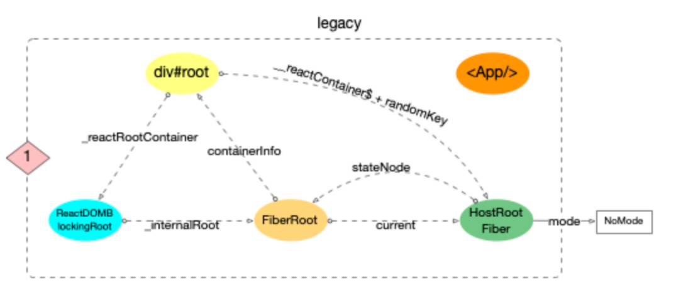
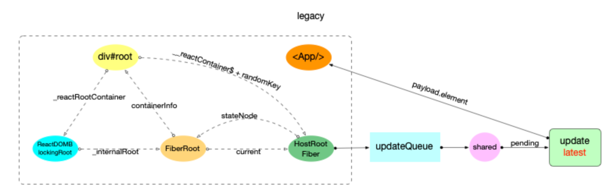
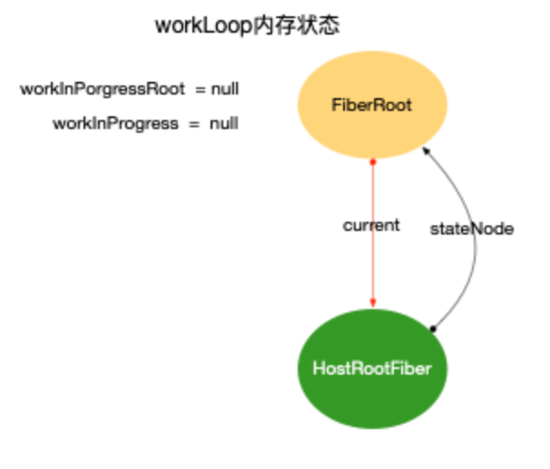
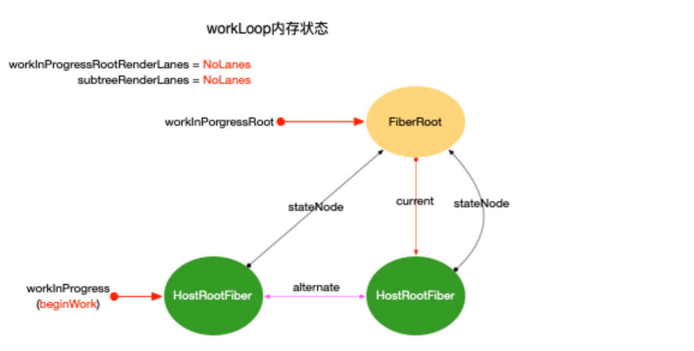

- 示例代码如下([codesandbox 地址](https://codesandbox.io/s/busy-jang-b26hy?file=/src/App.js)):
- ```js
  class App extends React.Component {
    componentDidMount() {
      console.log(`App Mount`);
      console.log(`App 组件对应的fiber节点: `, this._reactInternals);
    }
    render() {
      return (
        <div className="app">
          <header>header</header>
          <Content />
        </div>
      );
    }
  }
  
  class Content extends React.Component {
    componentDidMount() {
      console.log(`Content Mount`);
      console.log(`Content 组件对应的fiber节点: `, this._reactInternals);
    }
    render() {
      return (
        <React.Fragment>
          <p>1</p>
          <p>2</p>
        </React.Fragment>
      );
    }
  }
  export default App;
  ```
- ## 启动阶段
	- 在进入`react-reconciler`包之前([[#green]]==调用`updateContainer`==之前), 内存状态图如下:
	- 
	- 根据这个结构, 可以在控制台中打出当前页面对应的`fiber`树(用于观察其结构):
		- `document.getElementById('root')._reactRootContainer._internalRoot.current;`
	- 然后进入`react-reconciler`包调用[updateContainer 函数](https://github.com/facebook/react/blob/v17.0.2/packages/react-reconciler/src/ReactFiberReconciler.old.js#L250-L321):
		- ```js
		  // ... 省略了部分代码
		  export function updateContainer(
		    element: ReactNodeList,
		    container: OpaqueRoot,
		    parentComponent: ?React$Component<any, any>,
		    callback: ?Function,
		  ): Lane {
		    // 获取当前时间戳
		    const current = container.current;
		    const eventTime = requestEventTime();
		    // 1. 创建一个优先级变量(车道模型)
		    const lane = requestUpdateLane(current);
		  
		    // 2. 根据车道优先级, 创建update对象, 并加入fiber.updateQueue.pending队列
		    const update = createUpdate(eventTime, lane);
		    update.payload = { element };
		    callback = callback === undefined ? null : callback;
		    if (callback !== null) {
		      update.callback = callback;
		    }
		    enqueueUpdate(current, update);
		  
		    // 3. 进入reconciler运作流程中的`输入`环节
		    scheduleUpdateOnFiber(current, lane, eventTime);
		    return lane;
		  }
		  ```
	- 由于[[#green]]==`update`对象的创建==, 此时的内存结构如下:
	- 
- ## 构造阶段
	- 为了突出构造过程,排除干扰,先把内存状态图中的`FiberRoot`和`HostRootFiber`单独提出来:
	- {:height 258, :width 314}
	- 在[scheduleUpdateOnFiber 函数](https://github.com/facebook/react/blob/v17.0.2/packages/react-reconciler/src/ReactFiberWorkLoop.old.js#L517-L619)中:
		- ```js
		  // ...省略部分代码
		  export function scheduleUpdateOnFiber(
		    fiber: Fiber,
		    lane: Lane,
		    eventTime: number,
		  ) {
		    // 标记优先级
		    const root = markUpdateLaneFromFiberToRoot(fiber, lane);
		    if (lane === SyncLane) {
		      if (
		        (executionContext & LegacyUnbatchedContext) !== NoContext &&
		        (executionContext & (RenderContext | CommitContext)) === NoContext
		      ) {
		        // 首次渲染, 直接进行`fiber构造`
		        performSyncWorkOnRoot(root);
		      }
		      // ...
		    }
		  }
		  ```
		- 可以看到, 在[[#green]]==`Legacy`模式下且首次渲染==时, 有 2 个函数[markUpdateLaneFromFiberToRoot](https://github.com/facebook/react/blob/v17.0.2/packages/react-reconciler/src/ReactFiberWorkLoop.old.js#L625-L667)和[performSyncWorkOnRoot](https://github.com/facebook/react/blob/v17.0.2/packages/react-reconciler/src/ReactFiberWorkLoop.old.js#L965-L1045).
		- 其中`markUpdateLaneFromFiberToRoot(fiber, lane)`函数在`fiber树构造(对比更新)`中才会发挥作用, 因为在`初次创建`时并没有与当前页面所对应的`fiber树`, 所以核心代码并没有执行, 最后直接返回了`FiberRoot`对象.
		- `performSyncWorkOnRoot`看起来源码很多, `初次创建`中真正用到的就 2 个函数:
			- ```js
			  function performSyncWorkOnRoot(root) {
			    let lanes;
			    let exitStatus;
			    if (
			      root === workInProgressRoot &&
			      includesSomeLane(root.expiredLanes, workInProgressRootRenderLanes)
			    ) {
			      // 初次构造时(因为root=fiberRoot, workInProgressRoot=null), 所以不会进入
			    } else {
			      // 1. 获取本次render的优先级, 初次构造返回 NoLanes
			      lanes = getNextLanes(root, NoLanes);
			      // 2. 从root节点开始, 至上而下更新
			      exitStatus = renderRootSync(root, lanes);
			    }
			  
			    // 将最新的fiber树挂载到root.finishedWork节点上
			    const finishedWork: Fiber = (root.current.alternate: any);
			    root.finishedWork = finishedWork;
			    root.finishedLanes = lanes;
			    // 进入commit阶段
			    commitRoot(root);
			  
			    // ...后面的内容本节不讨论
			  }
			  ```
		- [renderRootSync](https://github.com/facebook/react/blob/v17.0.2/packages/react-reconciler/src/ReactFiberWorkLoop.old.js#L1490-L1553):
			- ```js
			  function renderRootSync(root: FiberRoot, lanes: Lanes) {
			    const prevExecutionContext = executionContext;
			    executionContext |= RenderContext;
			    // 如果fiberRoot变动, 或者update.lane变动, 都会刷新栈帧, 丢弃上一次渲染进度
			    if (workInProgressRoot !== root || workInProgressRootRenderLanes !== lanes) {
			      // 刷新栈帧, legacy模式下都会进入
			      prepareFreshStack(root, lanes);
			    }
			    do {
			      try {
			        workLoopSync();
			        break;
			      } catch (thrownValue) {
			        handleError(root, thrownValue);
			      }
			    } while (true);
			    executionContext = prevExecutionContext;
			    // 重置全局变量, 表明render结束
			    workInProgressRoot = null;
			    workInProgressRootRenderLanes = NoLanes;
			    return workInProgressRootExitStatus;
			  }
			  ```
			- 在`renderRootSync`中, 在执行`fiber树构造`前(`workLoopSync`)会先刷新栈帧`prepareFreshStack`.在这里创建了`HostRootFiber.alternate`, 重置全局变量`workInProgress`和`workInProgressRoot`等.
		- 
	- ### 循环构造
	  background-color:: pink
		- 逻辑来到`workLoopSync`,对比一下`workLoopConcurrent`:
			- ```js
			  function workLoopSync() {
			    while (workInProgress !== null) {
			      performUnitOfWork(workInProgress);
			    }
			  }
			  
			  function workLoopConcurrent() {
			    // Perform work until Scheduler asks us to yield
			    while (workInProgress !== null && !shouldYield()) {
			      performUnitOfWork(workInProgress);
			    }
			  }
			  ```
			- 可以看到`workLoopConcurrent`相比于`Sync`, 会多一个**停顿机制**, 这个机制实现了`时间切片`和`可中断渲染`(参考[React 调度原理](https://7km.top/main/scheduler#%E6%97%B6%E9%97%B4%E5%88%87%E7%89%87%E5%8E%9F%E7%90%86))
		- `performUnitOfWork函数`([源码地址](https://github.com/facebook/react/blob/v17.0.2/packages/react-reconciler/src/ReactFiberWorkLoop.old.js#L1642-L1668)):
			- ```js
			  // ... 省略部分无关代码
			  function performUnitOfWork(unitOfWork: Fiber): void {
			    // unitOfWork就是被传入的workInProgress
			    const current = unitOfWork.alternate;
			    let next;
			    next = beginWork(current, unitOfWork, subtreeRenderLanes);
			    unitOfWork.memoizedProps = unitOfWork.pendingProps;
			    if (next === null) {
			      // 如果没有派生出新的节点, 则进入completeWork阶段, 传入的是当前unitOfWork
			      completeUnitOfWork(unitOfWork);
			    } else {
			      workInProgress = next;
			    }
			  }
			  ```
		-
		-
-