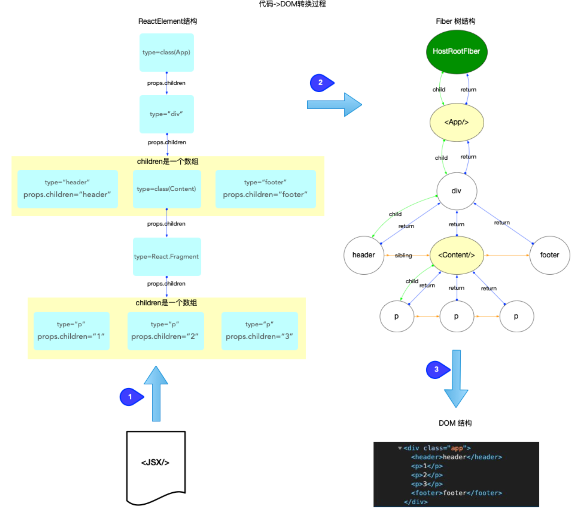

- > 在 React 运行时中, `fiber树构造`位于`react-reconciler`包.
  >
  > 1. 从`scheduler`调度中心的角度来看, 它是任务队列`taskQueue`中的一个具体的任务回调(`task.callback`).
  > 2. 从[React 工作循环](https://7km.top/main/workloop)的角度来看, 它属于`fiber树构造循环`.
- ## ReactElement, Fiber, DOM 三者的关系
	- ### 1. [ReactElement 对象](https://github.com/facebook/react/blob/v17.0.2/packages/react/src/ReactElement.js#L126-L146)(type 定义在[shared 包中](https://github.com/facebook/react/blob/v17.0.2/packages/shared/ReactElementType.js#L15))
	  background-color:: pink
		- 所有采用`jsx`语法书写的节点, 都会被编译器转换, 最终会以`React.createElement(...)`的方式, 创建出来一个与之对应的`ReactElement`对象.
	- ### 2. [fiber 对象](https://github.com/facebook/react/blob/v17.0.2/packages/react-reconciler/src/ReactFiber.old.js#L116-L155)(type 类型的定义在[ReactInternalTypes.js](https://github.com/facebook/react/blob/v17.0.2/packages/react-reconciler/src/ReactInternalTypes.js#L47-L174)中)
	  background-color:: pink
		- `fiber对象`是通过`ReactElement`对象进行创建的, 多个`fiber对象`构成了一棵`fiber树`, `fiber树`是构造`DOM树`的数据模型, `fiber树`的任何改动, 最后都体现到`DOM树`.
	- ### 3. [DOM 对象](https://developer.mozilla.org/zh-CN/docs/Web/API/Document_Object_Model): 文档对象模型
	  background-color:: pink
		- `DOM`将文档解析为一个由节点和对象（包含属性和方法的对象）组成的结构集合, 也就是常说的`DOM树`.
		- `JavaScript`可以访问和操作存储在 DOM 中的内容, 也就是操作`DOM对象`, 进而触发 UI 渲染.
	- 
	- [[#red]]==注意:==
		- 开发人员能够控制的是`JSX`, 也就是`ReactElement`对象.
		- `fiber树`是通过`ReactElement`生成的, 如果脱离了`ReactElement`,`fiber树`也无从谈起. 所以是`ReactElement`树(不是严格的树结构, 为了方便也称为树)驱动`fiber树`.
		- `fiber树`是`DOM树`的数据模型, `fiber树`驱动`DOM树`
- ## 全局变量
	-
-