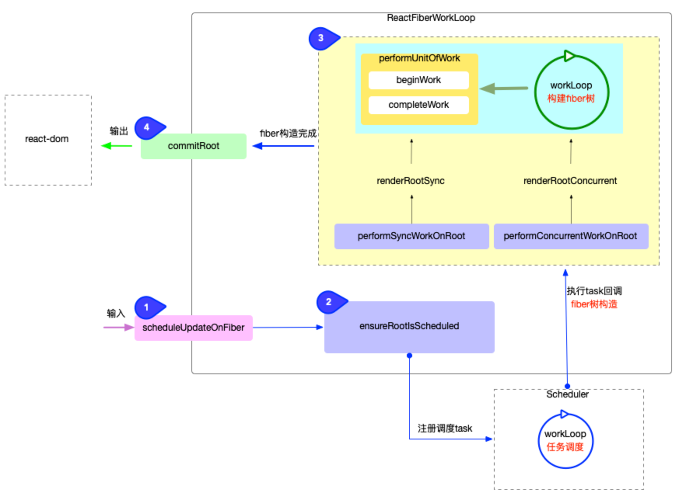

- > 本节从宏观上分析了`reconciler 运作流程`, 并将其分为了 4 个步骤, 基本覆盖了`react-reconciler`包的核心逻辑.
-
- ## 概览
	- `react-reconciler`包的主要作用, 将主要功能分为 4 个方面：
		- **输入**: 暴露`api`函数(如: `scheduleUpdateOnFiber`), 供给其他包(如`react`包)调用.
		  logseq.order-list-type:: number
		- **注册调度任务**: 与调度中心(`scheduler`包)交互, 注册调度任务`task`, 等待任务回调.
		  logseq.order-list-type:: number
		- **执行任务回调**: 在内存中构造出`fiber树`, 同时与与渲染器(`react-dom`)交互, 在内存中创建出与`fiber`对应的`DOM`节点.
		  logseq.order-list-type:: number
		- **输出**: 与渲染器(`react-dom`)交互, 渲染`DOM`节点.
		  logseq.order-list-type:: number
		- 
- ## 分解
	- ### 输入
	  background-color:: pink
		- 在`ReactFiberWorkLoop.js`中, 承接输入的函数只有`scheduleUpdateOnFiber`[源码地址](https://github.com/facebook/react/blob/v17.0.2/packages/react-reconciler/src/ReactFiberWorkLoop.old.js#L517-L619). 在`react-reconciler`对外暴露的 api 函数中, [[#green]]==只要涉及到需要改变 fiber 的操作(无论是`首次渲染`或`后续更新`操作), 最后都会间接调用`scheduleUpdateOnFiber`==, 所以`scheduleUpdateOnFiber`函数是输入链路中的`必经之路`.
			- ```js
			  // 唯一接收输入信号的函数
			  export function scheduleUpdateOnFiber(
			    fiber: Fiber,
			    lane: Lane,
			    eventTime: number,
			  ) {
			    // ... 省略部分无关代码
			    const root = markUpdateLaneFromFiberToRoot(fiber, lane);
			    if (lane === SyncLane) {
			      if (
			        (executionContext & LegacyUnbatchedContext) !== NoContext &&
			        (executionContext & (RenderContext | CommitContext)) === NoContext
			      ) {
			        // 直接进行`fiber构造`
			        performSyncWorkOnRoot(root);
			      } else {
			        // 注册调度任务, 经过`Scheduler`包的调度, 间接进行`fiber构造`
			        ensureRootIsScheduled(root, eventTime);
			      }
			    } else {
			      // 注册调度任务, 经过`Scheduler`包的调度, 间接进行`fiber构造`
			      ensureRootIsScheduled(root, eventTime);
			    }
			  }
			  ```
		- 逻辑进入到`scheduleUpdateOnFiber`之后, 后面有 2 种可能：
			- 不经过调度, 直接进行`fiber构造`.
			  logseq.order-list-type:: number
			- 注册调度任务, 经过`Scheduler`包的调度, 间接进行`fiber构造`.
			  logseq.order-list-type:: number
	- ### 注册调度任务
	  background-color:: pink
		- 与`输入`环节紧密相连, `scheduleUpdateOnFiber`函数之后, 立即进入`ensureRootIsScheduled`函数([源码地址](https://github.com/facebook/react/blob/v17.0.2/packages/react-reconciler/src/ReactFiberWorkLoop.old.js#L674-L736)):
			- ```js
			  // ... 省略部分无关代码
			  function ensureRootIsScheduled(root: FiberRoot, currentTime: number) {
			    // 前半部分: 判断是否需要注册新的调度
			    const existingCallbackNode = root.callbackNode;
			    const nextLanes = getNextLanes(
			      root,
			      root === workInProgressRoot ? workInProgressRootRenderLanes : NoLanes,
			    );
			    const newCallbackPriority = returnNextLanesPriority();
			    if (nextLanes === NoLanes) {
			      return;
			    }
			    if (existingCallbackNode !== null) {
			      const existingCallbackPriority = root.callbackPriority;
			      if (existingCallbackPriority === newCallbackPriority) {
			        return;
			      }
			      cancelCallback(existingCallbackNode);
			    }
			  
			    // 后半部分: 注册调度任务
			    let newCallbackNode;
			    if (newCallbackPriority === SyncLanePriority) {
			      newCallbackNode = scheduleSyncCallback(
			        performSyncWorkOnRoot.bind(null, root),
			      );
			    } else if (newCallbackPriority === SyncBatchedLanePriority) {
			      newCallbackNode = scheduleCallback(
			        ImmediateSchedulerPriority,
			        performSyncWorkOnRoot.bind(null, root),
			      );
			    } else {
			      const schedulerPriorityLevel =
			        lanePriorityToSchedulerPriority(newCallbackPriority);
			      newCallbackNode = scheduleCallback(
			        schedulerPriorityLevel,
			        performConcurrentWorkOnRoot.bind(null, root),
			      );
			    }
			    root.callbackPriority = newCallbackPriority;
			    root.callbackNode = newCallbackNode;
			  }
			  ```
		- `ensureRootIsScheduled`的逻辑很清晰, 分为 2 部分:
			- 前半部分: 判断是否需要注册新的调度(如果无需新的调度, 会退出函数).
			  logseq.order-list-type:: number
			- 后半部分: 注册调度任务
			  logseq.order-list-type:: number
				- `performSyncWorkOnRoot`或`performConcurrentWorkOnRoot`被封装到了任务回调(`scheduleCallback`)中;
				  logseq.order-list-type:: number
				- 等待调度中心执行任务, [[#green]]==任务运行其实就是执行`performSyncWorkOnRoot`或`performConcurrentWorkOnRoot`==
				  logseq.order-list-type:: number
	- ### 执行任务回调
	  background-color:: pink
		- [performSyncWorkOnRoot](https://github.com/facebook/react/blob/v17.0.2/packages/react-reconciler/src/ReactFiberWorkLoop.old.js#L965-L1045):
			- ```js
			  ```