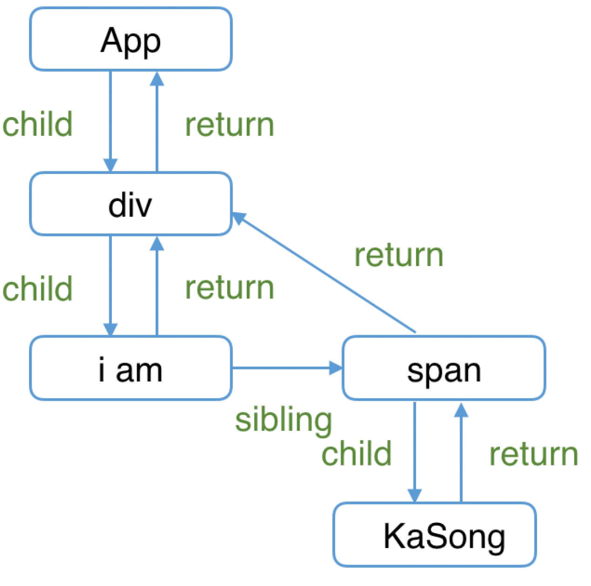

- > https://react.iamkasong.com/process/reconciler.html
-
- > 🔎 `Fiber节点`是如何被创建并构建`Fiber树`的。
- `render阶段`开始于`performSyncWorkOnRoot`或`performConcurrentWorkOnRoot`方法的调用。这取决于本次更新是同步更新还是异步更新。
- ```
  // performSyncWorkOnRoot会调用该方法
  function workLoopSync() {
    while (workInProgress !== null) {
      performUnitOfWork(workInProgress);
    }
  }
  
  // performConcurrentWorkOnRoot会调用该方法
  function workLoopConcurrent() {
    while (workInProgress !== null && !shouldYield()) {
      performUnitOfWork(workInProgress);
    }
  }
  ```
	- `shouldYield`：如果当前浏览器帧没有剩余时间，`shouldYield`会中止循环，直到浏览器有空闲时间后再继续遍历。
	- `workInProgress`：代表当前已创建的`workInProgress fiber`。
	- `performUnitOfWork`：创建下一个`Fiber节点`并赋值给`workInProgress`，并将`workInProgress`与已创建的`Fiber节点`连接起来构成`Fiber树`。
- > 你可以从[这里](https://github.com/facebook/react/blob/970fa122d8188bafa600e9b5214833487fbf1092/packages/react-reconciler/src/ReactFiberWorkLoop.new.js#L1599)看到`workLoopConcurrent`的源码
- 我们知道`Fiber Reconciler`是从`Stack Reconciler`重构而来，通过遍历的方式实现可中断的递归，所以`performUnitOfWork`的工作可以分为两部分：“递”和“归”。
- ## “递”阶段 - beginWork
	- 首先从`rootFiber`开始向下深度优先遍历。为遍历到的每个`Fiber节点`调用[beginWork方法](https://github.com/facebook/react/blob/970fa122d8188bafa600e9b5214833487fbf1092/packages/react-reconciler/src/ReactFiberBeginWork.new.js#L3058)。
	- 该方法会根据传入的`Fiber节点`创建`子Fiber节点`，并将这两个`Fiber节点`连接起来。
	- 当遍历到叶子节点（即没有子组件的组件）时就会进入[[#green]]==“归”阶段==。
- ## “归”阶段 - completeWork
	- 在“归”阶段会调用[completeWork](https://github.com/facebook/react/blob/970fa122d8188bafa600e9b5214833487fbf1092/packages/react-reconciler/src/ReactFiberCompleteWork.new.js#L652)处理`Fiber节点`。
	- 当某个`Fiber节点`执行完`completeWork`，如果其存在`兄弟Fiber节点`（即`fiber.sibling !== null`），会进入其`兄弟Fiber`的“递”阶段。
	- 如果不存在`兄弟Fiber`，会进入`父级Fiber`的“归”阶段。
	- “递”和“归”阶段会交错执行直到“归”到`rootFiber`。至此，`render阶段`的工作就结束了。
- ## 例子
	- ```
	  function App() {
	    return (
	      <div>
	        i am
	        <span>KaSong</span>
	      </div>
	    )
	  }
	  
	  ReactDOM.render(<App />, document.getElementById("root"));
	  ```
	- 对应的`Fiber树`结构：
	- {:height 449, :width 442}
	- `render阶段`会依次执行：
	  1. `rootFiber beginWork`
	  2. `App Fiber beginWork`
	  3. `div Fiber beginWork`
	  4. `"i am" Fiber beginWork`
	  5. `"i am" Fiber completeWork`
	  6. `span Fiber beginWork`
	  7. `span Fiber completeWork`
	  8. `div Fiber completeWork`
	  9. `App Fiber completeWork`
	  10. `rootFiber completeWork`
	- > ⚠️ **注意**
	  > 之所以没有 “KaSong” Fiber 的 beginWork/completeWork，是因为作为一种性能优化手段，针对只有单一文本子节点的`Fiber`，`React`会特殊处理。
- ## 参考资料
	- [The how and why on React’s usage of linked list in Fiber to walk the component’s tree](https://indepth.dev/the-how-and-why-on-reacts-usage-of-linked-list-in-fiber-to-walk-the-components-tree/)
	- [Inside Fiber: in-depth overview of the new reconciliation algorithm in React](https://indepth.dev/inside-fiber-in-depth-overview-of-the-new-reconciliation-algorithm-in-react/)