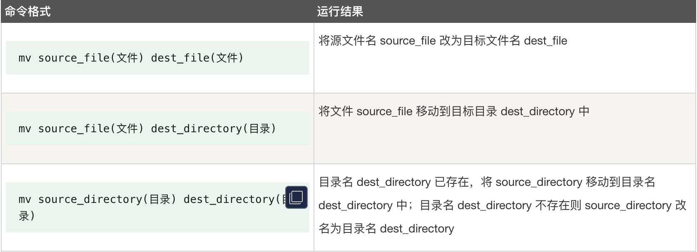
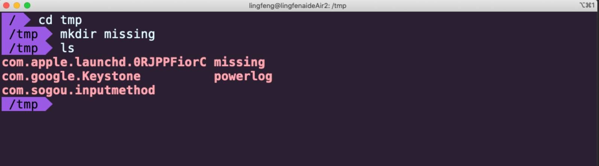
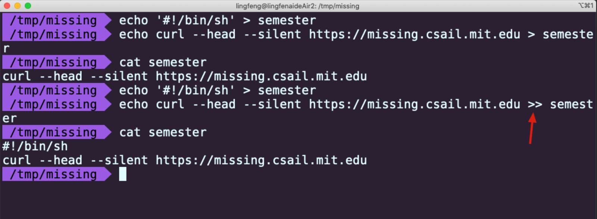
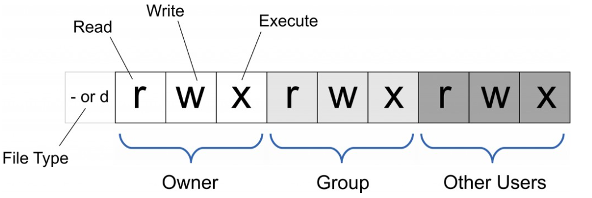
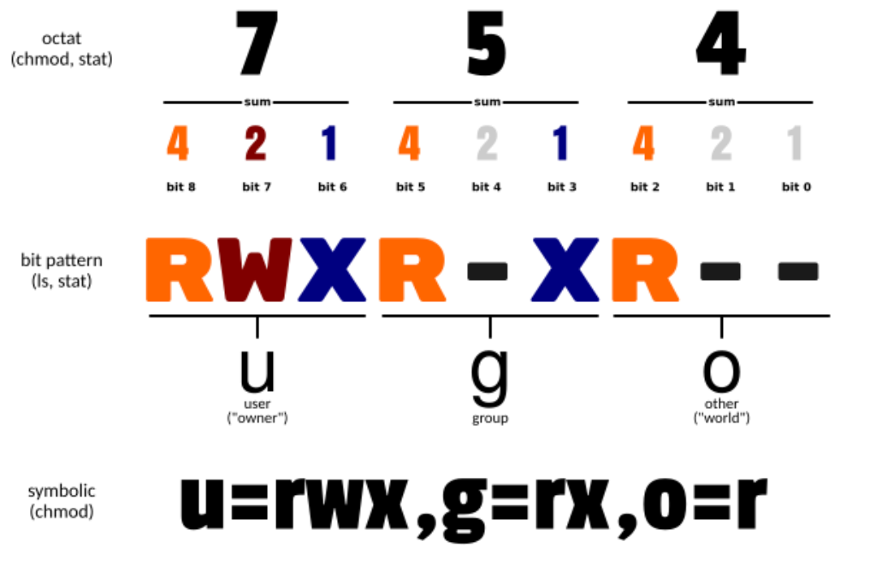
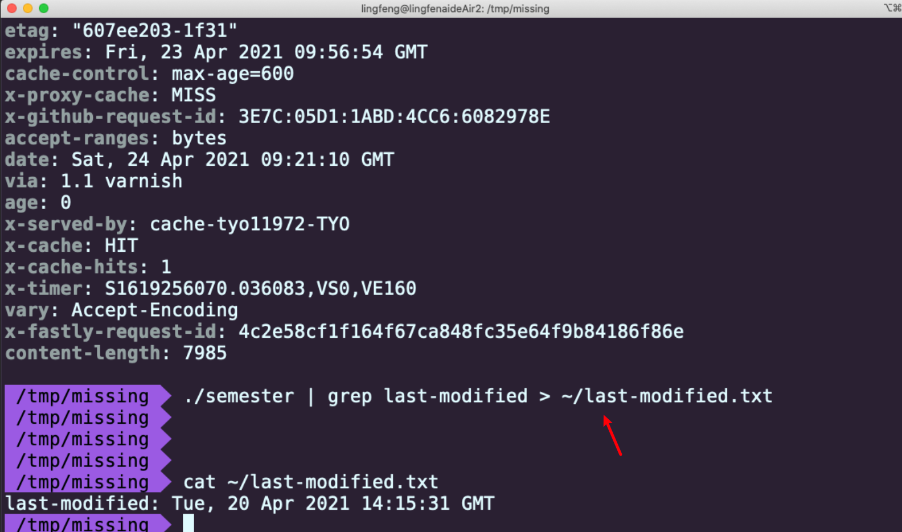

- > https://missing-semester-cn.github.io/2020/course-shell/
- ## The Shell
	- 文字接口：Shell，它允许你执行程序，输入并获取某种半结构化的输出。
	- [[#blue]]==Bourne Again Shell==, 简称 “**bash**”
	- ### 使用 shell
	  background-color:: blue
		- `echo $PATH`: 当我们执行 `echo` 命令时，shell 了解到需要执行 `echo` 这个程序，随后它便会在 `$PATH` 中搜索由 `:` 所分割的一系列目录，基于名字搜索该程序。当找到该程序时便执行（假定该文件是 *可执行程序*，后续课程将详细讲解）。我们也可以绕过 `$PATH`，通过直接指定需要执行的程序的路径来执行该程序。
		- `which $PATH`: 确定某个程序名代表的是哪个具体的程序，可以使用 `which` 程序。
		- ```shell
		  missing:~$ echo $PATH
		  /usr/local/sbin:/usr/local/bin:/usr/sbin:/usr/bin:/sbin:/bin
		  missing:~$ which echo
		  /bin/echo
		  missing:~$ /bin/echo $PATH
		  /usr/local/sbin:/usr/local/bin:/usr/sbin:/usr/bin:/sbin:/bin
		  ```
	- ### 在shell中导航
	  background-color:: blue
		- `pwd`: 当前工作目录
		- `cd`: 切换目录需要使用 `cd` 命令。在路径中，`.` 表示的是当前目录，而 `..` 表示上级目录
			- `cd ~`表示切换到根目录，`cd -`表示切换到前一个目录
		- `ls`: 查看指定目录下包含哪些文件
			- `ls -l` `ll`: 可以更加详细地列出目录下文件或文件夹的信息
			- ```
			  missing:~$ ls -l /home
			  drwxr-xr-x 1 missing  users  4096 Jun 15  2019 missing
			  ```
			- 第一个字符 `d` 表示 `missing` 是一个目录。
			- 然后接下来的九个字符，每三个字符构成一组（`rwx`），它们分别代表了**文件所有者**（`missing`），**用户组**（`users`） 以及**其他所有人**具有的权限，`r`- read, `w`- write, `x` - exacute
		- `mv`: 用于重命名或移动文件
			- ```
			  mv [options] source dest
			  mv [options] source... directory
			  ```
			- **mv 操作文件时是移动并且重命名**
			- 
		- `cp`: 拷贝文件
			- ```
			  cp [options] source dest
			  cp [options] source... directory
			  ```
			- `-r` 或 `--recursive`：用于[[#green]]==递归==复制目录及其所有的子目录和文件，如果要复制目录，需要使用该选项。
			- `-i` 或 `--interactive`：在复制前提示确认，如果目标文件已存在，则会询问是否覆盖，回答 **y** 时目标文件将被覆盖。
		- `mkdir`: 新建文件夹
		- `rmdir`: 移除目录（如果它是空的）
		- `man`: 接受一个程序名作为参数，然后将它的文档（用户手册）展现给您。注意，使用 `q` 可以退出该程序。
	- ### 在程序间创建连接
	  background-color:: blue
		- 在 shell 中，程序有两个主要的“流”：输入流和输出流。
		- 最简单的重定向是**输入** `< file` 和**输出** `> file`：将程序的输入输出流分别重定向到文件：
			- ```
			  missing:~$ echo hello > hello.txt
			  missing:~$ cat hello.txt
			  hello
			  missing:~$ cat < hello.txt
			  hello
			  missing:~$ cat < hello.txt > hello2.txt
			  missing:~$ cat hello2.txt
			  hello
			  ```
		- `cat`:  连接，打印文件
		- `>>`：向一个文件追加内容，`|` 操作符(pipe)允许我们将一个程序的输出和另外一个程序的输入连接起来：
			- ```
			  missing:~$ ls -l / | tail -n1
			  drwxr-xr-x 1 root  root  4096 Jun 20  2019 var
			  missing:~$ curl --head --silent google.com | grep --ignore-case content-length | cut --delimiter=' ' -f2
			  219
			  ```
	- ### 一个功能全面又强大的工具
	  background-color:: blue
		- `root`: 根用户几乎不受任何限制，他可以创建、读取、更新和删除系统中的任何文件。 通常在我们并不会以根用户的身份直接登录系统，因为这样可能会因为某些错误的操作而破坏系统。
		- `sudo`:  它的作用是让您可以以 su（**super user** 或 **root** 的简写）的身份执行一些操作。 当您遇到拒绝访问（**permission denied**）的错误时，通常是因为此时您必须是根用户才能操作。
- ## 习题解答
  background-color:: red
	- 在 /tmp 下新建一个名为 missing 的文件夹。[[#green]]==`mkdir missing`==
	  logseq.order-list-type:: number
		- 
	- 用 man 查看程序 touch 的使用手册。 [[#blue]]==`man touch`==
	  logseq.order-list-type:: number
	- 用 touch 在 missing 文件夹中新建一个叫 semester 的文件。 [[#green]]==`touch semester`==
	  logseq.order-list-type:: number
		- touch命令用于修改文件或者目录的时间属性，包括存取时间和更改时间。[[#green]]==若文件不存在，系统会建立一个新的文件。==
	- 将以下内容一行一行地写入 semester 文件：
	  logseq.order-list-type:: number
		- ```
		  #!/bin/sh
		   curl --head --silent https://missing.csail.mit.edu
		  ```
		- 第一行可能有点棘手， `#` 在Bash中表示注释，而 `!` 即使被双引号（`"`）包裹也具有特殊的含义。单引号（`'`）则不一样，此处利用这一点解决输入问题
		- 
	- 使用 chmod 命令改变权限，使 `./semester` 能够成功执行. [[#green]]==`chmod 777 semester`==
	  logseq.order-list-type:: number
		- chmod（英文全拼：change mode）命令是控制用户对文件的权限的命令
		- 
		- 
	- 使用 `|` 和 `>` ，将 semester 文件输出的最后更改日期信息，写入主目录下的 `last-modified.txt` 的文件中.
	  logseq.order-list-type:: number
		- 
		- `grep` (global regular expression) 命令用于查找文件里符合条件的字符串或正则表达式。
-