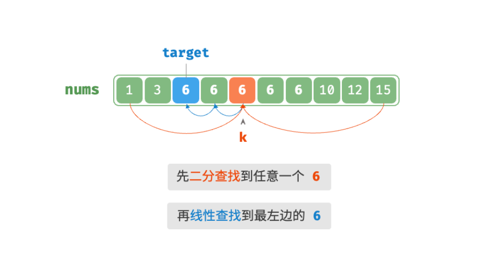

- > https://www.hello-algo.com/chapter_searching/binary_search_edge/
-
- > **Question**❓
  > 给定一个长度为 $n$ 的有序数组 `nums` ，数组可能包含重复元素。请查找并返回元素 `target` 在数组中首次出现的索引。若数组中不包含该元素，则返回 −1 。
- ## 简单方法
	- 为了查找数组中最左边的 `target` ，我们可以分为两步：
		- 1. 进行二分查找，定位到任意一个 `target` 的索引，记为 $k$ ；
		- 2. 以索引 $k$ 为起始点，向左进行**线性遍历**，找到最左边的 `target` 返回即可。
	- 
	- 这个方法虽然有效，但由于包含线性查找，**其时间复杂度可能会劣化至** $O(n)$ 。
- ## 二分方法
	- 仅通过二分查找解决以上问题。整体算法流程不变，先计算中点索引 $m$ ，再判断 `target` 和 `nums[m]` 大小关系：