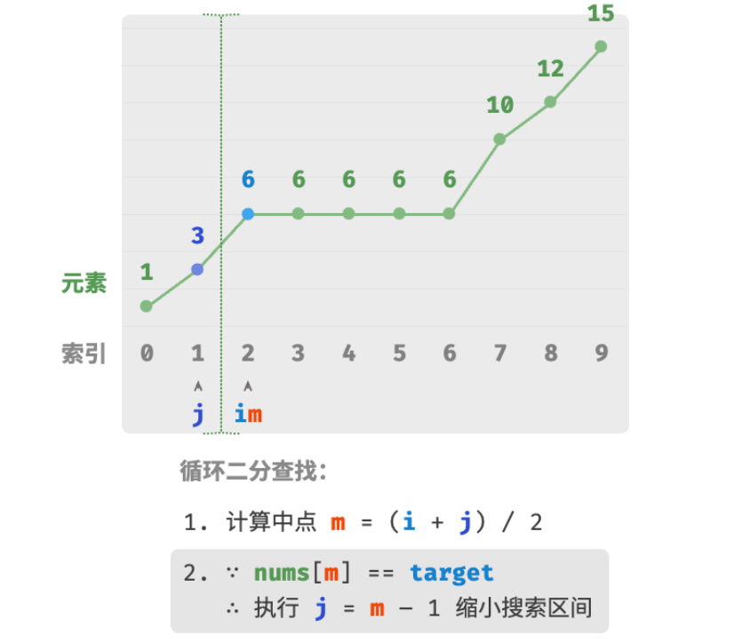
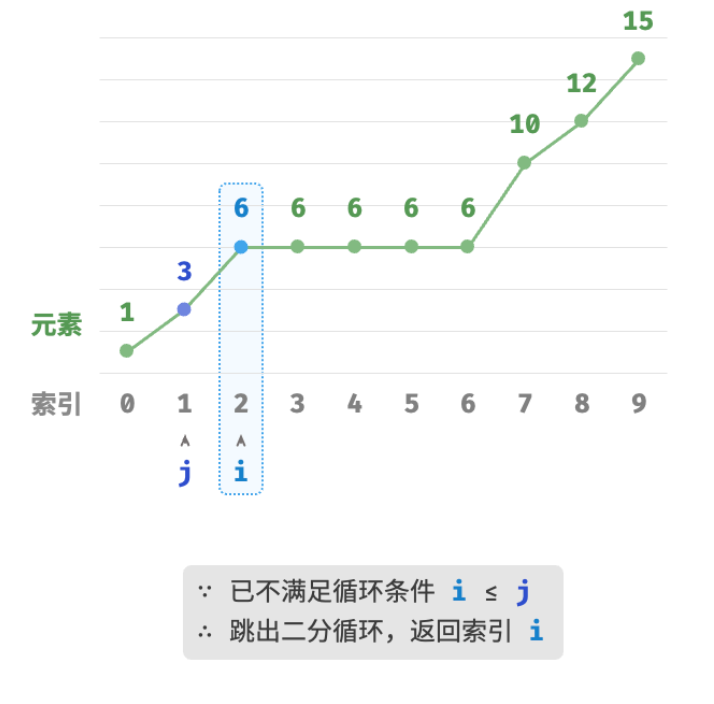

- > https://www.hello-algo.com/chapter_searching/binary_search_edge/
-
- > **Question**❓
  > 给定一个长度为 $n$ 的有序数组 `nums` ，数组可能包含重复元素。请查找并返回元素 `target` 在数组中首次出现的索引。若数组中不包含该元素，则返回 −1 。
- ## 简单方法
	- 为了查找数组中最左边的 `target` ，我们可以分为两步：
		- 1. 进行二分查找，定位到任意一个 `target` 的索引，记为 $k$ ；
		- 2. 以索引 $k$ 为起始点，向左进行**线性遍历**，找到最左边的 `target` 返回即可。
	- 
	- 这个方法虽然有效，但由于包含线性查找，**其时间复杂度可能会劣化至** $O(n)$ 。
- ## 二分方法
	- 仅通过二分查找解决以上问题。整体算法流程不变，先计算中点索引 $m$ ，再判断 `target` 和 `nums[m]` 大小关系：
		- 当 `nums[m] < target` 或 `nums[m] > target` 时，说明还没有找到 `target` ，因此采取与上节代码相同的缩小区间操作，**从而使指针 $i$ 和 $j$ 向 `target` 靠近**。
		- 当 `nums[m] == target` 时，说明“小于 `target` 的元素”在区间 $[i,m−1]$ 中，因此采用 $j=m−1$ 来缩小区间，**从而使指针 $j$ 向小于 `target` 的元素靠近**。
	- 二分查找完成后，**$i$ 指向最左边的 `target` ，$j=m-1$ 指向首个小于 `target` 的元素**，因此返回索引 $i$ 即可。
	- {:height 437, :width 463}
	- {:height 431, :width 447}
	- ```
	  /* 二分查找最左一个元素 */
	  function binarySearchLeftEdge(nums, target) {
	      let i = 0,
	          j = nums.length - 1; // 初始化双闭区间 [0, n-1]
	      while (i <= j) {
	          let m = Math.floor((i + j) / 2); // 计算中点索引 m
	          if (nums[m] < target) {
	              i = m + 1; // target 在区间 [m+1, j] 中
	          } else if (nums[m] > target) {
	              j = m - 1; // target 在区间 [i, m-1] 中
	          } else {
	              j = m - 1; // 首个小于 target 的元素在区间 [i, m-1] 中
	          }
	      }
	      if (i == nums.length || nums[i] != target) {
	          return -1; // 未找到目标元素，返回 -1
	      }
	      return i;
	  }
	  ```
	-