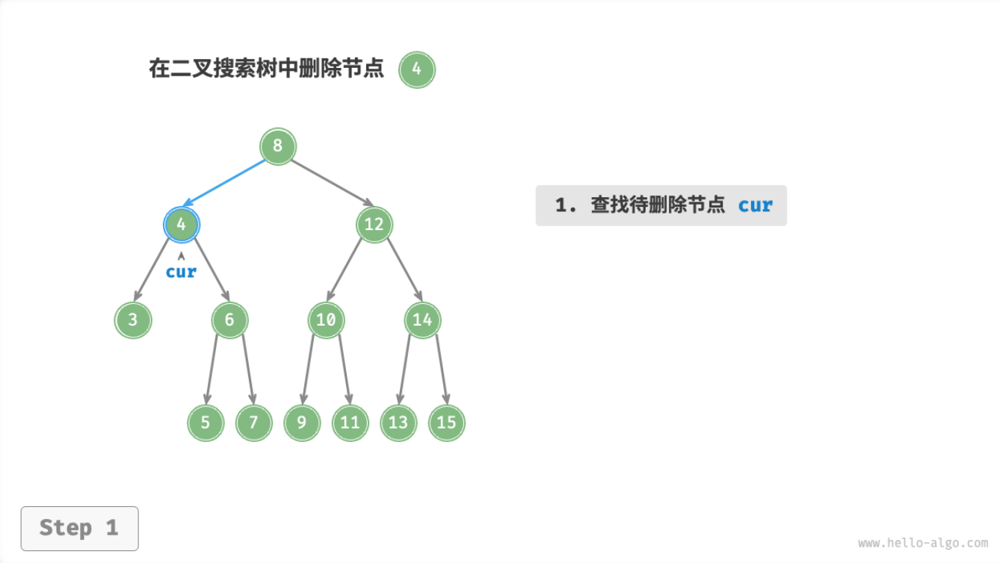
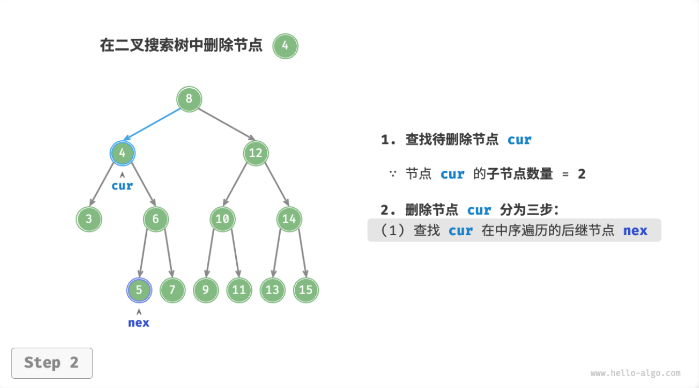
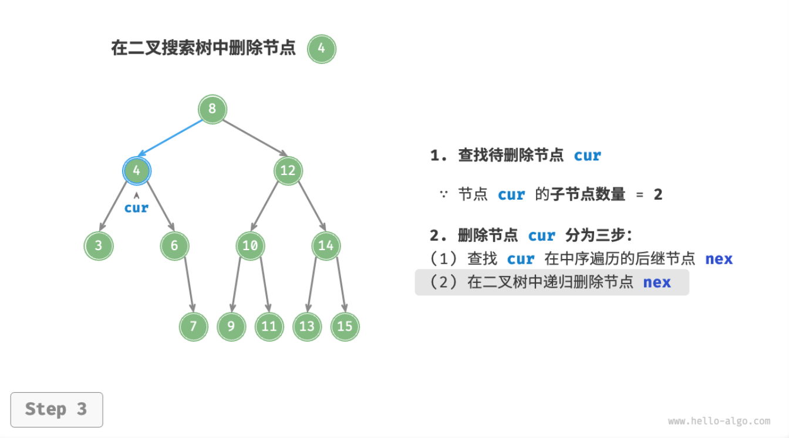
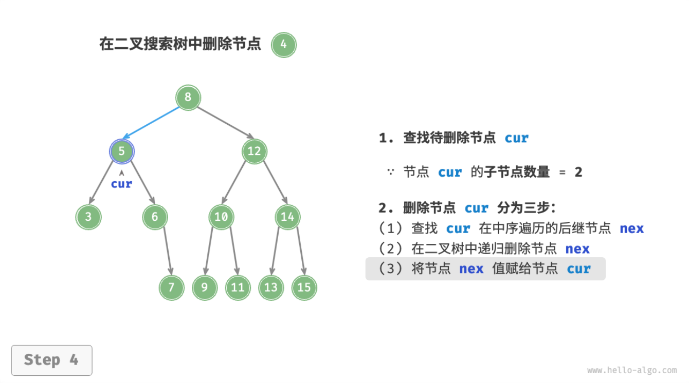

- > https://www.hello-algo.com/chapter_tree/binary_search_tree/
-
- 「二叉搜索树 Binary Search Tree」满足以下条件：
	- 1. 对于根节点，左子树中所有节点的值 < 根节点的值 < 右子树中所有节点的值；
	- 2. 任意节点的左、右子树也是二叉搜索树，即同样满足条件 `1.` ；
	- {:height 346, :width 579}
-
- ## 二叉搜索树的操作
	- [[#blue]]==查找节点==
		- 给定目标节点值 `num` ，可以根据二叉搜索树的性质来查找。我们声明一个节点 `cur` ，从二叉树的根节点 `root` 出发，循环比较节点值 `cur.val` 和 `num` 之间的大小关系
			- 1. 若 `cur.val < num` ，说明目标节点在 `cur` 的右子树中，因此执行 `cur = cur.right` ；
			  2. 若 `cur.val > num` ，说明目标节点在 `cur` 的左子树中，因此执行 `cur = cur.left` ；
			  3. 若 `cur.val = num` ，说明找到目标节点，跳出循环并返回该节点；
		- 二叉搜索树的查找操作与**二分查找**算法的工作原理一致，都是每轮排除一半情况。循环次数最多为二叉树的高度，当二叉树平衡时，使用 $O(\log{n}$) 时间。
		- ```
		  /* 查找节点 */
		  function search(num) {
		      let cur = root;
		      // 循环查找，越过叶节点后跳出
		      while (cur !== null) {
		          // 目标节点在 cur 的右子树中
		          if (cur.val < num) cur = cur.right;
		          // 目标节点在 cur 的左子树中
		          else if (cur.val > num) cur = cur.left;
		          // 找到目标节点，跳出循环
		          else break;
		      }
		      // 返回目标节点
		      return cur;
		  }
		  ```
	- [[#blue]]==插入节点==
		- 给定一个待插入元素 `num` ，为了保持二叉搜索树“左子树 < 根节点 < 右子树”的性质，插入操作分为两步：
			- 1. **查找插入位置**：与查找操作相似，从根节点出发，根据当前节点值和 `num` 的大小关系循环向下搜索，直到越过叶节点（遍历至 null ）时跳出循环；
			- 2. **在该位置插入节点**：初始化节点 `num` ，将该节点置于 null 的位置；
		- ```
		  /* 插入节点 */
		  function insert(num) {
		      // 若树为空，直接提前返回
		      if (root === null) return;
		      let cur = root,
		          pre = null;
		      // 循环查找，越过叶节点后跳出
		      while (cur !== null) {
		          // 找到重复节点，直接返回
		          if (cur.val === num) return;
		          pre = cur;
		          // 插入位置在 cur 的右子树中
		          if (cur.val < num) cur = cur.right;
		          // 插入位置在 cur 的左子树中
		          else cur = cur.left;
		      }
		      // 插入节点
		      let node = new TreeNode(num);
		      if (pre.val < num) pre.right = node;
		      else pre.left = node;
		  }
		  ```
		- 为了插入节点，我们需要利用辅助节点 `pre` 保存上一轮循环的节点，这样在遍历至 null 时，我们可以获取到其父节点，从而完成节点插入操作。
		- 与查找节点相同，插入节点使用 $O(\log{n})$ 时间。
	- [[#blue]]==删除节点==
		- 与插入节点类似，我们需要在删除操作后维持二叉搜索树的“左子树 < 根节点 < 右子树”的性质。首先，我们需要在二叉树中执行查找操作，获取待删除节点。接下来，根据待删除节点的子节点数量（待删除节点的度），删除操作需分为三种情况：
		- `度 = 0`
			- 表示待删除节点是叶节点，可以直接删除。
		- `度 = 1`
			- 将待删除节点替换为其子节点即可。
		- `度 = 2`
			- 删除操作分为三步：
				- 1. 找到待删除节点在“中序遍历序列”中的下一个节点，记为 `tmp` ；
				  2. 在树中递归删除节点 `tmp` ；
				  3. 用 `tmp` 的值覆盖待删除节点的值；
			- {:height 305, :width 493}
			- {:height 305, :width 493}
			- {:height 305, :width 493}
			- {:height 305, :width 493}
			- 删除节点操作同样使用 $O(\log⁡{n})$ 时间，其中查找待删除节点需要 $O(\log⁡{n})$ 时间，获取中序遍历后继节点需要 $O(\log⁡{n})$时间。
		- ```
		  /* 删除节点 */
		  function remove(num) {
		      // 若树为空，直接提前返回
		      if (root === null) return;
		      let cur = root,
		          pre = null;
		      // 循环查找，越过叶节点后跳出
		      while (cur !== null) {
		          // 找到待删除节点，跳出循环
		          if (cur.val === num) break;
		          pre = cur;
		          // 待删除节点在 cur 的右子树中
		          if (cur.val < num) cur = cur.right;
		          // 待删除节点在 cur 的左子树中
		          else cur = cur.left;
		      }
		      // 若无待删除节点，则直接返回
		      if (cur === null) return;
		      // 子节点数量 = 0 or 1
		      if (cur.left === null || cur.right === null) {
		          // 当子节点数量 = 0 / 1 时， child = null / 该子节点
		          let child = cur.left !== null ? cur.left : cur.right;
		          // 删除节点 cur
		          if (cur != root) {
		              if (pre.left === cur) pre.left = child;
		              else pre.right = child;
		          } else {
		              // 若删除节点为根节点，则重新指定根节点
		              root = child;
		          }
		      }
		      // 子节点数量 = 2
		      else {
		          // 获取中序遍历中 cur 的下一个节点
		          let tmp = cur.right;
		          while (tmp.left !== null) {
		              tmp = tmp.left;
		          }
		          // 递归删除节点 tmp
		          remove(tmp.val);
		          // 用 tmp 覆盖 cur
		          cur.val = tmp.val;
		      }
		  }
		  ```
	-