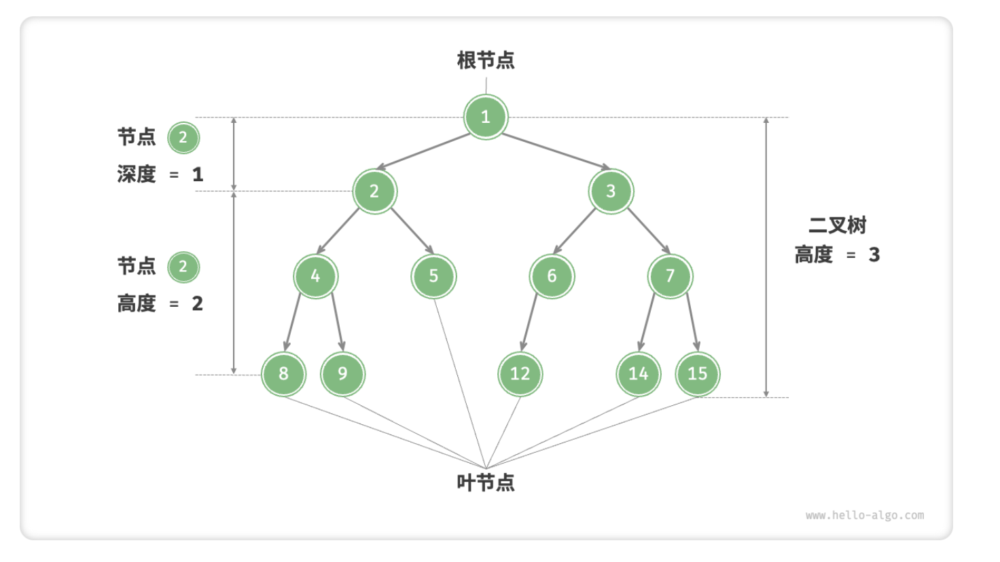
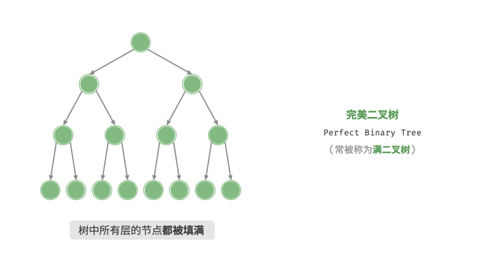
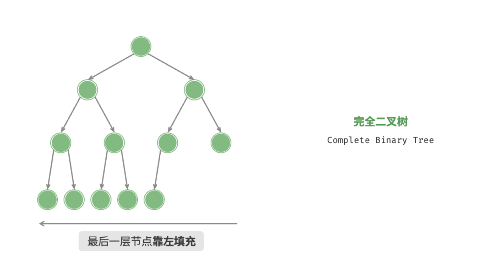
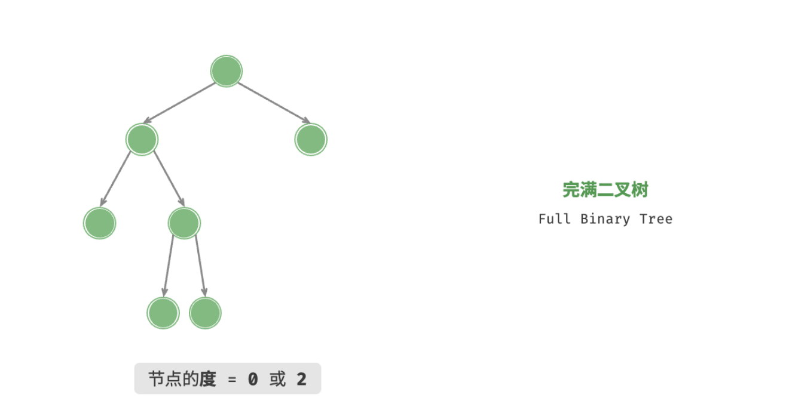
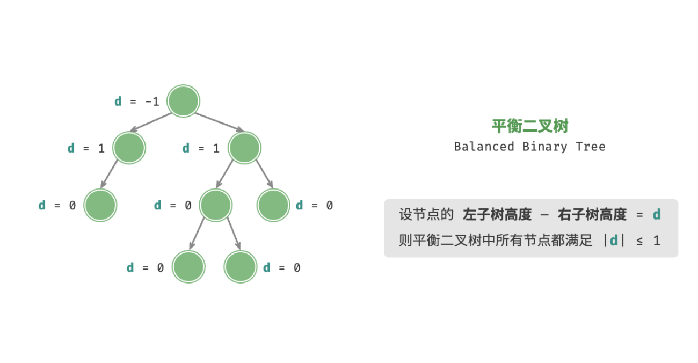

- > https://www.hello-algo.com/chapter_tree/binary_tree/
-
- 「二叉树 Binary Tree」是一种非线性数据结构，代表着祖先与后代之间的派生关系，体现着“一分为二”的分治逻辑。与链表类似，二叉树的基本单元是节点，每个节点包含一个「值」和两个「指针」。
- ```
  /* 二叉树节点类 */
  function TreeNode(val, left, right) {
      this.val = (val === undefined ? 0 : val); // 节点值
      this.left = (left === undefined ? null : left); // 左子节点指针
      this.right = (right === undefined ? null : right); // 右子节点指针
  }
  ```
- **在二叉树中，除叶节点外，其他所有节点都包含子节点和非空子树**。
-
- ## 二叉树常见术语
	- 二叉树涉及的术语较多，建议尽量理解并记住。
		- 1. 「根节点 Root Node」：位于二叉树顶层的节点，没有父节点；
		  2. 「叶节点 Leaf Node」：没有子节点的节点，其两个指针均指向 null ；
		  3. 节点的「层 Level」：从顶至底递增，根节点所在层为 1 ；
		  4. 节点的「度 Degree」：节点的子节点的数量。在二叉树中，度的范围是 0, 1, 2 ；
		  5. 「边 Edge」：连接两个节点的线段，即节点指针；
		  6. 二叉树的「高度」：从根节点到最远叶节点所经过的边的数量；
		  7. 节点的「深度 Depth」 ：从根节点到该节点所经过的边的数量；
		  8. 节点的「高度 Height」：从最远叶节点到该节点所经过的边的数量；
	- {:height 415, :width 718}
	- ^^请注意，我们通常将「高度」和「深度」定义为“走过边的数量”，但有些题目或教材可能会将其定义为“走过节点的数量”。在这种情况下，高度和深度都需要加 1 。^^
- ## 二叉树基本操作
	- **初始化二叉树**。与链表类似，首先初始化节点，然后构建引用指向（即指针）。
		- ```
		  /* 初始化二叉树 */
		  // 初始化节点
		  let n1 = new TreeNode(1),
		      n2 = new TreeNode(2),
		      n3 = new TreeNode(3),
		      n4 = new TreeNode(4),
		      n5 = new TreeNode(5);
		  // 构建引用指向（即指针）
		  n1.left = n2;
		  n1.right = n3;
		  n2.left = n4;
		  n2.right = n5;
		  ```
	- **插入与删除节点**。与链表类似，通过修改指针来实现插入与删除节点。
		- ```
		  /* 插入与删除节点 */
		  let P = new TreeNode(0);
		  // 在 n1 -> n2 中间插入节点 P
		  n1.left = P;
		  P.left = n2;
		  // 删除节点 P
		  n1.left = n2;
		  ```
- ## 常见二叉树类型
	- [[#blue]]==完美二叉树(满二叉树)==
		- 「完美二叉树 Perfect Binary Tree」除了最底层外，其余所有层的节点都被完全填满。在完美二叉树中，叶节点的度为 0 ，其余所有节点的度都为 2 ；若树高度为 $h$ ，则节点总数为 $2^{h+1}−1$ ，呈现标准的指数级关系，反映了自然界中常见的细胞分裂现象。
		- {:height 372, :width 705}
	- [[#blue]]==完全二叉树==
		- 「完全二叉树 Complete Binary Tree」只有最底层的节点未被填满，且最底层节点尽量靠左填充。
		- {:height 365, :width 694}
	- [[#blue]]==完满二叉树==
		- 「完满二叉树 Full Binary Tree」除了叶节点之外，其余所有节点都有两个子节点。
		- {:height 369, :width 683}
	- [[#blue]]==平衡二叉树==
		- 「平衡二叉树 Balanced Binary Tree」中任意节点的**左子树和右子树的高度之差**的绝对值不超过 1 。
		- {:height 379, :width 704}
- ## 二叉树的退化
	- 当二叉树的每层节点都被填满时，达到「完美二叉树」；而当所有节点都偏向一侧时，二叉树退化为「链表」。
		- 1. 完美二叉树是理想情况，可以充分发挥二叉树“分治”的优势；
		  2. 链表则是另一个极端，各项操作都变为线性操作，时间复杂度退化至 $O(n)$ ；