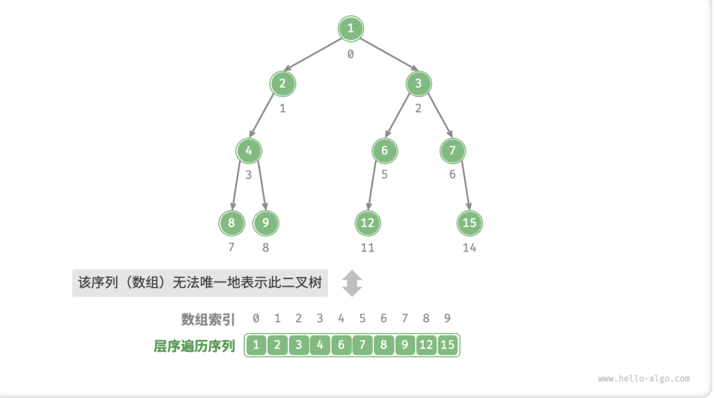
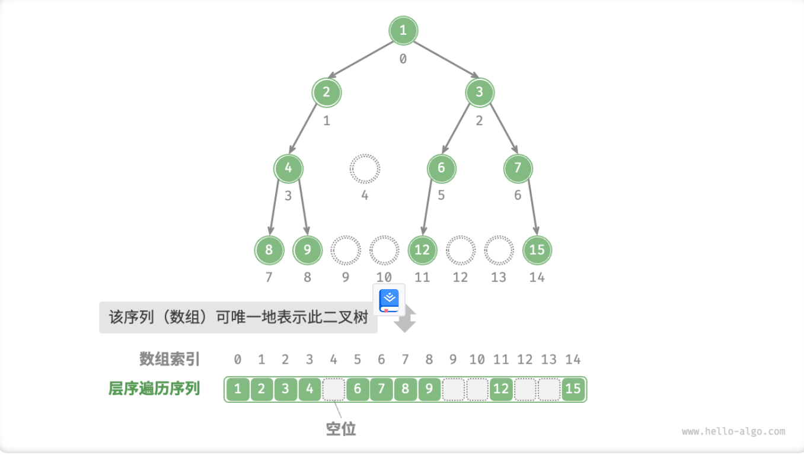

- > https://www.hello-algo.com/chapter_tree/array_representation_of_tree/
-
- ## 表示完美二叉树
	- 给定一个完美二叉树，我们将节点按照层序遍历(BFS)的顺序编号（从 0 开始），此时每个节点都对应唯一的索引。
	- 根据层序遍历的特性，我们可以推导出父节点索引与子节点索引之间的“映射公式”：**若节点的索引为** $i$ ，**则该节点的左子节点索引为** $2i+1$ **，右子节点索引为** $2i+2$ 。
	- {:height 421, :width 734}
	- **映射公式的作用相当于链表中的指针**。如果我们将节点按照层序遍历的顺序存储在一个数组中，那么对于数组中的任意节点，我们都可以通过映射公式来访问其子节点。
- ## 表示任意二叉树
	- 然而，完美二叉树只是一个特例。在二叉树的中间层，通常存在许多 null ，而层序遍历序列并不包含这些 null 。我们无法仅凭该序列来推测 null 的数量和分布位置，**这意味着存在多种二叉树结构都符合该层序遍历序列**。显然在这种情况下，上述的数组表示方法已经失效。
	- {:height 409, :width 699}
	- 为了解决此问题，**我们可以考虑在层序遍历序列中显式地写出所有 null**。如下图所示，这样处理后，层序遍历序列就可以唯一表示二叉树了。 {:height 399, :width 660}
	-
-