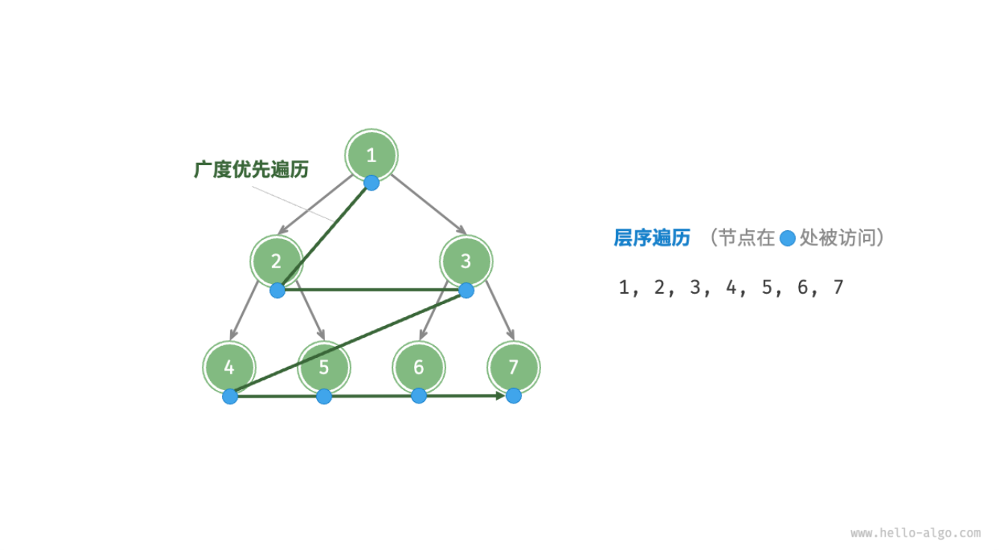

- > https://www.hello-algo.com/chapter_tree/binary_tree_traversal/
-
- ## 层序遍历
	- **「层序遍历 Level-Order Traversal」**从顶部到底部逐层遍历二叉树，并在每一层按照从左到右的顺序访问节点。
	- 层序遍历本质上属于**「广度优先搜索 Breadth-First Search」**，它体现了一种“一圈一圈向外扩展”的逐层搜索方式。
	- {:height 405, :width 731}
	- [[#blue]]==算法实现==
		- 广度优先遍历通常借助**「队列」**来实现。队列遵循“先进先出”的规则，而广度优先遍历则遵循“逐层推进”的规则，两者背后的思想是一致的。
		- ```
		  /* 层序遍历 */
		  function levelOrder(root) {
		      // 初始化队列，加入根节点
		      const queue = [root];
		      // 初始化一个列表，用于保存遍历序列
		      const list = [];
		      while (queue.length) {
		          let node = queue.shift(); // 队列出队
		          list.push(node.val); // 保存节点值
		          if (node.left) queue.push(node.left); // 左子节点入队
		          if (node.right) queue.push(node.right); // 右子节点入队
		      }
		      return list;
		  }
		  ```
	- [[#blue]]==复杂度分析==
		- **时间复杂度**：所有节点被访问一次，使用 $O(n)$ 时间，其中 $n$ 为节点数量。
		- **空间复杂度**：在最差情况下，即满二叉树时，遍历到最底层之前，队列中最多同时存在 $\frac{n+1}{2}$ 个节点，占用 $O(n)$ 空间。
- ## 前序、中序、后序遍历
	- 前序、中序和后序遍历都属于**「深度优先遍历 Depth-First Traversal」**，它体现了一种“先走到尽头，再回溯继续”的遍历方式。
	- [[#blue]]==算法实现==
		- ```
		  /* 前序遍历 */
		  function preOrder(root) {
		      if (root === null) return;
		      // 访问优先级：根节点 -> 左子树 -> 右子树
		      list.push(root.val);
		      preOrder(root.left);
		      preOrder(root.right);
		  }
		  
		  /* 中序遍历 */
		  function inOrder(root) {
		      if (root === null) return;
		      // 访问优先级：左子树 -> 根节点 -> 右子树
		      inOrder(root.left);
		      list.push(root.val);
		      inOrder(root.right);
		  }
		  
		  /* 后序遍历 */
		  function postOrder(root) {
		      if (root === null) return;
		      // 访问优先级：左子树 -> 右子树 -> 根节点
		      postOrder(root.left);
		      postOrder(root.right);
		      list.push(root.val);
		  }
		  ```
		-