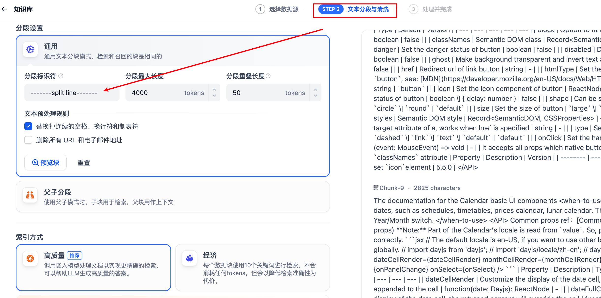
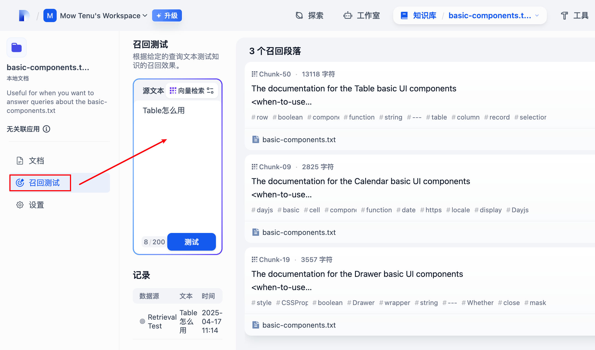

## 创建 RAG 知识库
	- > 前置准备
	  > 1、配置 embedding 能力 - 在 Dify 增加 Embedding model
	  > 2、私有组件库数据清洗（排除掉 antd 相关的内容）
	- ### 1. 新建知识库
	  background-color:: green
	- {:height 371, :width 685}
	- ### 2. 导入数据，分段清洗
	  background-color:: green
	- 
	- ### 3. Retrieval 召回测试
	  background-color:: green
	- 
- ## 集成 RAG 应用
	- > 创建一个 AI 应用，可以根据 RAG 知识库生成组件
	- ### 1. 创建新应用
	- ### 2. 写入提示词
	- ### 3. 关联知识库
	- ### 4. 测试 Augmented、Generation 阶段测试
-