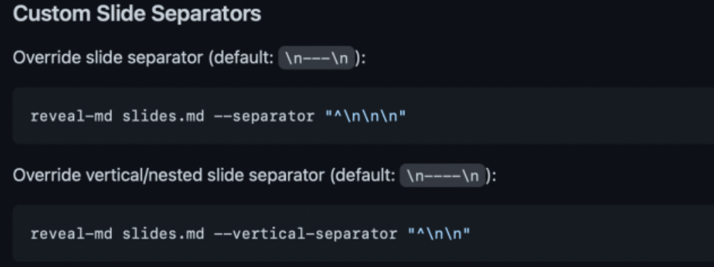
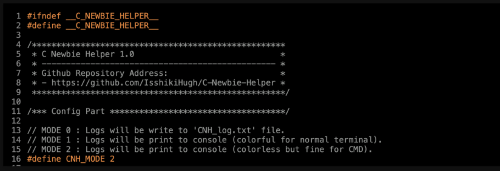

- >> https://note.isshikih.top/others/reveal-md2Slides/
- >> `reveal-md` 是`reveal.js` 的一个扩展工具，类似于一个预编译工具。利用 `reveal-md`，你可以通过编写一个 `Markdown` 文件来快速简便地生成一个基于网页的 Slides，你也可以将它导出为静态资源并部署在类似 github pages 等平台来分享静态页面。
- [reveal.js 的官方 demo](https://revealjs.com/?demo)
- [reveal-md 的 github repo](https://github.com/webpro/reveal-md)
-
- ## 安装与演示
	- `npm install -g reveal-md`
	- ### 核心命令：
		- ```js
		  ## 最基础的命令，根据 Markdown 文件在本地 1948 端口生成 Slides 服务。
		  $ reveal-md your-md-file.md
		  
		  ## 为了实现在线部署，需要导出为静态资源。
		  $ reveal-md your-md-file.md --static your-static-dir
		  ```
	- ### 操作：
		- 1. 通过点击/ 空格来选择下一页，使用 `h/←` `j/↓` `k/↑` `l/→` 或者点击右下角的方向盘来进行上下左右切换，直接点击页面底部的进度条也可以实现页面跳转。
		- 2. 按下 `f` 来全屏显示，按下 `Esc` 或者 `f` 退出。
		- 3. 按下`s`进入演讲者模式.
		- 4. 按下`o`进入总览视图，可以利用方向键进行移动.
		- 5. 按下`v`或`.`黑屏。
- ## 文档编写
	- ### 分页
		- 两种 `separator` 和 `vertical separator` 两种，顾名思义，分别对应着左右分页和上下分页。默认情况下，separator 是 `\n---\n`，而 vertical separator 是 `\n----\n`。
			- ```markdown
			  ### Part 1
			  
			  ---
			  
			  #### Part 1.1
			  
			  - Orderred List
			  - Next Line
			  
			  1. Numberred List
			  2. Next Line
			  
			  ----
			  
			  #### Part 1.2
			  
			  {code block here}
			  
			  ----
			  
			  #### Part 1.3
			  
			  > Everthings seems ok!
			  
			  ```
		- 如何修改默认的 separator：
			- 一种是通过在命令行中的附加参数实现
			  logseq.order-list-type:: number
				- 
			- 另一种则是在`md`文件开头写好配置文件实现。
			  logseq.order-list-type:: number
				- ```
				  ---
				  separator: <!--s-->
				  verticalSeparator: <!--v-->
				  ---
				  ```
			- 这里将 `<!--s-->` 设为 separator，将 `<!--v-->` 设为 vertical separator，在这种情况下，除了开头配置文件的部分，其他的 `---` 则会被认为是 `md` 的语法，渲染为正常的分割线。
	- ### 代码框
		- **代码框高亮**
			- 
			- ```
			  - 前面的数字是为了标记它们属于代码框的第几行而写的，实际不需要写这些数字（废话）
			  - 反斜杠是为了防止md渲染错误，实际上不需要加
			  
			  \```cpp
			  1        #include <iostream>
			  2        int main(){
			  3            std::cout << "Hello World!\n";
			  4          return 0;
			  5        }
			  \```
			  ```
			- 在语言后面加上一个方括号 `[...]` 来标记高亮行即可，比如 `[2-5]` 就是标记 2～5 行，也就是整个 `main()` 函数。此外，你还可以用`|`来分隔多个高亮块，来实现动画的效果，例如 `[1|2-5]` 就是先高亮预编译，再高亮 `main()` 函数。
			- ```
			  ---
			  separator: <!--s-->
			  verticalSeparator: <!--v-->
			  ---
			  
			  #### Part 1.2
			  
			  \```cpp[1|2-5]
			  #include <iostream>
			  int main(){
			      std::cout << "Hello World!\n";
			      return 0;
			  }
			  \```
			  
			  <!--v-->
			  
			  #### Part 1.3
			  
			  > Everthings seems ok!
			  ```
	- ### 格式支持
		- 在文本格式排版方面，`Markdown` 的原生语法都是支持的，此外你当然也可以使用 `html` 标签来编辑你的文字，例如修改颜色、设置居中/靠左/靠右、修改大小
- ## 定制与美化
	-