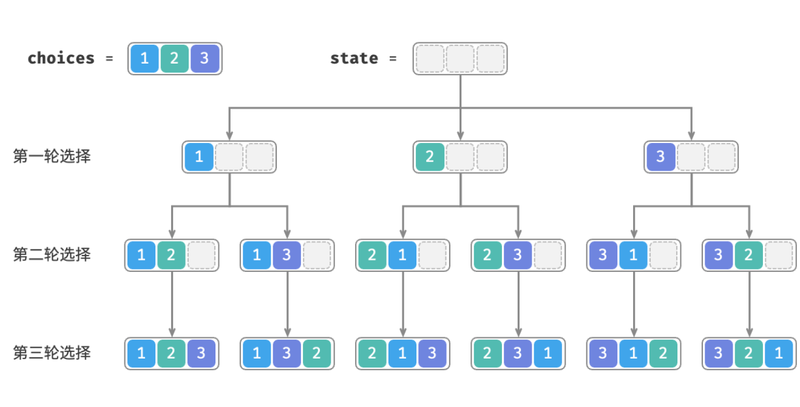

- > https://www.hello-algo.com/chapter_backtracking/permutations_problem/
-
- **全排列问题**是回溯算法的一个典型应用。它的定义是在给定一个集合（如一个数组或字符串）的情况下，找出这个集合中元素的所有可能的排列。
- ## 无重复的情况
	- > ❓ **Question**
	  > 
	  > 输入一个整数数组，数组中不包含重复元素，返回所有可能的排列。
	- **从回溯算法的角度看，我们可以把生成排列的过程想象成一系列选择的结果**。假设输入数组为 [1,2,3] ，如果我们先选择 1 、再选择 3 、最后选择 2 ，则获得排列 [1,3,2] 。回退表示撤销一个选择，之后继续尝试其他选择。
	- 从回溯算法代码的角度看，候选集合 `choices` 是输入数组中的所有元素，状态 `state` 是直至目前已被选择的元素。注意，每个元素只允许被选择一次，**因此在遍历选择时，应当排除已经选择过的元素**。
	- 如下图所示，我们可以将搜索过程展开成一个递归树，树中的每个节点代表当前状态 `state` 。从根节点开始，经过三轮选择后到达叶节点，每个叶节点都对应一个排列。
	- 
	-