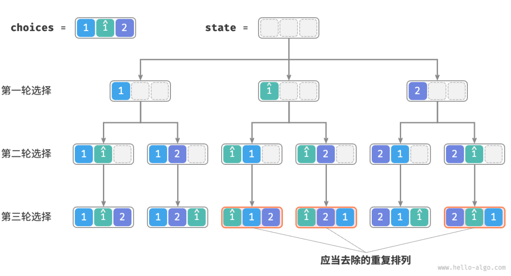

- > https://www.hello-algo.com/chapter_backtracking/permutations_problem/
-
- **全排列问题**是回溯算法的一个典型应用。它的定义是在给定一个集合（如一个数组或字符串）的情况下，找出这个集合中元素的所有可能的排列。
- ## 无重复的情况
	- > ❓ **Question**
	  > 
	  > 输入一个整数数组，数组中不包含重复元素，返回所有可能的排列。
	- **从回溯算法的角度看，我们可以把生成排列的过程想象成一系列选择的结果**。假设输入数组为 [1,2,3] ，如果我们先选择 1 、再选择 3 、最后选择 2 ，则获得排列 [1,3,2] 。回退表示撤销一个选择，之后继续尝试其他选择。
	- 从回溯算法代码的角度看，候选集合 `choices` 是输入数组中的所有元素，状态 `state` 是直至目前已被选择的元素。注意，每个元素只允许被选择一次，**因此在遍历选择时，应当排除已经选择过的元素**。
	- 如下图所示，我们可以将搜索过程展开成一个递归树，树中的每个节点代表当前状态 `state` 。从根节点开始，经过三轮选择后到达叶节点，每个叶节点都对应一个排列。
	- 
	- ```
	  /* 回溯算法：全排列 I */
	  function backtrack(state, choices, selected, res) {
	      // 当状态长度等于元素数量时，记录解
	      if (state.length === choices.length) {
	          res.push([...state]);
	          return;
	      }
	      // 遍历所有选择
	      choices.forEach((choice, i) => {
	          // 剪枝：不允许重复选择元素 且 不允许重复选择相等元素
	          if (!selected[i]) {
	              // 尝试：做出选择，更新状态
	              selected[i] = true;
	              state.push(choice);
	              // 进行下一轮选择
	              backtrack(state, choices, selected, res);
	              // 回退：撤销选择，恢复到之前的状态
	              selected[i] = false;
	              state.pop();
	          }
	      });
	  }
	  
	  /* 全排列 I */
	  function permutationsI(nums) {
	      const res = [];
	      backtrack([], nums, Array(nums.length).fill(false), res);
	      return res;
	  }
	  ```
	- 需要重点关注的是，我们引入了一个布尔型数组 `selected` ，它的长度与输入数组长度相等，其中 `selected[i]` 表示 `choices[i]` 是否已被选择。[[#green]]==我们利用 `selected` 避免某个元素被重复选择，从而实现剪枝。==
- ## 考虑重复的情况
	- > ❓**Question**
	  >
	  > 输入一个整数数组，**数组中可能包含重复元素**，返回所有不重复的排列。
	- 假设输入数组为 [1,1,2] 。为了方便区分两个重复的元素 1 ，接下来我们将第二个元素记为 1^ 。如下图所示，上述方法生成的排列有一半都是重复的。
	- 
	-