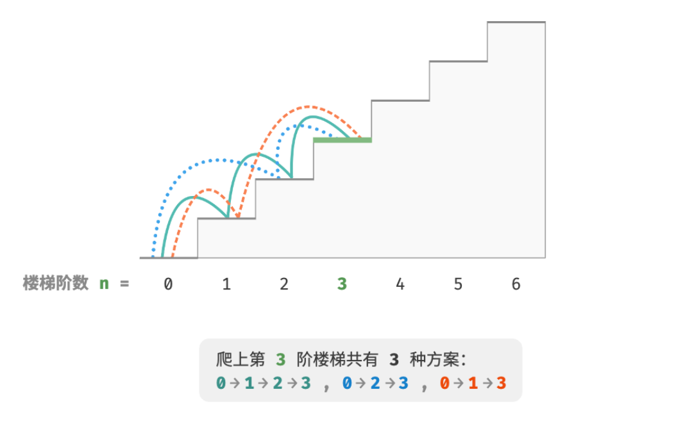

- > https://www.hello-algo.com/chapter_dynamic_programming/intro_to_dynamic_programming/
-
- **「动态规划 Dynamic Programming」**是一种通过将复杂问题分解为更简单的子问题的方式来求解问题的方法。它将一个问题分解为一系列更小的子问题，并通过存储子问题的解来避免重复计算，从而大幅提升时间效率。
- > ❓ 爬楼梯
  >
  > 给定一个共有 $n$ 阶的楼梯，你每步可以上 1 阶或者 2 阶，请问有多少种方案可以爬到楼顶。
- 
- 本题的目标是求解方案数量，**我们可以考虑通过回溯来穷举所有可能性**。具体来说，将爬楼梯想象为一个多轮选择的过程：[[#blue]]==从地面出发，每轮选择上 1 阶或 2 阶，每当到达楼梯顶部时就将方案数量加 1 ，当越过楼梯顶部时就将其剪枝。==
-