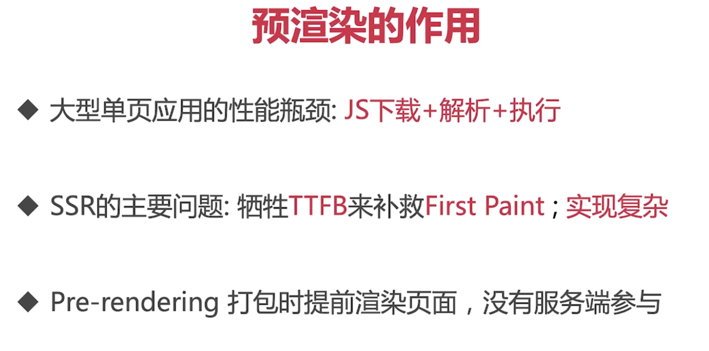
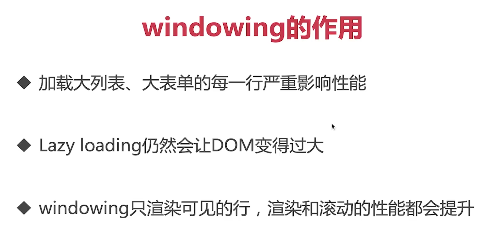

- ## 移动端图标 SVG
	- ### 从 PNG 到 IconFont
	  background-color:: pink
		- 图标字体化，多个图标 —— 一套字体，减少获取时的请求资源
		- 矢量图形，可伸缩
		- 直接通过 CSS 修改图标的样式
	- ### SVG
	  background-color:: pink
		- 保持了图片能力，支持多色彩
		- 独立的矢量图形
		- XML 语法，搜索引擎 SEO 和无障碍
- ## Flexbox 布局优化
- ## 优化资源加载顺序
  collapsed:: true
	- ### 资源优先级
	  background-color:: pink
		- #### 浏览器默认安排资源加载优先级
			- HTML
			- <head> JS、CSS
			- 其他资源
		- #### 使用 preload、prefetch调整优先级
			- `preload`：提前加载当前页面资源；
			- `prefetch`：提前加载后继页面资源；
		- #### webpack 支持 preload、prefetch
			- ```
			  import (/* webpackPrefetch: true */ 'XXX')
			  ```
- ## 预渲染页面
  collapsed:: true
	- ### react-snap
	  background-color:: pink
	  collapsed:: true
		- **原理**：调取 `headless chrome`，扒取页面
		- ```
		  // package.json 1.配置 postbuild
		  "scripts": {
		  	...
		      "postbuild": "react-snap"
		  }
		  
		  // index.js 2.使用 hybrate，考虑预渲染或 SSR 的兼容
		  ...
		  let root = document.getElementById('main');
		  if (root.hasChildNodes) {
		  	ReactDom.hydrate(<App />, root);
		  } else {
		  	ReactDom.render(<App />, root);
		  };
		  
		  3.内联样式使用，避免样式抖动
		  ...
		  ```
	- 
- ## Windowing 提高列表性能
  collapsed:: true
	- ### Windowing —— 窗口化
	  background-color:: pink
		- #### react-window
		- 
	-
- ## 使用骨架组件减少布局移动 ——