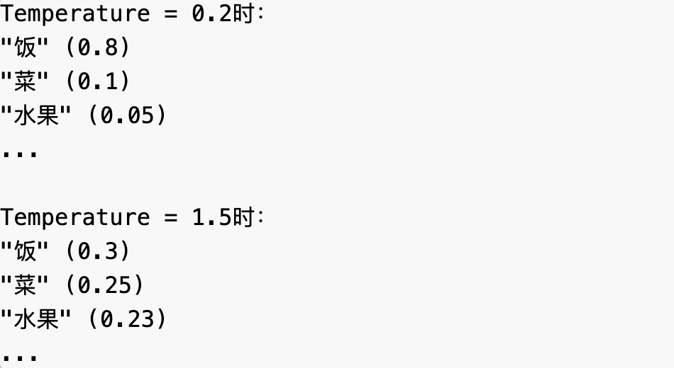

## **作为大模型的使用者**
	- > 不需要了解太多内部实现细节。我们可以将模型当作黑盒，理解其[[#green]]==输入==与[[#blue]]==输出==
	- ### **模型的输入**
	  background-color:: pink
		- [openAI 的API](https://302ai.apifox.cn/api-147522039) 接口名`chat/completions`
		- 有哪些role：
			- System
			- User
			- Assistant
			- Tool
		- 文本转换成模型可理解的符号（tokenization：文本 -> token -> token IDs），再对符号进行补全
	- ### **token与文本的关系**
	  background-color:: pink
		- 1. token不等于字符或单词
			- 不是按单词拆分：happy unhappy
			- 不同上下文中拆分不一样：This is my backpack : backpack
		- 2. 不同语言token表达效率不同
		- 以openAI GPT为例，一般规律：
			- 1个token约等于4个英文字符，大概 3/4 个单词。100个token大约等于75个英文单词
			- 1个token接近0.7个中文字
	- ### **符号（token）补全**
	  background-color:: pink
		- API 参数`Temperature`、`Top_p`、`frequency_penalty`、`presence_penalty` 如何影响补全效果？
		- 例如："我喜欢吃" → 预测下一个token，可能的token及其概率：
			- "饭" (0.3)
			- "菜" (0.2)
			- "水果" (0.15)
			- "零食" (0.1)
			- ...其他选项
		- #### **Temperature**
		  background-color:: green
			- 0～2，调整概率分布的差异：
				- 低温：强化高概率选项，减少选择多样性
				- 高温：使概率分布更平缓，增加选择多样性
				- {:height 258, :width 438}
		- #### **Top_p 核采样**
		  background-color:: green
			- 设定累积概率阈值，从高到低概率依次选择的token，直到总和达到设定值
				-