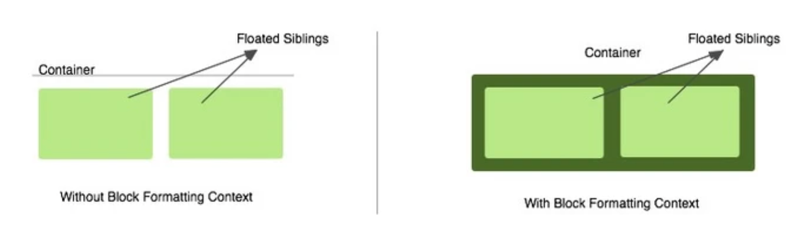
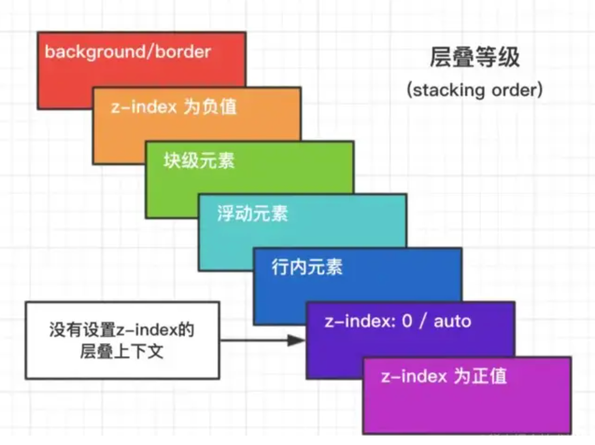
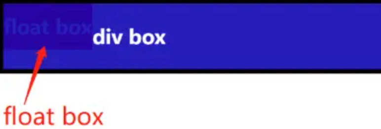
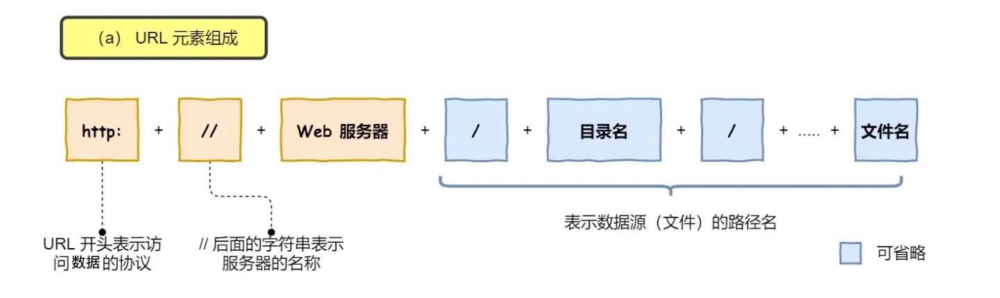
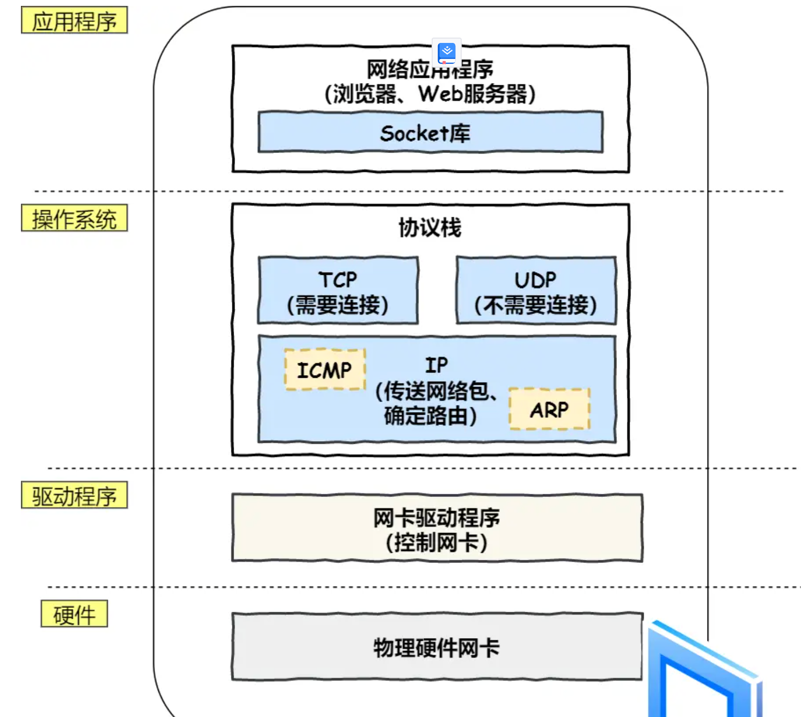
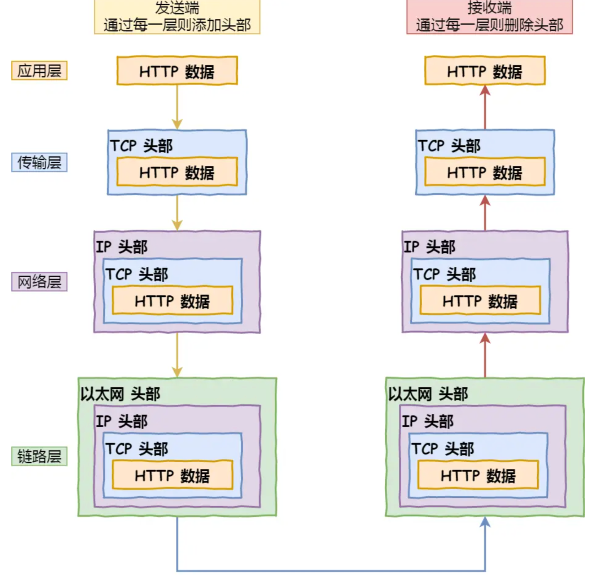

## HTML面试题
collapsed:: true
	- HTML语义化标签？有哪些？ #card #html
		- 可读性
		- SEO
		- 标签：
			- header
			  footer
			  main
			  aside
			  article
			  section
			  address
			  summary/details
			  menu
			  h1/h2/h3/h4/h5/h6
			  img
			  p
			  strong/italic
- ## CSS面试题
  collapsed:: true
	- {{cards [[css]]}}
	- offsetWidth = ？,box-sizing: border-box时，offsetWidth = ？ #card #css
	  collapsed:: true
		- $$offsetWidth = width + padding * 2 + border * 2$$
		- $$box-sizing: border-box时，offsetWidth = width$$
	- BFC? 应用？#card #css
	  collapsed:: true
		- Block Formatting Context，块级格式化上下文
		- ### 创建 BFC
		  background-color:: pink
			- 根元素或包含根元素的元素
			  logseq.order-list-type:: number
			- 浮动元素 float ＝ left | right 或 inherit**（≠ none）**
			  logseq.order-list-type:: number
			- 绝对定位元素 position ＝ absolute 或 fixed
			  logseq.order-list-type:: number
			- display ＝ inline-block | flex | inline-flex | table-cell 或 table-caption
			  logseq.order-list-type:: number
			- overflow ＝ hidden | auto 或 scroll** (≠ visible)**
			  logseq.order-list-type:: number
		- ### BFC 的特性
		  background-color:: pink
			- 1. BFC 是一个独立的容器，容器内子元素不会影响容器外的元素。反之亦如此。
			  2. 盒子从顶端开始垂直地一个接一个地排列，盒子之间垂直的间距是由 margin 决定的。
			  3. 在同一个 BFC 中，两个相邻的块级盒子的**垂直外边距**会发生重叠。
			  4. **BFC 区域不会和 float box 发生重叠。**
			  5. **BFC 能够识别并包含浮动元素，当计算其区域的高度时，浮动元素也可以参与计算了。**
		- ### BFC 的作用
		  background-color:: pink
			- #### 1. 包含浮动元素（清除浮动）
			  background-color:: green
			  collapsed:: true
				- 浮动元素会脱离文档流(绝对定位元素也会脱离文档流)，导致无法计算准确的高度，这种问题称为**高度塌陷**。
				  解决高度塌陷问题的前提是能够识别并包含浮动元素，也就是**清除浮动**。
				- [[#green]]==解决方法==：**在容器（container）中创建 BFC。**
				- 
			- #### 2. 导致外边距折叠
			  background-color:: green
			  collapsed:: true
				- **相邻**的两个盒子（可能是兄弟关系也可能是祖先关系）的垂直边距相遇时， 它们将形成一个外边距。这个外边距的高度等于两个发生折叠的外边距的高度中的**较大者**。
			- #### 3. 避免外边距折叠
			  background-color:: green
			  collapsed:: true
				- **外边距折叠（Margin collapsing）只会发生在属于同一BFC的块级元素之间**。如果它们属于不同的 BFC，它们之间的外边距则不会折叠。所以通过**创建一个不同的 BFC** ，就可以避免外边距折叠。
	- 居中对齐实现？ #card #css
		- ### 水平居中
		  background-color:: pink
			- **inline元素**：`text-align: center`
			- **block元素**：`margin: auto`
			- **absolute元素**：`left: 50%; margin-left: 负值`
		- ### 垂直居中
		  background-color:: pink
			- **inline元素**：`line-height: height`
			- **absolute元素**：
				- `top: 50%; margin-top: 负值`
				- `left: 50%; top: 50%; transform: translate(-50%, -50%)`
				- `top, left, bottom, right: 0; margin: auto`
		- ### flexbox
		  background-color:: pink
			- `display: flex; align-items: center; justify-content: center;`
		- ### grid
		  background-color:: pink
			- ```
			  .container {
			    display: grid;
			    place-items: center;
			  }
			  
			  // or
			  .container {
			    display: grid;
			    place-content: center;
			  }
			  ```
	- line-height如何继承？ #card #css
		- 1. line-height为具体数值，如 `30px` 继承该数值；
		- 2. line-height为比例，如 `2`，继承该比例；
		- 3. line-height为百分比，如 `200%` ，[[#blue]]==继承计算后的数值==；
	- rem、em？ #card #css
		- `rem`: 根据根元素(即 `html`)的 `font-size`
		- `em`: 根据**自身元素**的 `font-size`
	- z-index 与 层叠上下文 #card #css
		- > https://segmentfault.com/a/1190000043788683
		- ### 问题
		  background-color:: pink
			- 为什么我设置的 **`z-index`** 值不生效呢？
		- ### 层叠上下文
		  background-color:: blue
			- 
			- #### 利用 CSS 层叠上下文不让 浮动元素 覆盖 块元素
			  collapsed:: true
				- 正常情况下，**浮动元素** 和 **块级元素** 之间的表现如下：
					- {:height 123, :width 340}
				- 让 **block 元素** 产生一个新的层叠上下文，例如将它的 **`opacity`** 属性值设置成任意 **小于 1** 的值即可，以下是设置了 `opacity: 0.9;` 的效果：
					- {:height 134, :width 341}
		- ### 总结
		  background-color:: blue
			- 一个元素产生层叠上下文，那么它会比其他元素拥有高优先级
			- 一个层叠上下文中元素的排列顺序：
				- 1. 层叠上下文的 **背景色、背景图（如果有）、边框（如果有）**
				  2. **定位元素**，且 **`z-index < 0`**
				  3. **（非定位）块元素**
				  4. **（非定位）浮动元素**
				  5. **（非定位）行内（块）元素**
				  6. **定位元素**，且 **`z-index = auto | 0`**
				  7. **定位元素**，且 **`z-index > 0`**
			- 比较两个元素的层叠顺序，先确定它们 **所处的层叠上下文** 的层叠顺序：
				- 处于 **相同层叠上下文**，则按如上顺序计算
				  处于 **不同层叠上下文**，则比较它们各自层叠上下文的顺序
			- **层叠上下文** 和 **图层** 不是同一个东西，即使从视图表现来看是相似的，但本质不同
	- css 如何实现左侧固定300px，右侧自适应的布局 #card #css
		- ### flex 布局
		  background-color:: pink
			- ```
			  <div class="container">
			    <div class="left"></div>
			    <div class="main"></div>
			  </div>
			  ```
			- ```
			  .container {
			    display: flex;
			  }
			  
			  .left {
			    flex-basis: 300px;
			  }
			  
			  .main {
			    flex: 1 1;
			  }
			  
			  ```
		- ### grid 布局
		  background-color:: pink
			- ```
			  .container {
			    display: grid;
			    grid-template-columns: 300px 1fr;
			  }
			  ```
	- 如何实现三列均分布局 #card #css
		- ### 使用 flex 布局
		  background-color:: pink
			- ```
			  .flex-container {
			  	display: flex;
			      flex-wrap: wrap;
			  }
			  
			  .item {
			  	flex: 0 0 calc(100% / 3);
			      // flex: 1; 相当于flex-grow: 1; flex-shrink: 1; flex-basis: 0%;
			  }
			  ```
			- [[#red]]==缺点==：**不能够很好的为子元素设置左右间隙**
		- ### 使用 grid 布局
		  background-color:: pink
			- 使用 Grid 直接操作容器即可，[[#green]]==对于子元素之间的间隙也可以很好地控制。==
			- ```
			  .grid-container {
			  	display: grid;
			      grid-template-columns: 1fr 1fr 1fr;
			      gap: 1rem;
			  }
			  ```
	- CSS 如何实现固定长宽比的元素 #card #css
		- 现代化的解决方案是使用长宽比的 CSS 属性: `aspect-ratio: 1/1`
	- CSS 如何避免样式冲突 #card #css
	  collapsed:: true
		- ### 1. BEM 式
		  background-color:: pink
			- ```
			  .home-page {
			    .home-page-btn {
			    }
			  }
			  ```
			- [[#red]]==缺点：==有些太长，可适当简化，只包裹该页面组件的根类名，但有可能增加样式冲突的风险
		- ### 2. CSS Scoped
		  background-color:: pink
			- `scoped css` 会对当前组件(scope)下所有元素生成唯一的属性或类名，对所有 CSS 规则将携带唯一属性实现作用域的命名保护。
			- ```
			  // 手动写
			  .btn {
			  }
			   
			  // 编译后
			  .btn .jsx-1287234 {
			  }
			  ```
		- ### 3. CSS Module
		  background-color:: pink
			- `module css` 会对类名进行 hash 化
	- 有没有使用过 css variable，它解决了哪些问题 #card #css
	  collapsed:: true
		- css 变量减少样式重复定义，比如同一个颜色值要在多个地方重复使用，以前通过 less 和 sass 预处理做到，现在 css 变量也可以做到，方便维护，提高可读性
		- ```
		  :root{
		    --color: red;
		  }
		  p {
		    color: var(--color);
		  }
		  ```
		- 方便在 js 中使用：
		- ```
		  // 设置变量
		  document.getElementById("box").style.setPropertyValue('--color', 'pink')
		  // 读取变量
		  doucment.getElementById('box').style.getPropertyValue('--color').trim()    //pink
		  // 删除变量
		  document.getElementById('box').style.removeProperty('--color')
		  ```
	- 如何使用 CSS 实现网站的暗黑模式 (Dark Mode) #card #css
		- ### 1. [Dark mode in 5 minutes, with inverted lightness variables](https://lea.verou.me/2021/03/inverted-lightness-variables/)
			- > [prefers-color-scheme自由切换网站主题背景色变化](https://www.bilibili.com/read/cv18661145/)
			- ```
			  @media (prefers-color-scheme: dark) {
			    :root {
			    }
			  }
			  ```
		- 2. [如何实现网页 dark-model](https://dev.to/akhilarjun/one-line-dark-mode-using-css-24li)
			- ```
			  html[theme='dark-mode'] {
			    filter: invert(1) hue-rotate(180deg);
			    transition: color 300ms, background-color 300ms; /*过渡动画*/
			  }
			  ```
			- [[#green]]==JS 实现：==
				- ```
				  const html = document.getElementsByTagName('html')[0];
				  const toggleTheme = (theme) => {
				      html.dataset.theme = theme;
				  } // 在UI点击模式切换按钮时调用这个方法
				  ```
- ## JavaScript面试题
  collapsed:: true
	- ### [[JavaScript错题集]]
	  background-color:: pink
	- ### JavaScript手写题
	  background-color:: pink
		- 手写JS深拷贝
			- [[JavaScript专题之深浅拷贝]]
		- 手写Promise
			- [[手写Promise]]
			- 实现Promise.all - ((651fe061-51cb-4f53-b644-b18d3c233ba0))
		- 手写bind、call、apply
			- 手写 softBind - ((651ef3d1-3dc9-4511-89a8-16f99d72d479))
			- [[JavaScript深入之bind的模拟实现]]
			- [[JavaScript深入之call和apply的模拟实现]]
		- 手写flatern  concat递归
			- ```
			  function flatten(list, depth = 1) {
			    if (depth === 0) return list;
			    return list.reduce(
			      (a, b) => a.concat(Array.isArray(b) ? flatten(b, depth - 1) : b),
			      [],
			    );
			  }
			  ```
		- 手写 debounce 和 throttle
			- [[JavaScript专题之跟着underscore学防抖]]
			- [[JavaScript专题之跟着underscore学节流]]
		- 手写 Array.prototype.reduce
			- ```
			  const reduce = (list, fn, ...init) => {
			    let next = init.length ? init[0] : list[0];
			    for (let i = init.length ? 0 : 1; i < list.length; i++) {
			      next = fn(next, list[i], i);
			    }
			    return next;
			  };
			  ```
	- ### JavaScript API
	  background-color:: pink
		- 在 js 中如何把类数组转化为数组 #card #JavaScript
		  collapsed:: true
			- > 类数组(Array Like) 定义
			  > **一个简单的定义，如果一个对象有 `length` 属性值，则它就是类数组**
			- [[#blue]]==把类数组转化成数组最靠谱的方式是以下三个：==
				- `Array.from(arrayLike)`
				- `Array.apply(null, arrayLike)`
				- `Array.prototype.concat.apply([], arrayLike)`
			- [[#blue]]==以下几种方式需要考虑稀疏数组的转化：==
				- `Array.prototype.filter.call(divs, (x) => 1)`
				- `Array.prototype.map.call(arrayLike, (x) => x)`
				- `Array.prototype.filter.call(arrayLike, (x) => 1)`
			- [[#blue]]==以下方法要注意是否是 `iterable object`==
				- `[...arrayLike]`
		- 如何判断某一个值是数组 #card #JavaScript
		  collapsed:: true
			- `isArray = Array.isArray || ele => Object.prototype.toString.call(ele) === '[object Array]'`
- ## DOM 面试题
  collapsed:: true
	- 如何实现图片的懒加载 #card #dom
	  id:: 652372ba-d93c-46a0-b652-54860090d041
		- [[#blue]]==1. 如何判断图片出现在了当前视口==
		  [[#blue]]==2. 如何控制图片的加载==
		- ### 方案一: 位置计算 + 滚动事件 (Scroll) + DataSet API
		  background-color:: pink
			- #### 1. 如何判断图片出现在了当前视口
				- `clientTop`，`offsetTop`，`clientHeight` 以及 `scrollTop`
				- **监听 `window.scroll` 事件**
			- #### 2. 如何控制图片的加载
				- ``
				- 首先设置一个临时 Data 属性 `data-src`，控制加载时使用 `src` 代替 `data-src`，可利用 DataSet API 实现。
				- `img.src = img.datset.src`
		- ### 方案二: getBoundingClientRect API + Scroll with Throttle + DataSet API
		  background-color:: pink
			- #### 1. 如何判断图片出现在了当前视口
				- **`Element.getBoundingClientRect()` 方法返回元素的大小及其相对于视口的位置。**
				- ```
				  // clientHeight 代表当前视口的高度
				  img.getBoundingClientRect().top < document.documentElement.clientHeight;
				  ```
			- ```
			  const demo = document.querySelectorAll("img");
			      function lazy() {
			        for (let elem of demo) {
			          if (
			            elem.getBoundingClientRect().top <
			            document.documentElement.clientHeight
			          ) {
			            if (elem.dataset.src && elem.src == "") {
			              elem.src = elem.dataset.src;
			            }
			          }
			        }
			      }
			     
			      function throttle(t, fn) {
			        let time;
			        return function () {
			          if (!time) {
			            time = setTimeout(() => {
			              time = null;
			              fn();
			            }, t);
			          }
			        };
			      }
			      lazy();
			      window.addEventListener("scroll", throttle(500, lazy));
			  ```
		- ### 方案三: IntersectionObserver API + DataSet API
		  background-color:: pink
			- #### 1. 如何判断图片出现在了当前视口
				- **方案二使用的方法是: `window.scroll` 监听 `Element.getBoundingClientRect()` 并使用 `_.throttle` 节流**
				- **一系列组合动作太复杂了，于是浏览器出了一个三合一事件:  [IntersectionObserver API](https://developer.mozilla.org/zh-CN/docs/Web/API/Intersection_Observer_API) ，一个能够监听元素是否到了当前视口的事件，一步到位！**
					- ```
					  let options = {
					    root: document.querySelector("#scrollArea"),
					    rootMargin: "0px",
					    threshold: 1.0,
					  };
					  
					  let observer = new IntersectionObserver(callback, options);
					  ```
				- `entry.isIntersecting` 代表目标元素可见：
				- ```
				  const observer = new IntersectionObserver((changes) => {
				    // changes: 目标元素集合
				    changes.forEach((change) => {
				      // intersectionRatio
				      if (change.isIntersecting) {
				        const img = change.target;
				        img.src = img.dataset.src;
				        observer.unobserve(img);
				      }
				    });
				  });
				   
				  observer.observe(img);
				  ```
			- #### Intersection Observer API 应用
				- 图片懒加载——当图片滚动到可见时才进行加载
				- 内容无限滚动——也就是用户滚动到接近内容底部时直接加载更多，而无需用户操作翻页，给用户一种网页可以无限滚动的错觉
				- 检测广告的曝光情况——为了计算广告收益，需要知道广告元素的曝光情况
				- 在用户看见某个区域时执行任务或播放动画
		- ### 方案四: LazyLoading 属性
		  background-color:: pink
			- ``
			- 兼容性问题：`polyfill`，以提供对旧的和目前不兼容的浏览器的支持：[loading-attribute-polyfill](https://github.com/mfranzke/loading-attribute-polyfill)
	- 浏览器中监听事件函数 addEventListener 参数 #card #dom
	  collapsed:: true
		- `addEventListener(type, listener, options);`
		  `addEventListener(type, listener, useCapture);`
		- [[#green]]==参数：==
			- `type`：表示监听[事件类型](https://developer.mozilla.org/zh-CN/docs/Web/Events)的大小写敏感的字符串。
			- `listener`：事件监听回调函数。
			- `options` ：
				- `capture`：监听器会在事件捕获阶段传播到 event.target 时触发。
				- `once`：监听器只会执行一次，执行后移除。
				- `passive`：监听器不会调用 preventDefault()。
				- `signal`：调用 abort()移除监听器。
			- `useCapture`
	- DOM 中如何阻止事件默认行为，如何判断事件否可阻止？ #card #dom
		- [[#green]]==阻止默认事件==：event.preventDefault()，如果 `addEventListener` 第三个参数 `{ passive: true}`，`preventDefault` 将会会无效。
		- [[#green]]==判断事件是否可以被阻止==：event.cancelable
	- ClipBoard API #card #dom
		- #### 1. 在浏览器中如何获取剪切板中内容
		  collapsed:: true
			- 通过 `Clipboard API` 可以获取剪切板中内容，但需要获取到 `clipboard-read` 的权限：
			- ```
			  // 是否能够有读取剪贴板的权限
			  const result = await navigator.permissions.query({ name: "clipboard-read" })
			  
			  // 获取剪贴板内容
			  const text = await navigator.clipboard.readText()
			  ```
		- #### 2. 浏览器的剪切板中如何监听复制事件
		  collapsed:: true
			- ```
			  document.addEventListener("copy", cb);
			  ```
		- #### 3. 如何实现页面文本不可复制
		  collapsed:: true
			- [[#green]]==使用 CSS 如下：==
				- `user-select: none;`
			- [[#green]]==使用 JS 如下：==
				- 当用户选中一片区域时，将触发 `selectstart` 事件，Selection API 将会选中一片区域。禁止选中区域即可实现页面文本不可复制。
				- ```
				  document.body.onselectstart = (e) => {
				    e.preventDefault();
				  };
				   
				  document.body.oncopy = (e) => {
				    e.preventDefault();
				  };
				  ```
	- 如何取消请求的发送 #card #dom
		- `XMLHttpRequest`：
			- `XMLHttpRequest.abort()`
		- `fetch`：
			- `AbortController`
			- ```
			  const controller = new AbortController();
			  const signal = controller.signal;
			  fetch('https://somewhere', { signal })
			  controller.abort()
			  ```
		- `axios`：
			- `CancelToken`
			- ```
			  var CancelToken = axios.CancelToken;
			  var source = CancelToken.source();
			  axios.get('/https://somewhere', {
			    cancelToken: source.token
			  }
			  source.cancel()
			  ```
	- 如何把 DOM 转化为图片#card #dom
		- [html2canvas](https://html2canvas.hertzen.com/): Screenshots with JavaScript
			- [html2canvas截图原理](https://juejin.cn/post/7277045020423798840?utm_source=gold_browser_extension)
			- DOM -> SVG -> Canvas -> JPEG/PNG
			- 核心 `foreignObject`：在 DOM 转 SVG 步骤
- ## TypeScript 面试题
	- TS 类型体操 - [[TypeScript type-challenges]] #card #TypeScript
	- interface 与 type 的异同 #card #TypeScript
		- > 很多对象类型既可以用 interface 表示，也可以用 type 表示。而且，两者往往可以换用，几乎所有的 interface 命令都可以改写为 type 命令。
		- [[#blue]]==相同点：==
			- 都能为**对象**类型起名。
		- [[#green]]==不同点：==
			- `type`能够表示非对象类型，而`interface`只能表示对象类型（包括数组、函数等）。
			  logseq.order-list-type:: number
			- `interface`可以继承其他类型，`type`不支持继承（可以使用`&`合并）。
			  logseq.order-list-type:: number
			- 同名`interface`会自动合并，同名`type`则会报错。也就是说，TypeScript 不允许使用`type`多次定义同一个类型。
			  logseq.order-list-type:: number
			- `interface`不能包含属性映射（mapping），`type`可以。
			  logseq.order-list-type:: number
			  collapsed:: true
				- ```
				  interface Point {
				    x: number;
				    y: number;
				  }
				  
				  // 正确
				  type PointCopy1 = {
				    [Key in keyof Point]: Point[Key];
				  };
				  
				  // 报错
				  interface PointCopy2 {
				    [Key in keyof Point]: Point[Key];
				  };
				  ```
			- `this`关键字只能用于`interface`。
			  logseq.order-list-type:: number
			- type 可以扩展原始数据类型，interface 不行。
			  logseq.order-list-type:: number
			  collapsed:: true
				- ```
				  // 正确
				  type MyStr = string & {
				    type: 'new'
				  };
				  
				  // 报错
				  interface MyStr extends string {
				    type: 'new'
				  }
				  ```
			- `interface`无法表达某些复杂类型（比如交叉类型和联合类型），但是`type`可以。
			  logseq.order-list-type:: number
- ## HTTP 面试题
  collapsed:: true
	- http 常见的状态码有哪些？#card #http
	  collapsed:: true
		- ### 200 OK
		  background-color:: green
			- 表示资源请求成功，也是最常见到的状态码
		- ### 204 No Content
		  background-color:: green
			- 响应不会返回 Body，一般由以下两种情况
				- 1. 与 Options/Delete 请求搭配
				- 2. 打点类
		- ### 206 Partial Content
		  background-color:: green
			- 当请求多媒体数据数据较大时，会进行分片传输。
		- ### 301 Moved Permanently
		  background-color:: blue
			- 永久重定向。http 转向 https时，有时会使用 301。
		- ### 302 Found
		  background-color:: blue
			- 暂时重定向。http 转向 https时，有时也会使用 302。
			- 会在重定向的时候改变 method：把 POST 改成 GET。
		- ### 304 Not Modified
		  background-color:: blue
			- 资源已被缓存，与之相关的响应头部有：
				- `ETag`
				- `last-modified`/`if-modified-since`
		- ### 307 Temporary Redirect
		  background-color:: blue
			- 临时重定向，在重定向时不会改变 method。
		- ### 400 Bad Request
		  background-color:: red
			- 对于服务器无法理解的参数，将会使用 400 作为返回码。
		- ### 401 Unauthorized
		  background-color:: red
			- 当没有权限的用户请求需要带有权限的资源时，会返回 401。
		- ### 403 Forbidden
		  background-color:: red
			- 没有权限
		- ### 404 Not Found
		  background-color:: red
			- 未找到资源
		- ### 500 Internal Server Error
		  background-color:: purple
			- 服务器内部错误，很有可能是应用层未捕获错误而导致整个服务挂掉。
		- ### 502 Bad Gateway
		  background-color:: purple
			- 网关错误
	- 简述 http 的缓存机制 #card #http
	  collapsed:: true
		- 通过 HTTP **响应头**（response header）控制缓存：
			- ### 强制缓存
			  background-color:: green
				- 再次请求时无需再向服务器发送请求
				- ```
				                client        local cache         server
				  GET /a.ab389z.js ----------------------------->  
				                   <----------------------------- 200 OK
				  (再也不会发请求)   -------------->
				                   <----------- cache data
				  ```
				- [[#blue]]==**Response Headers：**==
					- `Expires`：使用绝对时间，且有固定的格式。
						- `Expires: Mon, 25 Oct 2021 20:11:12 GMT`
					- `Cache-Control`，具有强大的缓存控制能力：
						- `no-cache`，每次请求需要校验服务器资源的新鲜度。
						- `max-age=31536000`，浏览器在一年内都不需要向服务器请求资源。
			- ### 协商缓存
			  background-color:: blue
				- 再次请求时，需要向服务器校验新鲜度，如果资源是新鲜的，返回 `304`，从浏览器获取资源。
				- ```
				             client         server
				  GET /a.js   ----------->
				                     <----------- 200 OK
				  GET /a.js   ----------->
				                     <----------- 304 Not Modified
				  ```
				- [[#blue]]==**Response Headers：**==
					- `Last-Modified`：资源最后的修改时间。
						- [[#green]]==Request Headers==： `If-Modified-Since`
					- `Etag`：资源唯一标识。
						- [[#green]]==Request Headers==：`If-None-Match`
	- 现代前端应用如何配置 HTTP 缓存机制（最佳实践） #card #http
		- 关于 http 缓存配置的[[#green]]==**最佳实践**==为以下两条：
			- 文件路径中带有 hash 值：[[#blue]]==一年的强缓存==。因为该文件的内容发生变化时，会生成一个带有新的 hash 值的 URL。前端将会发起一个新的 URL 的请求。配置响应头 `Cache-Control: public,max-age=31536000,immutable`
			  logseq.order-list-type:: number
				- > 但是当处理永久缓存时，切记不可打包为一个大的 `bundle.js`，此时一行业务代码的改变，将导致整个项目的永久缓存失效，此时需要按代码更新频率分为多个 chunk 进行打包，可细粒度控制缓存。
				- `webpack-runtime`: 应用中的 `webpack` 的版本比较稳定，分离出来，保证长久的永久缓存
				  `react/react-dom`: `react` 的版本更新频次也较低
				  `vendor`: 常用的第三方模块打包在一起，如 `lodash`，`classnames` 基本上每个页面都会引用到，但是它们的更新频率会更高一些。另外对低频次使用的第三方模块不要打进来
				  `pageA`: A 页面，当 A 页面的组件发生变更后，它的缓存将会失效
				  `pageB`: B 页面
				  `echarts`: 不常用且过大的第三方模块单独打包
				  `mathjax`: 不常用且过大的第三方模块单独打包
				  `jspdf`: 不常用且过大的第三方模块单独打包
			- 文件路径中不带有 hash 值：[[#blue]]==协商缓存==。大部分为 [[#red]]==`public`== 下文件。配置响应头 `Cache-Control: no-cache` 与 `etag/last-modified`
			  logseq.order-list-type:: number
	- SameSite Cookie 有哪些值，是如何预防 CSRF 攻击的 #card #http
	  collapsed:: true
		- `None`: 任何情况下都会向第三方网站请求发送 Cookie
		  `Lax`: 只有导航到第三方网站的 Get 链接会发送 Cookie，跨域的图片、iframe、form表单都不会发送 Cookie
		  `Strict`: 任何情况下都不会向第三方网站请求发送Cookie
	- 什么是 CSRF 攻击 #card #http
	  collapsed:: true
		- CSRF (Cross-site request forgery)，跨站请求伪造，又称为 `one-click attack`，顾名思义，通过恶意引导用户一次点击劫持 cookie 进行攻击。跟跨网站脚本（XSS）相比，XSS 利用的是用户对指定网站的信任，CSRF 利用的是网站对用户网页浏览器的信任。
			- 使用 JSON API。当进行 CSRF 攻击时，请求体通过 `<form>` 构建，请求头为 `application/www-form-urlencoded`。它难以发送 JSON 数据被服务器所理解。
			  logseq.order-list-type:: number
			- CSRF Token。生成一个随机的 token，切勿放在 cookie 中，每次请求手动携带该 token 进行校验。
			  logseq.order-list-type:: number
			- SameSite Cookie。设置为 Lax 或者 Strict，禁止发送第三方 Cookie。
			  logseq.order-list-type:: number
	- 键入网址到网页显示，期间发生了什么？#card #http
	  id:: 65261d1d-800d-4aff-b7a8-96a60ad3d9b0
		- ### HTTP
		  background-color:: pink
		  collapsed:: true
			- 1. 浏览器做的第一步工作是解析 URL
				- 
			- 2. 生成 HTTP 请求信息
				- 对 `URL` 进行解析之后，浏览器确定了 Web 服务器和文件名，接下来就是根据这些信息来生成 HTTP 请求消息了。
		- ### 真实地址查询 —— DNS
		  background-color:: pink
		  collapsed:: true
			- 3. 查询服务器域名对应的 IP 地址
				- 有一种服务器就专门保存了 `Web` 服务器域名与 `IP` 的对应关系，它就是 `DNS` 服务器。
			- #### 域名的层级关系
				- 根 DNS 服务器（.）
				  顶级域 DNS 服务器（.com）
				  权威 DNS 服务器（server.com）
		- ### 指南好帮手 —— 协议栈
		  background-color:: pink
		  collapsed:: true
			- 4. 通过 DNS 获取到 IP 后，就可以把 HTTP 的传输工作交给操作系统中的**协议栈**。
				- a. 协议栈的上半部分有两块，分别是负责收发数据的 TCP 和 UDP 协议，这两个传输协议会接受应用层的委托执行收发数据的操作。
				- b. 协议栈的下面一半是用 IP 协议控制网络包收发操作，此外 IP 中还包括 `ICMP` 协议和 `ARP` 协议。
					- `ICMP` 用于告知网络包传送过程中产生的错误以及各种控制信息。
					- `ARP` 用于根据 IP 地址查询相应的以太网 MAC 地址。
				- c. IP 下面的网卡驱动程序负责控制网卡硬件，而最下面的网卡则负责完成实际的收发操作，也就是对网线中的信号执行发送和接收操作。
			- {:height 544, :width 581}
		- ### 可靠传输 —— TCP
		  background-color:: pink
		  collapsed:: true
			- 5. TCP 传输数据之前，要先**三次握手**建立连接， TCP 报文生成
				- 三次握手目的是**保证双方都有发送和接收的能力**。
		- ### 远程定位 —— IP
		  background-color:: pink
		  collapsed:: true
			- 6. TCP 模块在执行连接、收发、断开等各阶段操作时，都需要委托 IP 模块将数据封装成**网络包**发送给通信对象。
		- ### 两点传输 —— MAC
		  background-color:: pink
		  collapsed:: true
			- 7. 生成了 IP 头部之后，接下来网络包还需要在 IP 头部的前面加上 **MAC 头部**。
				- ARP 广播查找 MAC 地址
		- ### 出口 —— 网卡
		  background-color:: pink
		  collapsed:: true
			- 8. 网卡将**数字信息转换为电信号**，通过网线发送出去。
		- ### 交换机
		  background-color:: pink
		  collapsed:: true
			- 9. 交换机的设计是将网络包**原样**转发到目的地。交换机工作在 MAC 层，也称为**二层网络设备**。
		- ### 出境大门 —— 路由器
		  background-color:: pink
		  collapsed:: true
			- 10. **路由器**，在此被转发到下一个路由器或目标设备。
		- ### 互相扒皮 —— 服务器 与 客户端
		  background-color:: pink
		  collapsed:: true
			- 11. 数据包抵达服务器
				- 
- ## React 面试题
	- setState 是同步还是异步？ #card #React
		- 在组件事件中是**异步**的，但在 setTimeout 和 自定义的 DOM 事件中是同步的。
		- [[#red]]==React 18 中都为异步，所有事件自动批处理。==
	- setState 何时会合并 state？ #card #React
		- [[#green]] ==传入对象，会合并 stste==
			- ```
			  ...
			  this.setState({
			  	count: this.state.count + 1
			  })；
			  this.setState({
			  	count: this.state.count + 1
			  })；
			  this.setState({
			  	count: this.state.count + 1
			  });
			  ...
			  // count + 1
			  ```
		- [[#red]]==传入函数，不会合并==
			- ```
			  this.setState((prevState, props) => {
			  	return {
			  		count: prevState. count + 1
			  	};
			  });
			  this.setState((prevState, props) => {
			  	return {
			  		count: prevState. count + 1
			  	};
			  });
			  this.setState((prevState, props) => {
			  	return {
			  		count: prevState. count + 1
			  	};
			  });
			  ...
			  // count + 3
			  ```
	- React 生命周期 #card #React
		- [React 生命周期](https://projects.wojtekmaj.pl/react-lifecycle-methods-diagram/)
	- 什么是 virtual DOM，它的引入带了什么好处？ #card #React
		- vdom 把渲染过程抽象化了，从而使得组件的抽象能力也得到提升，并且可以适配 DOM 以外的渲染目标。
		- Virtual DOM 在牺牲(牺牲很关键)部分性能的前提下，增加了可维护性，这也是很多框架的通性。 实现了对 DOM 的集中化操作，在数据改变时先对虚拟 DOM 进行修改，再反映到真实的 DOM中，用最小的代价来更新DOM，提高效率。
		- [[#red]]==*缺点*：==
			- 初次需要构建遍历深层次的组件树，耗费性能，所以有普遍首屏渲染慢的问题。
	- 如何实现一个 react hook，你有没有自己写过一个？ #card #React
		- 自定义一个 `hook` 仅仅是一个以 `use` 打头，组合 `useState` 和 `useEffect` 或者其它 `hooks` 的一个普通函数。
		- https://zhuanlan.zhihu.com/p/425129987
		- ```
		  // 自定义hook
		  function useAsyncEffect(effect: () => Promise<void | (() => void)>, dependencies?: any[]) {
		    return useEffect(() => {
		      const cleanupPromise = effect()
		      return () => { cleanupPromise.then(cleanup => cleanup && cleanup()) }
		    }, dependencies)
		  }
		  // 使用
		  useAsyncEffect(async () => {
		      const count = await fetchData()
		      setCount(count)
		    }, [fetchData])
		  ```
- ## 前端性能优化
	- [[性能优化问题面试指南]]