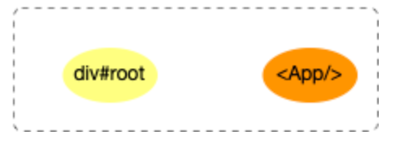

- > `react`应用程序的启动过程, 位于`react-dom`包, 衔接`reconciler 运作流程`中的[`输入`](https://7km.top/main/reconciler-workflow#%E8%BE%93%E5%85%A5)步骤.
- ## 启动模式
	- `legacy` 模式
	  logseq.order-list-type:: number
		- `ReactDOM.render(<App />, rootNode)`. 这是当前 React app 使用的方式. 这个模式可能不支持[这些新功能(concurrent 支持的所有功能)](https://zh-hans.reactjs.org/docs/concurrent-mode-patterns.html#the-three-steps).
		- ```
		  // LegacyRoot
		  ReactDOM.render(<App />, document.getElementById('root'), (dom) => {});
		  // 支持callback回调, 参数是一个dom对象
		  ```
	- [Blocking 模式](https://zh-hans.reactjs.org/docs/concurrent-mode-adoption.html#migration-step-blocking-mode)：
	  logseq.order-list-type:: number
		- `ReactDOM.createBlockingRoot(rootNode).render(<App />)`. 目前正在实验中, 它仅提供了 `concurrent` 模式的小部分功能, 作为迁移到 `concurrent` 模式的第一个步骤.
	- [Concurrent 模式](https://zh-hans.reactjs.org/docs/concurrent-mode-adoption.html#enabling-concurrent-mode)：
	  logseq.order-list-type:: number
		- `ReactDOM.createRoot(rootNode).render(<App />)`. 目前在实验中, 未来稳定之后，打算作为 React 的默认开发模式. 这个模式开启了所有的新功能.
		- ```
		  // ConcurrentRoot
		  // 1. 创建ReactDOMRoot对象
		  const reactDOMRoot = ReactDOM.createRoot(document.getElementById('root'));
		  // 2. 调用render
		  reactDOMRoot.render(<App />); // 不支持回调
		  ```
- ## 启动流程
	- 在调用入口函数之前,`reactElement(<App/>)`和 DOM 对象`div#root`之间没有关联, 用图片表示如下:
	- {:height 123, :width 278}
	- ### 创建全局对象 {\#create-global-obj}
		-