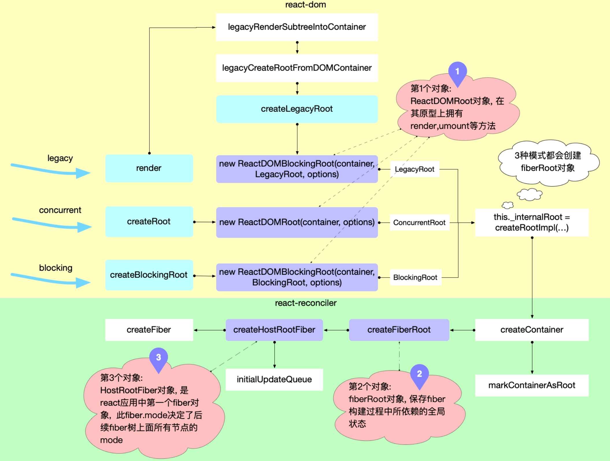

- > `react`应用程序的启动过程, 位于`react-dom`包, 衔接`reconciler 运作流程`中的[`输入`](https://7km.top/main/reconciler-workflow#%E8%BE%93%E5%85%A5)步骤.
- ## 启动模式
	- `legacy` 模式
	  logseq.order-list-type:: number
		- `ReactDOM.render(<App />, rootNode)`. 这是当前 React app 使用的方式. 这个模式可能不支持[这些新功能(concurrent 支持的所有功能)](https://zh-hans.reactjs.org/docs/concurrent-mode-patterns.html#the-three-steps).
		- ```javascript
		  // LegacyRoot
		  ReactDOM.render(<App />, document.getElementById('root'), (dom) => {});
		  // 支持callback回调, 参数是一个dom对象
		  ```
	- [Blocking 模式](https://zh-hans.reactjs.org/docs/concurrent-mode-adoption.html#migration-step-blocking-mode)：
	  logseq.order-list-type:: number
		- `ReactDOM.createBlockingRoot(rootNode).render(<App />)`. 目前正在实验中, 它仅提供了 `concurrent` 模式的小部分功能, 作为迁移到 `concurrent` 模式的第一个步骤.
	- [Concurrent 模式](https://zh-hans.reactjs.org/docs/concurrent-mode-adoption.html#enabling-concurrent-mode)：
	  logseq.order-list-type:: number
		- `ReactDOM.createRoot(rootNode).render(<App />)`. 目前在实验中, 未来稳定之后，打算作为 React 的默认开发模式. 这个模式开启了所有的新功能.
		- ```javascript
		  // ConcurrentRoot
		  // 1. 创建ReactDOMRoot对象
		  const reactDOMRoot = ReactDOM.createRoot(document.getElementById('root'));
		  // 2. 调用render
		  reactDOMRoot.render(<App />); // 不支持回调
		  ```
- ## 启动流程
	- 在调用入口函数之前,`reactElement(<App/>)`和 DOM 对象`div#root`之间没有关联, 用图片表示如下:
	- {:height 123, :width 278}
	- ### 创建全局对象 {\#create-global-obj}
	  background-color:: pink
		- 无论`Legacy, Concurrent或Blocking`模式, react 在初始化时, 都会创建 3 个全局对象:
			- [`ReactDOM(Blocking)Root`对象](https://github.com/facebook/react/blob/v17.0.2/packages/react-dom/src/client/ReactDOMRoot.js#L62-L72)
			  logseq.order-list-type:: number
				- - 属于`react-dom`包, 该对象[暴露有`render,unmount`方法](https://github.com/facebook/react/blob/v17.0.2/packages/react-dom/src/client/ReactDOMRoot.js#L62-L104), 通过调用该实例的`render`方法, 可以引导 react 应用的启动.
			- [`fiberRoot`对象](https://github.com/facebook/react/blob/v17.0.2/packages/react-reconciler/src/ReactFiberRoot.old.js#L83-L103)
			  logseq.order-list-type:: number
				- - 属于`react-reconciler`包, 作为`react-reconciler`在运行过程中的全局上下文, 保存 fiber 构建过程中所依赖的全局状态.
				- - 其大部分实例变量用来存储`fiber 构造循环`(详见[`两大工作循环`](https://7km.top/main/workloop))过程的各种状态.react 应用内部, 可以根据这些实例变量的值, 控制执行逻辑.
			- [`HostRootFiber`对象](https://github.com/facebook/react/blob/v17.0.2/packages/react-reconciler/src/ReactFiber.old.js#L431-L449)
			  logseq.order-list-type:: number
				- - 属于`react-reconciler`包, 这是 react 应用中的第一个 Fiber 对象, 是 [[#green]]==Fiber 树的根节点, 节点的类型是`HostRoot`.==
		- 这一过程是从`react-dom`包发起, 内部调用了`react-reconciler`包, 核心流程图如下(其中红色标注了 3 个对象的创建时机).
			- 
	- > 下面逐一解释这 3 个对象的创建过程.
	- ### 创建 ReactDOM(Blocking)Root 对象
	  background-color:: green
		- 由于 3 种模式启动的 api 有所不同, 所以从源码上追踪, 也对应了 3 种方式. 最终都[[#green]]== new 一个`ReactDOMRoot`或`ReactDOMBlockingRoot`的实例==, 需要创建过程中`RootTag`参数, 3 种模式各不相同. 该`RootTag`的类型决定了整个 react 应用是否支持[可中断渲染(后文有解释)](https://7km.top/main/bootstrap#%E5%8F%AF%E4%B8%AD%E6%96%AD%E6%B8%B2%E6%9F%93).
		- #### legacy 模式
			- `legacy`模式表面上是直接调用`ReactDOM.render`, 跟踪`ReactDOM.render`后续调用`legacyRenderSubtreeIntoContainer`([源码链接](https://github.com/facebook/react/blob/v17.0.2/packages/react-dom/src/client/ReactDOMLegacy.js#L175-L222))
			  collapsed:: true
				- ```javascript
				  function legacyRenderSubtreeIntoContainer(
				    parentComponent: ?React$Component<any, any>,
				    children: ReactNodeList,
				    container: Container,
				    forceHydrate: boolean,
				    callback: ?Function,
				  ) {
				    let root: RootType = (container._reactRootContainer: any);
				    let fiberRoot;
				    if (!root) {
				      // 初次调用, root还未初始化, 会进入此分支
				      //1. 创建ReactDOMRoot对象, 初始化react应用环境
				      root = container._reactRootContainer = legacyCreateRootFromDOMContainer(
				        container,
				        forceHydrate,
				      );
				      fiberRoot = root._internalRoot;
				      if (typeof callback === 'function') {
				        const originalCallback = callback;
				        callback = function () {
				          // instance最终指向 children(入参: 如<App/>)生成的dom节点
				          const instance = getPublicRootInstance(fiberRoot);
				          originalCallback.call(instance);
				        };
				      }
				      // 2. 更新容器
				      unbatchedUpdates(() => {
				        updateContainer(children, fiberRoot, parentComponent, callback);
				      });
				    } else {
				      // root已经初始化, 二次调用render会进入
				      // 1. 获取FiberRoot对象
				      fiberRoot = root._internalRoot;
				      if (typeof callback === 'function') {
				        const originalCallback = callback;
				        callback = function () {
				          const instance = getPublicRootInstance(fiberRoot);
				          originalCallback.call(instance);
				        };
				      }
				      // 2. 调用更新
				      updateContainer(children, fiberRoot, parentComponent, callback);
				    }
				    return getPublicRootInstance(fiberRoot);
				  }
				  ```
			- 继续跟踪`legacyCreateRootFromDOMContainer`. 最后调用`new ReactDOMBlockingRoot(container, LegacyRoot, options);`
			  collapsed:: true
				- ```javascript
				  function legacyCreateRootFromDOMContainer(
				    container: Container,
				    forceHydrate: boolean,
				  ): RootType {
				    const shouldHydrate =
				      forceHydrate || shouldHydrateDueToLegacyHeuristic(container);
				    return createLegacyRoot(
				      container,
				      shouldHydrate
				        ? {
				            hydrate: true,
				          }
				        : undefined,
				    );
				  }
				  
				  export function createLegacyRoot(
				    container: Container,
				    options?: RootOptions,
				  ): RootType {
				    return new ReactDOMBlockingRoot(container, LegacyRoot, options); // 注意这里的LegacyRoot是固定的, 并不是外界传入的
				  }
				  ```
			- 通过以上分析,`legacy`模式下调用`ReactDOM.render`有 2 个核心步骤：
				- 创建`ReactDOMBlockingRoot`实例(在 Concurrent 模式和 Blocking 模式中详细分析该类), 初始化 react 应用环境.
				  logseq.order-list-type:: number
				- 调用`updateContainer`进行更新.
				  logseq.order-list-type:: number
		- #### Concurrent 模式和 Blocking 模式
			- `Concurrent`模式和`Blocking`模式从调用方式上直接可以看出：
				- 分别调用[[#green]]==`ReactDOM.createRoot`==和[[#green]]==`ReactDOM.createBlockingRoot`==创建`ReactDOMRoot`和`ReactDOMBlockingRoot`实例；
				  logseq.order-list-type:: number
				- 调用`ReactDOMRoot`和`ReactDOMBlockingRoot`实例的`render`方法.
				  logseq.order-list-type:: number
				- ```javascript
				  export function createRoot(
				    container: Container,
				    options?: RootOptions,
				  ): RootType {
				    return new ReactDOMRoot(container, options);
				  }
				  
				  export function createBlockingRoot(
				    container: Container,
				    options?: RootOptions,
				  ): RootType {
				    return new ReactDOMBlockingRoot(container, BlockingRoot, options); // 注意第2个参数BlockingRoot是固定写死的
				  }
				  ```
			- 继续查看`ReactDOMRoot`和`ReactDOMBlockingRoot`对象:
				- ```javascript
				  function ReactDOMRoot(container: Container, options: void | RootOptions) {
				    // 创建一个fiberRoot对象, 并将其挂载到this._internalRoot之上
				    this._internalRoot = createRootImpl(container, ConcurrentRoot, options);
				  }
				  function ReactDOMBlockingRoot(
				    container: Container,
				    tag: RootTag,
				    options: void | RootOptions,
				  ) {
				    // 创建一个fiberRoot对象, 并将其挂载到this._internalRoot之上
				    this._internalRoot = createRootImpl(container, tag, options);
				  }
				  
				  ReactDOMRoot.prototype.render = ReactDOMBlockingRoot.prototype.render =
				    function (children: ReactNodeList): void {
				      const root = this._internalRoot;
				      // 执行更新
				      updateContainer(children, root, null, null);
				    };
				  
				  ReactDOMRoot.prototype.unmount = ReactDOMBlockingRoot.prototype.unmount =
				    function (): void {
				      const root = this._internalRoot;
				      const container = root.containerInfo;
				      // 执行更新
				      updateContainer(null, root, null, () => {
				        unmarkContainerAsRoot(container);
				      });
				    };
				  ```
			-
-