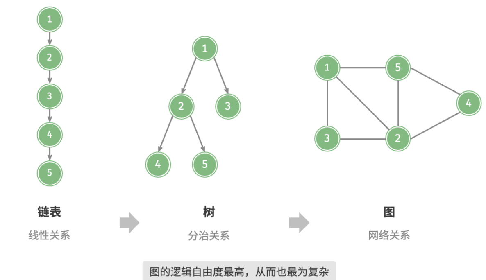
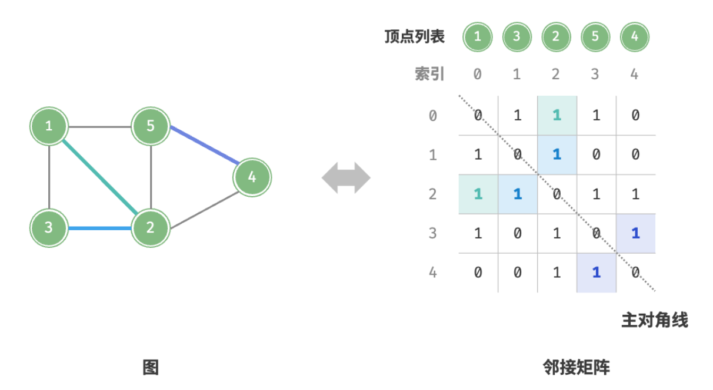
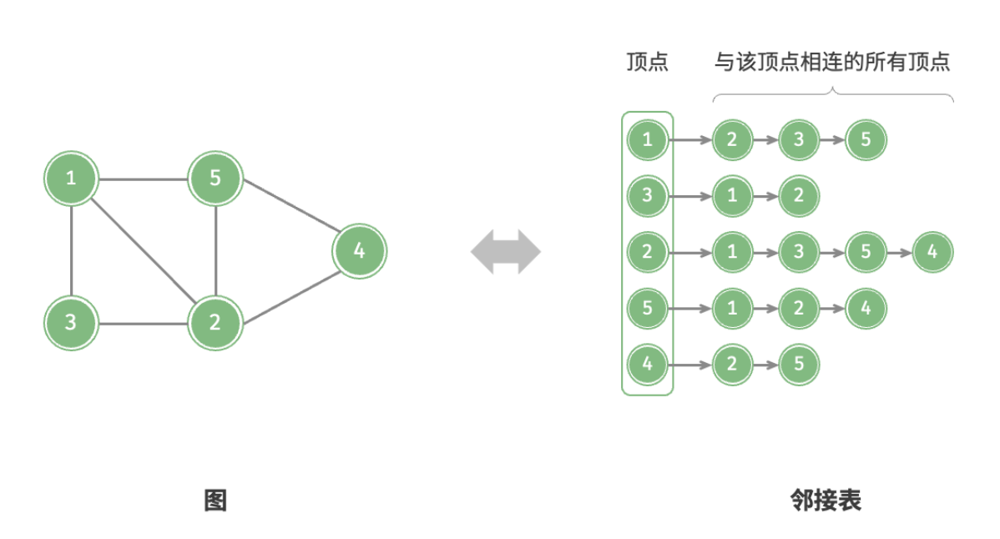

- > https://www.hello-algo.com/chapter_graph/graph/
-
- **「图 Graph」**是一种非线性数据结构，由**「顶点 Vertex」**和**「边 Edge」**组成。我们可以将图 $G$ 抽象地表示为一组顶点 $V$ 和一组边 $E$ 的集合。以下示例展示了一个包含 5 个顶点和 7 条边的图。
	- $$\begin{align*}
	  V={1,2,3,4,5}\\
	  E={(1,2),(1,3),(1,5),(2,3),(2,4),(2,5),(4,5)}\\
	  G={V,E}
	  \end{align*}
	  $$
	- 
- ## 图常见类型
	- 根据边是否具有方向，可分为**「无向图 Undirected Graph」**和**「有向图 Directed Graph」**。
	- 根据所有顶点是否连通，可分为**「连通图 Connected Graph」**和**「非连通图 Disconnected Graph」**。
		- 对于连通图，从某个顶点出发，可以到达其余任意顶点；
		  对于非连通图，从某个顶点出发，至少有一个顶点无法到达；
	- 我们还可以为边添加“权重”变量，从而得到**「有权图 Weighted Graph」**。
- ## 图常用术语
	- **「邻接 Adjacency」**：当两顶点之间存在边相连时，称这两顶点“邻接”。
	- **「路径 Path」**：从顶点 A 到顶点 B 经过的边构成的序列被称为从 A 到 B 的“路径”。
	- **「度 Degree」**表示一个顶点拥有的边数。对于有向图，**「入度 In-Degree」**表示有多少条边指向该顶点，**「出度 Out-Degree」**表示有多少条边从该顶点指出。
- ## 图的表示
	- 图的常用表示方法包括「邻接矩阵」和「邻接表」。以下使用无向图进行举例。
	- ### 邻接矩阵
	  background-color:: pink
		- 设图的顶点数量为 $n$ ，**「邻接矩阵 Adjacency Matrix」**使用一个 $n×n$ 大小的矩阵来表示图，每一行（列）代表一个顶点，矩阵元素代表边，用 1 或 0 表示两个顶点之间是否存在边。
		- 
		- 邻接矩阵具有以下特性：
			- 1. 顶点不能与自身相连，因此邻接矩阵主对角线元素没有意义。
			  2. 对于无向图，两个方向的边等价，此时邻接矩阵关于主对角线对称。
			  3. 将邻接矩阵的元素从 1 , 0 替换为权重，则可表示有权图。
		- 使用邻接矩阵表示图时，我们可以直接访问矩阵元素以获取边，因此增删查操作的效率很高，时间复杂度均为 $O(1)$ 。然而，矩阵的空间复杂度为 $O(n^2)$ ，内存占用较多。
	- ### 邻接表
	  background-color:: pink
		- **「邻接表 Adjacency List」**使用 $n$ 个链表来表示图，链表节点表示顶点。第 $i$ 条链表对应顶点 $i$ ，其中存储了该顶点的所有邻接顶点（即与该顶点相连的顶点）。
		- 
		- **邻接表结构与哈希表中的「链地址法」非常相似，因此我们也可以采用类似方法来优化效率**。
		-