- > https://www.hello-algo.com/chapter_graph/graph_operations/
-
- 图的基础操作可分为对「边」的操作和对「顶点」的操作。在「邻接矩阵」和「邻接表」两种表示方法下，实现方式有所不同。
  background-color:: yellow
- ## 基于邻接矩阵的实现
	- 给定一个顶点数量为 $n$ 的**无向图**，则有：
		- **添加或删除边**：直接在邻接矩阵中修改指定的边即可，使用 $O(1)$ 时间。而由于是无向图，因此[[#blue]]==需要同时更新两个方向的边==。
		- **添加顶点**：在邻接矩阵的尾部添加一行一列，并全部填 $0$ 即可，使用 $O(n)$ 时间。
		- **删除顶点**：在邻接矩阵中删除一行一列。当删除首行首列时达到最差情况，需要将 $(n−1)^2$ 个元素“向左上移动”，从而使用 $O(n^2)$ 时间。
		- **初始化**：传入 $n$ 个顶点，初始化长度为 $n$ 的顶点列表 `vertices` ，使用 $O(n)$ 时间；初始化 $n×n$ 大小的邻接矩阵 `adjMat` ，使用 $O(n^2)$ 时间。
	- 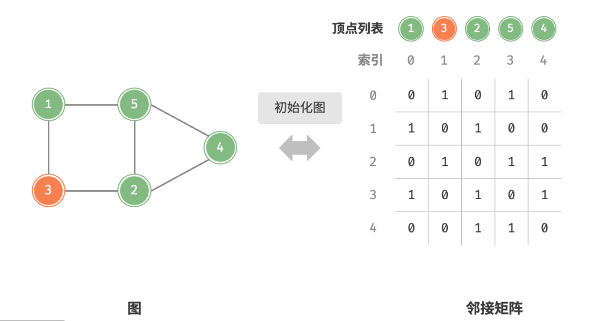
	- 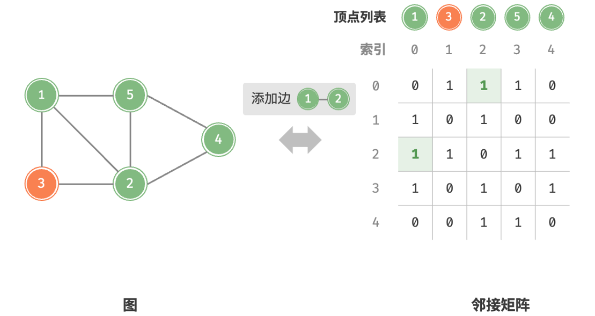
	- 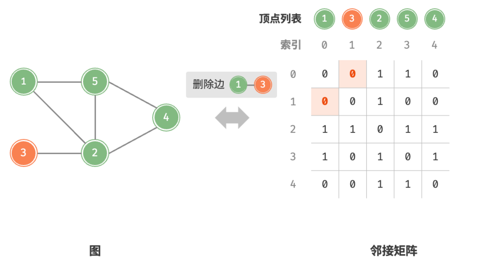
	- 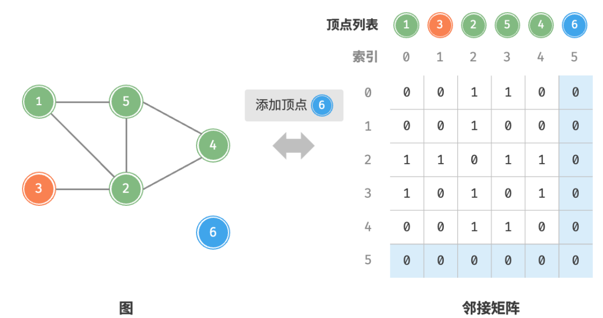
	- 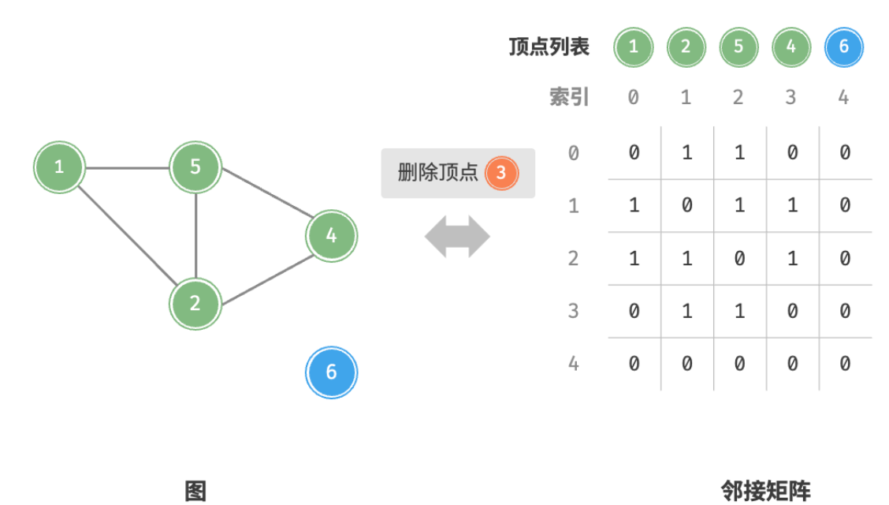
	- 以下是基于邻接矩阵表示图的实现代码。
	- ```
	  /* 基于邻接矩阵实现的无向图类 */
	  class GraphAdjMat {
	      vertices; // 顶点列表，元素代表“顶点值”，索引代表“顶点索引”
	      adjMat; // 邻接矩阵，行列索引对应“顶点索引”
	  
	      /* 构造函数 */
	      constructor(vertices, edges) {
	          this.vertices = [];
	          this.adjMat = [];
	          // 添加顶点
	          for (const val of vertices) {
	              this.addVertex(val);
	          }
	          // 添加边
	          // 请注意，edges 元素代表顶点索引，即对应 vertices 元素索引
	          for (const e of edges) {
	              this.addEdge(e[0], e[1]);
	          }
	      }
	  
	      /* 获取顶点数量 */
	      size() {
	          return this.vertices.length;
	      }
	  
	      /* 添加顶点 */
	      addVertex(val) {
	          const n = this.size();
	          // 向顶点列表中添加新顶点的值
	          this.vertices.push(val);
	          // 在邻接矩阵中添加一行
	          const newRow = [];
	          for (let j = 0; j < n; j++) {
	              newRow.push(0);
	          }
	          this.adjMat.push(newRow);
	          // 在邻接矩阵中添加一列
	          for (const row of this.adjMat) {
	              row.push(0);
	          }
	      }
	  
	      /* 删除顶点 */
	      removeVertex(index) {
	          if (index >= this.size()) {
	              throw new RangeError('Index Out Of Bounds Exception');
	          }
	          // 在顶点列表中移除索引 index 的顶点
	          this.vertices.splice(index, 1);
	  
	          // 在邻接矩阵中删除索引 index 的行
	          this.adjMat.splice(index, 1);
	          // 在邻接矩阵中删除索引 index 的列
	          for (const row of this.adjMat) {
	              row.splice(index, 1);
	          }
	      }
	  
	      /* 添加边 */
	      // 参数 i, j 对应 vertices 元素索引
	      addEdge(i, j) {
	          // 索引越界与相等处理
	          if (i < 0 || j < 0 || i >= this.size() || j >= this.size() || i === j) {
	              throw new RangeError('Index Out Of Bounds Exception');
	          }
	          // 在无向图中，邻接矩阵沿主对角线对称，即满足 (i, j) == (j, i)
	          this.adjMat[i][j] = 1;
	          this.adjMat[j][i] = 1;
	      }
	  
	      /* 删除边 */
	      // 参数 i, j 对应 vertices 元素索引
	      removeEdge(i, j) {
	          // 索引越界与相等处理
	          if (i < 0 || j < 0 || i >= this.size() || j >= this.size() || i === j) {
	              throw new RangeError('Index Out Of Bounds Exception');
	          }
	          this.adjMat[i][j] = 0;
	          this.adjMat[j][i] = 0;
	      }
	  
	      /* 打印邻接矩阵 */
	      print() {
	          console.log('顶点列表 = ', this.vertices);
	          console.log('邻接矩阵 =', this.adjMat);
	      }
	  }
	  ```
- ## 基于邻接表的实现
	- 设无向图的顶点总数为 $n$ 、边总数为 $m$ ，则有：
		- **添加边**：在顶点对应链表的末尾添加边即可，使用 $O(1)$ 时间。因为是无向图，所以需要同时添加两个方向的边。
		- **删除边**：在顶点对应链表中查找并删除指定边，使用 $O(m)$ 时间。在无向图中，需要同时删除两个方向的边。
		- **添加顶点**：在邻接表中添加一个链表，并将新增顶点作为链表头节点，使用 $O(1)$ 时间。
		- **删除顶点**：需遍历整个邻接表，删除包含指定顶点的所有边，使用 $O(n+m)$ 时间。
		- **初始化**：在邻接表中创建 $n$ 个顶点和 $2m$ 条边，使用 $O(n+m)$ 时间。
	- 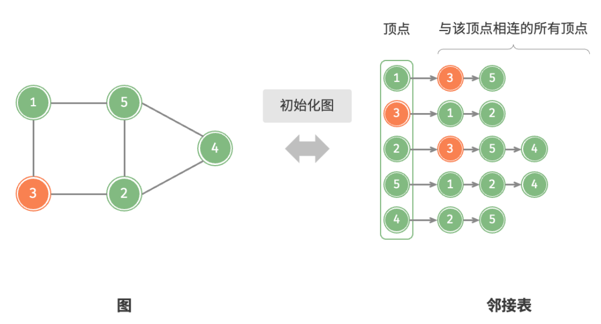
	- 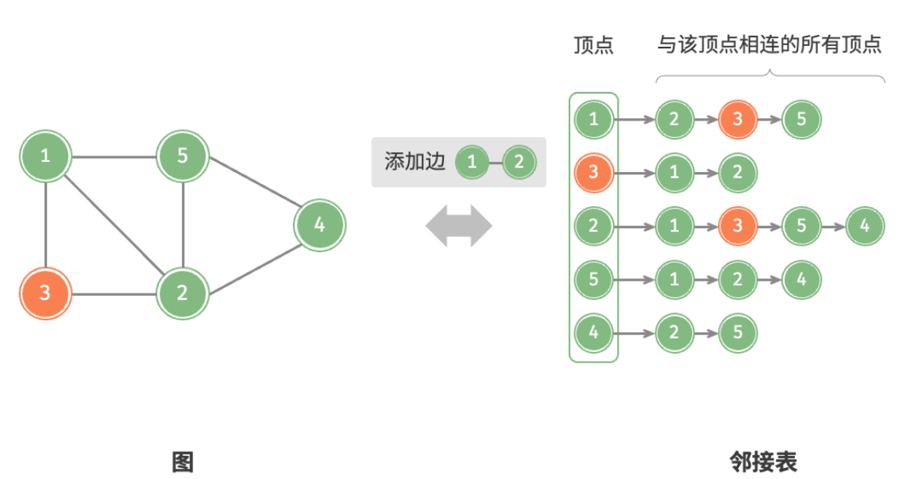
	- 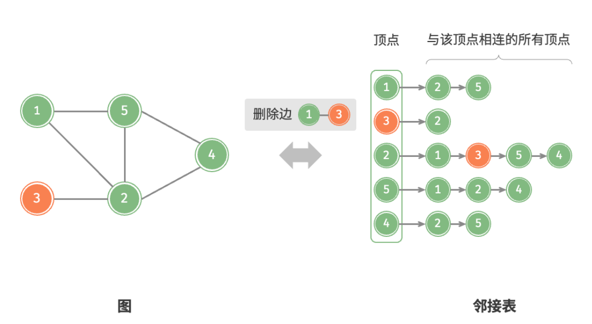
	- 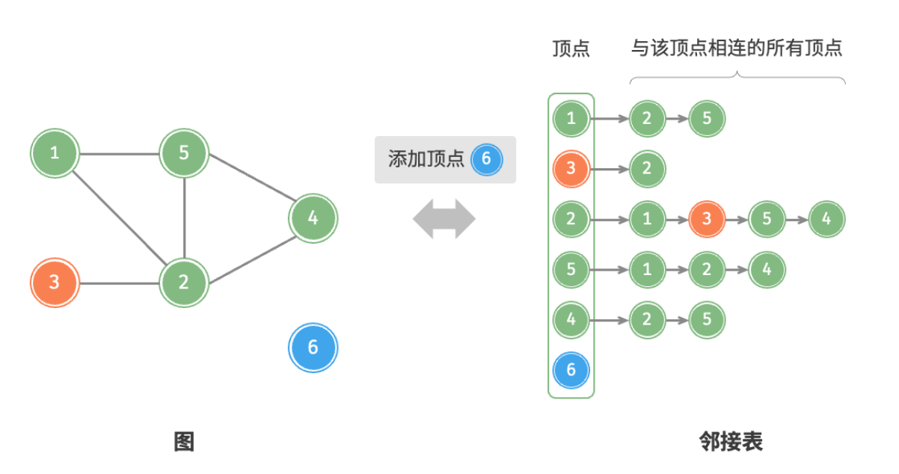
	- 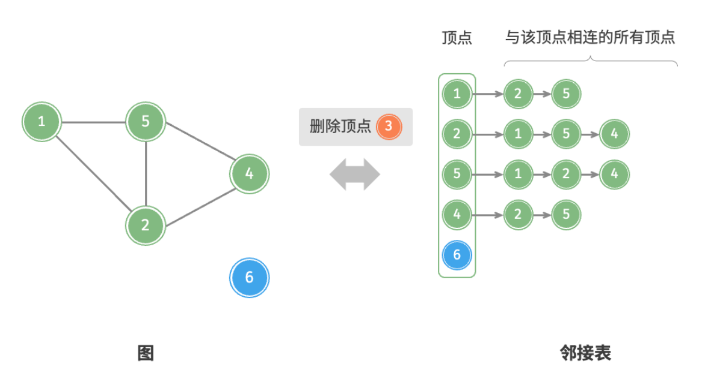
	- 以下是基于邻接表实现图的代码示例。细心的同学可能注意到，**我们在邻接表中使用 `Vertex` 节点类来表示顶点**，这样做的原因有：
		- 如果我们选择通过顶点值来区分不同顶点，那么值重复的顶点将无法被区分。
		- 如果类似邻接矩阵那样，使用顶点列表索引来区分不同顶点。那么，假设我们想要删除索引为 $i$ 的顶点，则需要遍历整个邻接表，将其中 $>i$ 的索引全部减 1 ，这样操作效率较低。
		- 因此我们考虑引入顶点类 `Vertex` ，使得每个顶点都是唯一的对象，此时删除顶点时就无需改动其余顶点了。
	- ```
	  /* 基于邻接表实现的无向图类 */
	  class GraphAdjList {
	      // 邻接表，key: 顶点，value：该顶点的所有邻接顶点
	      adjList;
	  
	      /* 构造方法 */
	      constructor(edges) {
	          this.adjList = new Map();
	          // 添加所有顶点和边
	          for (const edge of edges) {
	              this.addVertex(edge[0]);
	              this.addVertex(edge[1]);
	              this.addEdge(edge[0], edge[1]);
	          }
	      }
	  
	      /* 获取顶点数量 */
	      size() {
	          return this.adjList.size;
	      }
	  
	      /* 添加边 */
	      addEdge(vet1, vet2) {
	          if (
	              !this.adjList.has(vet1) ||
	              !this.adjList.has(vet2) ||
	              vet1 === vet2
	          ) {
	              throw new Error('Illegal Argument Exception');
	          }
	          // 添加边 vet1 - vet2
	          this.adjList.get(vet1).push(vet2);
	          this.adjList.get(vet2).push(vet1);
	      }
	  
	      /* 删除边 */
	      removeEdge(vet1, vet2) {
	          if (
	              !this.adjList.has(vet1) ||
	              !this.adjList.has(vet2) ||
	              vet1 === vet2
	          ) {
	              throw new Error('Illegal Argument Exception');
	          }
	          // 删除边 vet1 - vet2
	          this.adjList.get(vet1).splice(this.adjList.get(vet1).indexOf(vet2), 1);
	          this.adjList.get(vet2).splice(this.adjList.get(vet2).indexOf(vet1), 1);
	      }
	  
	      /* 添加顶点 */
	      addVertex(vet) {
	          if (this.adjList.has(vet)) return;
	          // 在邻接表中添加一个新链表
	          this.adjList.set(vet, []);
	      }
	  
	      /* 删除顶点 */
	      removeVertex(vet) {
	          if (!this.adjList.has(vet)) {
	              throw new Error('Illegal Argument Exception');
	          }
	          // 在邻接表中删除顶点 vet 对应的链表
	          this.adjList.delete(vet);
	          // 遍历其他顶点的链表，删除所有包含 vet 的边
	          for (let set of this.adjList.values()) {
	              const index = set.indexOf(vet);
	              if (index > -1) {
	                  set.splice(index, 1);
	              }
	          }
	      }
	  
	      /* 打印邻接表 */
	      print() {
	          console.log('邻接表 =');
	          for (const [key, value] of this.adjList) {
	              const tmp = [];
	              for (const vertex of value) {
	                  tmp.push(vertex.val);
	              }
	              console.log(key.val + ': ' + tmp.join());
	          }
	      }
	  }
	  ```
- ## 效率对比
	- 设图中共有 $n$ 个顶点和 $m$ 条边，下表为邻接矩阵和邻接表的时间和空间效率对比。
	- 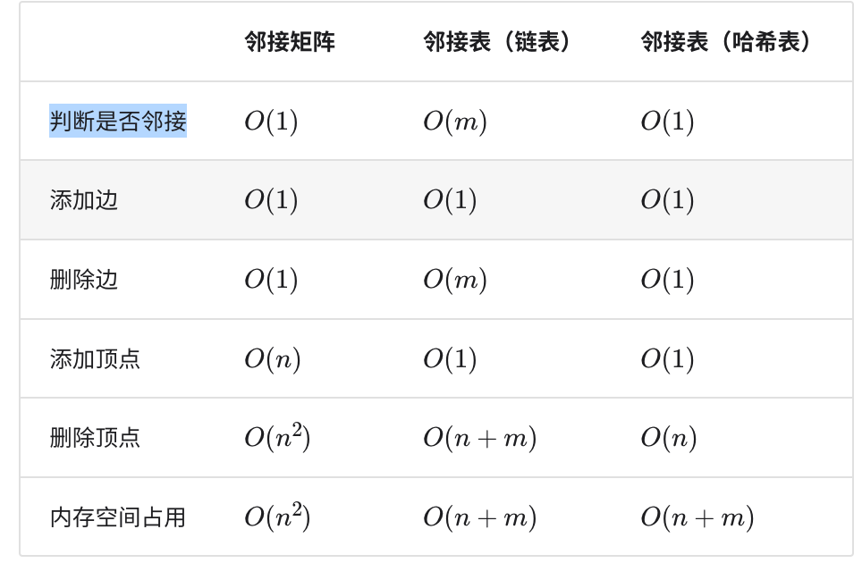{:height 395, :width 583}
	-