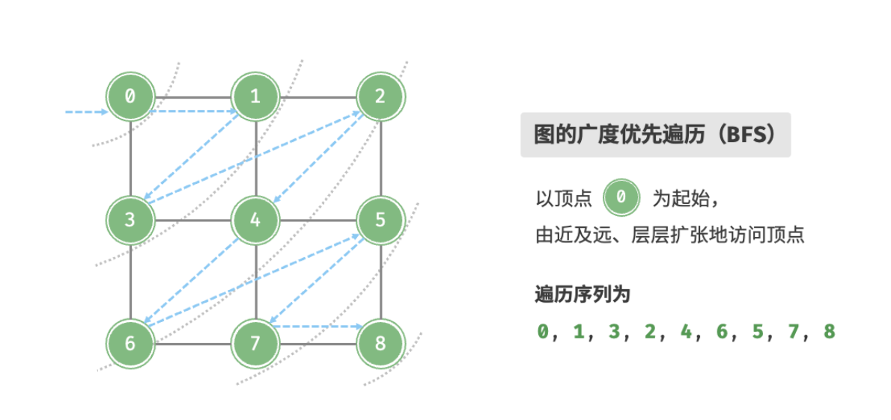
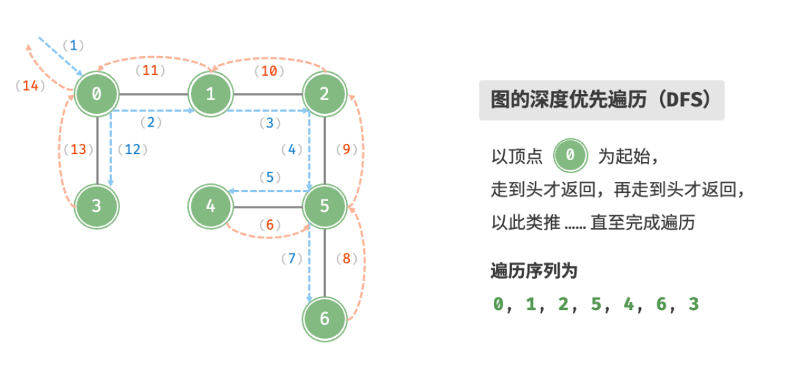

- > https://www.hello-algo.com/chapter_graph/graph_traversal/
-
- >**图与树的关系**
  > 
  >树代表的是“一对多”的关系，而图则具有更高的自由度，可以表示任意的“多对多”关系。因此，我们可以把树看作是图的一种特例。显然，**树的遍历操作也是图的遍历操作的一种特例**，建议你在学习本章节时融会贯通两者的概念与实现方法。
- ## 广度优先遍历 BFS
	- **广度优先遍历是一种由近及远的遍历方式，从距离最近的顶点开始访问，并一层层向外扩张**。具体来说，从某个顶点出发，先遍历该顶点的所有邻接顶点，然后遍历下一个顶点的所有邻接顶点，以此类推，直至所有顶点访问完毕。
	- 
	- ### 算法实现
	  background-color:: pink
		- BFS 通常借助「队列」来实现。队列具有“先入先出”的性质，这与 BFS 的“由近及远”的思想异曲同工。
			- 1. 将遍历起始顶点 `startVet` 加入队列，并开启循环；
			  2. 在循环的每轮迭代中，弹出队首顶点并记录访问，然后将该顶点的所有邻接顶点加入到队列尾部；
			  3. 循环步骤 `2.` ，直到所有顶点被访问完成后结束；
		- [[#blue]]==为了防止重复遍历顶点，我们需要借助一个哈希表 `visited` 来记录哪些节点已被访问。==
		- ```
		  /* 广度优先遍历 BFS */
		  // 使用邻接表来表示图，以便获取指定顶点的所有邻接顶点
		  function graphBFS(graph, startVet) {
		      // 顶点遍历序列
		      const res = [];
		      // 哈希表，用于记录已被访问过的顶点
		      const visited = new Set();
		      visited.add(startVet);
		      // 队列用于实现 BFS
		      const que = [startVet];
		      // 以顶点 vet 为起点，循环直至访问完所有顶点
		      while (que.length) {
		          const vet = que.shift(); // 队首顶点出队
		          res.push(vet); // 记录访问顶点
		          // 遍历该顶点的所有邻接顶点
		          for (const adjVet of graph.adjList.get(vet) ?? []) {
		              if (visited.has(adjVet)) {
		                  continue; // 跳过已被访问过的顶点
		              }
		              que.push(adjVet); // 只入队未访问的顶点
		              visited.add(adjVet); // 标记该顶点已被访问
		          }
		      }
		      // 返回顶点遍历序列
		      return res;
		  }
		  ```
	- > **广度优先遍历的序列是否唯一？**
	  >
	  >不唯一。广度优先遍历只要求按“由近及远”的顺序遍历，**而多个相同距离的顶点的遍历顺序是允许被任意打乱的**。
	- ### 复杂度分析
	  background-color:: pink
		- **时间复杂度：** 所有顶点都会入队并出队一次，使用 $O(|V|)$ 时间；在遍历邻接顶点的过程中，由于是无向图，因此所有边都会被访问 2 次，使用 $O(2|E|)$ 时间；总体使用 $O(|V|+|E|)$ 时间。
		- **空间复杂度：** 列表 `res` ，哈希表 `visite，队列 `que` 中的顶点数量最多为 $|V|$ ，使用 $O(|V|)$ 空间。
- ## 深度优先遍历
	- **深度优先遍历是一种优先走到底、无路可走再回头的遍历方式**。具体地，从某个顶点出发，访问当前顶点的某个邻接顶点，直到走到尽头时返回，再继续走到尽头并返回，以此类推，直至所有顶点遍历完成。
	- 
	- ### 算法实现
	  background-color:: pink
		- 基于递归来实现。与 BFS 类似，在 DFS 中我们也需要借助一个哈希表 `visited` 来记录已被访问的顶点，以避免重复访问顶点。
		- ```
		  /* 深度优先遍历 DFS */
		  // 使用邻接表来表示图，以便获取指定顶点的所有邻接顶点
		  function dfs(graph, visited, res, vet) {
		      res.push(vet); // 记录访问顶点
		      visited.add(vet); // 标记该顶点已被访问
		      // 遍历该顶点的所有邻接顶点
		      for (const adjVet of graph.adjList.get(vet)) {
		          if (visited.has(adjVet)) {
		              continue; // 跳过已被访问过的顶点
		          }
		          // 递归访问邻接顶点
		          dfs(graph, visited, res, adjVet);
		      }
		  }
		  
		  /* 深度优先遍历 DFS */
		  // 使用邻接表来表示图，以便获取指定顶点的所有邻接顶点
		  function graphDFS(graph, startVet) {
		      // 顶点遍历序列
		      const res = [];
		      // 哈希表，用于记录已被访问过的顶点
		      const visited = new Set();
		      dfs(graph, visited, res, startVet);
		      return res;
		  }
		  ```
	- > **深度优先遍历的序列是否唯一？**
	  >
	  >与广度优先遍历类似，深度优先遍历序列的顺序也不是唯一的。给定某顶点，先往哪个方向探索都可以，即邻接顶点的顺序可以任意打乱，都是深度优先遍历。
	- ### 复杂度分析
	  background-color:: pink
		- **时间复杂度：** 所有顶点都会入队并出队一次，使用 $O(|V|)$ 时间；在遍历邻接顶点的过程中，由于是无向图，因此所有边都会被访问 2 次，使用 $O(2|E|)$ 时间；总体使用 $O(|V|+|E|)$ 时间。
		- **空间复杂度：** 列表 `res` ，哈希表 `visited` 顶点数量最多为 $|V|$ ，递归深度最大为 $|V|$ ，因此使用 $O(|V|)$ 空间。