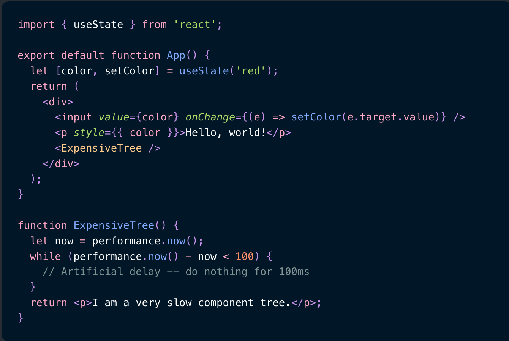

- > https://overreacted.io/zh-hans/before-you-memo/
-
- ## 一个（人工）减缓的组件
	- 这里是一个具有严重渲染性能问题的组件
	- 
	- *([在这里试试](https://codesandbox.io/s/frosty-glade-m33km?file=/src/App.js:23-513))*
	- 问题就是当`App`中的`color`变化时，我们会重新渲染一次被我们手动大幅延缓渲染的`<ExpensiveTree />`组件。
- ## 解法 1： 向下移动State
	- 如果你仔细看一下渲染代码，你会注意到返回的树中只有一部分真正关心当前的`color`
	- 所以让我们把这一部分提取到`Form`组件中然后将state移动到该组件里
	- 
- ## 解法 2：内容提升
	- 当一部分state在高开销树的上层代码中使用时上述解法就无法奏效了。举个例子，如果我们将`color`放到父元素`div`中。
	- 
	- 答案显而易见：
	- 
	- 我们将`App`组件分割为两个子组件。依赖`color`的代码就和`color` state变量一起放入`ColorPicker`组件里。 不关心`color`的部分就依然放在`App`组件中，然后以JSX内容的形式传递给`ColorPicker`，也被称为`children`属性。 当`color`变化时，`ColorPicker`会重新渲染。但是它仍然保存着上一次从`App`中拿到的相同的`children`属性，所以React并不会访问那棵子树。 因此，`ExpensiveTree`不会重新渲染。
- ## 寓意是什么？
	- 在你用`memo`或者`useMemo`做优化时，如果你可以从不变的部分里分割出变化的部分，那么这看起来可能是有意义的。 关于这些方式有趣的部分是**他们本身并不真的和性能有关**. 使用children属性来拆分组件通常会使应用程序的数据流更容易追踪，并且可以减少贯穿树的props数量。
	- 在这种情况下提高性能是锦上添花，而不是最终目标。 奇怪的是，这种模式在将来还会带来更多的性能好处。 举个例子，当[服务器组件](https://reactjs.org/blog/2020/12/21/data-fetching-with-react-server-components.html) 稳定且可被采用时，我们的`ColorPicker`组件就可以从服务器上获取到它的`children`。 整个`<ExpensiveTree />`组件或其部分都可以在服务器上运行，即使是顶级的React状态更新也会在客户机上“跳过”这些部分。 这是`memo`做不到的事情!
	- 但是，这两种方法是互补的。不要忽视state下移(和内容提升!) 然后，如果这还不够，那就使用Profiler然后用memo来写吧。