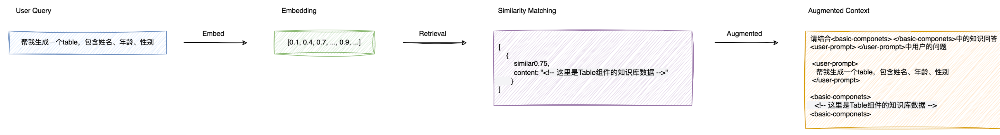

## Embedding 实现
	- ### 环境准备
		- `数据库`：Postgres - [Supabase](https://supabase.com/) - aBJijqIQHbmTLhKp
		- `模型`：claude-3-5-sonnet-latest
		- `AI_BASE_URL`：https://api.302.ai/v1
		- `EMBEDDING`：text-embedding-ada-002
	- ### **1、Postgres数据表初始化**
	  background-color:: green
		- > [[#blue]]==`drizzle`==:  TypeScript ORM（对象关系映射）工具，定义数据库 Schema，并通过类型安全的方式与数据库进行交互
		- [[#green]]==`schema`==：open_ai_embeddings
			- `id`：使用 nanoid 生成的主键，varchar(191) 类型
			- `content`：文本内容，text 类型，不允许为空
			- `embedding`：向量类型字段，维度为 1536，不允许为空
		- [[#green]]==`向量索引`==：HNSW 算法的向量索引，用于**余弦相似度**搜索
		- [[#green]]==`生成迁移表`==：`db: generate  db:migrate` 将生成的数据库 table 迁移到 `supabase`
		- [[#green]]==`数据库 action`==：接受数据源(embeddings)，保存到 `db`)
		- [[#blue]]==`脚本`==：将组件库文档转化为 embeddings，并保存到数据库
	- ### **2、RAG API**
	  background-color:: green
		- 
		- [[#green]]==`向量相似度`==：基于向量嵌入的语义相似度搜索函数
			- 接收一个查询向量（embedding）作为输入
			- 计算输入向量与数据库中存储的向量之间的余弦相似度
			- 筛选出相似度高于指定阈值的结果
			- 返回相似度最高的 N 个结果，包含原始内容和相似度分数
			- 使用 `drizzle-orm` 实现数据库查询
		- [[#green]]==`Embedding Query`==：针对用户提问的 embedding 函数及召回
	- ### 3、RAG API 路由
	  background-color:: green
		-
-