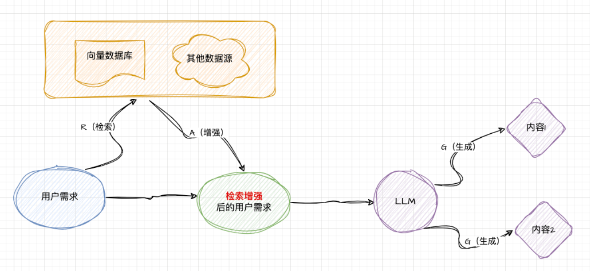

## 方案一：预训练
	- > `预训练`是整个大模型训练过程中最复杂的阶段，如 GPT4 的预训练由大量的算力（GPU）在`海量无标记`的数据上训练数月，最终产出`基座模型`。
	- 尝试让`公司私有组件库`数据包含在预训练的`海量无标记数据`中：
		- 从 0 ～ 1 ，预训练一个属于你自己的基座模型（自定义训练数据集）
		- 考虑将公司的私有组件库`开源`，暴露到外部`海量无标记数据`中
- ## 方案二：微调 fine-tuning
	- > 基于`基座模型`，使用`少量已标记的数据`(相对预训练来说)进行再训练，让模型更符合你的特定场景。
- ## 方案三：RAG - Retrieval(检索) Agumented(增强) Generation(生成 )
	- > 本质：一种思想和方法论，目的是为了解决大模型在特定场景（如公司私有组件库）的"幻觉"问题。
	- 
- ## 方案对比
  background-color:: red
	-