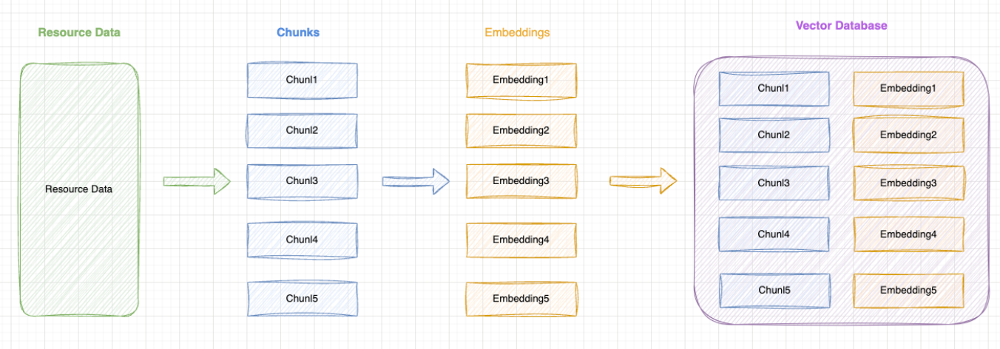

## 方案一：预训练
	- > `预训练`是整个大模型训练过程中最复杂的阶段，如 GPT4 的预训练由大量的算力（GPU）在`海量无标记`的数据上训练数月，最终产出`基座模型`。
	- 尝试让`公司私有组件库`数据包含在预训练的`海量无标记数据`中：
		- 从 0 ～ 1 ，预训练一个属于你自己的基座模型（自定义训练数据集）
		- 考虑将公司的私有组件库`开源`，暴露到外部`海量无标记数据`中
- ## 方案二：微调 fine-tuning
	- > 基于`基座模型`，使用`少量已标记的数据`(相对预训练来说)进行再训练，让模型更符合你的特定场景。
- ## 方案三：RAG - Retrieval(检索) Agumented(增强) Generation(生成 )
	- > 本质：一种思想和方法论，目的是为了解决大模型在特定场景（如公司私有组件库）的"幻觉"问题。
- ## 方案对比
  background-color:: red
	- ### 优缺点
		- |方案|优点|缺点|
		  |--|--|--|
		  |预训练|效果相对最好，模型能完全理解私有组件|成本极高（算力、时间、人力）[:br]技术门槛高[:br]需要海量训练数据[:br]维护成本高|
		  |fine-tuning|成本相对较低[:br]只需少量标注数据（相对预训练来说）[:br]可以快速适应特定场景|效果不如预训练[:br]可能出现灾难性遗忘[:br]仍需要一定的算力和专业知识|
		  |RAG|实现简单，成本最低[:br]无需训练，可即时更新知识[:br]可控性强，易于维护[:br]可以保证知识的准确性|受限于上下文窗口大小[:br]检索质量依赖于向量化效果[:br]响应速度可能较慢|
	- ### 适用场景
		- |方案|适用场景|
		  |--|--|
		  |预训练|大型科技公司有充足资源[:br]需要构建完全定制化的模型[:br]有海量专有数据需要学习[:br]对模型理解深度要求极高|
		  |fine-tuning|有特定垂直领域的应用需求[:br]有一定的标注数据集[:br]需要模型具备特定的能力[:br]预算和资源相对充足|
		  |RAG|快速落地 AI 应用[:br]需要及时更新知识库[:br]对知识准确性要求高[:br]资源有限但需要快速实现|
- ##
- ## RAG 详解
  background-color:: pink
	- 
	- ### 前置名词
		- `Chunk`: 将文本（或其它数据）切分为每一段数据，是一种数据切片的方法。
		- `Embedding`: 将每个 chunk 转换为向量，是一种将高维空间的数据（文字、图片等）转换为低维空间的表示方法，后续可以通过匹配向量之间的`余弦相似度`来实现语义检索。
		- `Vector Database`: 向量数据库，用于存储 Embedding 和原始 Chunk 的数据库（注意：某些 Vector Database 只支持存储 Embedding，需要自行来建立 Embedding 和原始 Chunk 之间的映射关系）。
	- ### 图示构建 RAG 向量知识库的过程
		- 
		- **原始数据（Resource Data）**:
		  logseq.order-list-type:: number
			- 从各种来源收集原始数据，比如公司私有组件库的文档文本。
		- **分块（Chunking）**:
		  logseq.order-list-type:: number
			- 将资源数据细分为更小的块，称为`Chunk`。
		- **向量化（Embedding）**:
		  logseq.order-list-type:: number
			- 将每个`Chunk`转换为向量表示，便于后续根据向量进行语义相似度匹配。
		- **存储至向量数据库**:
		  logseq.order-list-type:: number
			- 将所有的`Chunk`和`Embedding`一一对应存储在向量数据库中，用于后续向量匹配检索出原始的 Chunk 数据。
		-