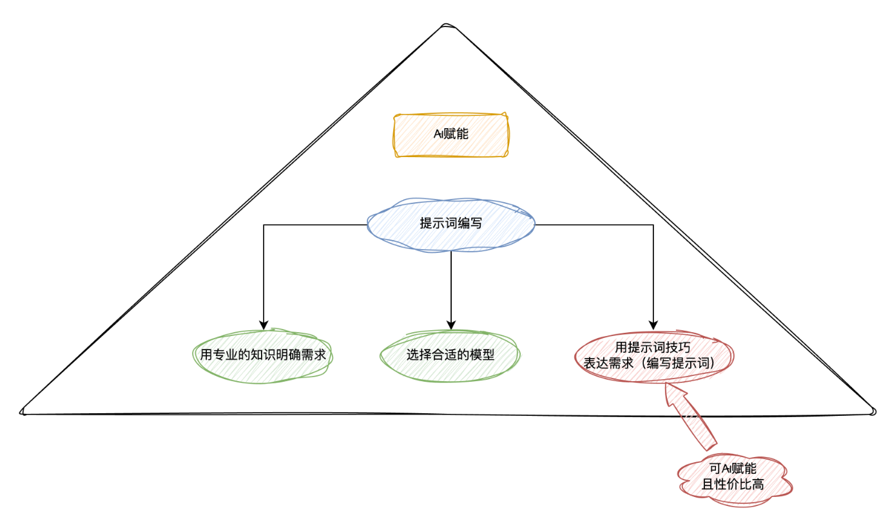

## 编写提示词工作流
	- 
- ##
- ## 使用 Cursor 生成提示词
	- 新建一个提示词的 md 文件，用来存放生成的提示词
	- 打开 Cursor 的 `Composer Agent`，输入如下内容：
		- ```
		  请帮我生成一个提示词，能够根据用户输入的设计稿或者自然语言需求来生成业务组件代码:
		  
		  - 技术栈是：`React + TailwindCSS + antd`
		  
		  - 业务组件遵循的文件结构和代码规范如@StorybookExample 所示
		  
		  - 业务组件遵循前后端状态分离原则：所有需要请求服务端数据的操作，都通过 props 暴露个外部的页面来进行对接联调。
		  ```
- ## 使用 Cursor 生成一个 `生成提示词的提示词`
	- 新建一个提示词的 md 文件，用来存放生成的提示词
	- 打开 Cursor 的 `Composer Agent`，输入如下内容：
		- ```markdown
		  请帮我生成一个提示词，能够根据用户输入的需求来生成符合下面 LangGPT md 格式的提示词:
		  
		  https://github.com/langgptai/LangGPT
		  ```
	- 在 [Dify](https://dify.ai/) 中根据提示词模版创建生成提示词的应用，类似 [Kimi 提示词专家](https://kimi.moonshot.cn/kimiplus/conpg00t7lagbbsfqkq0)