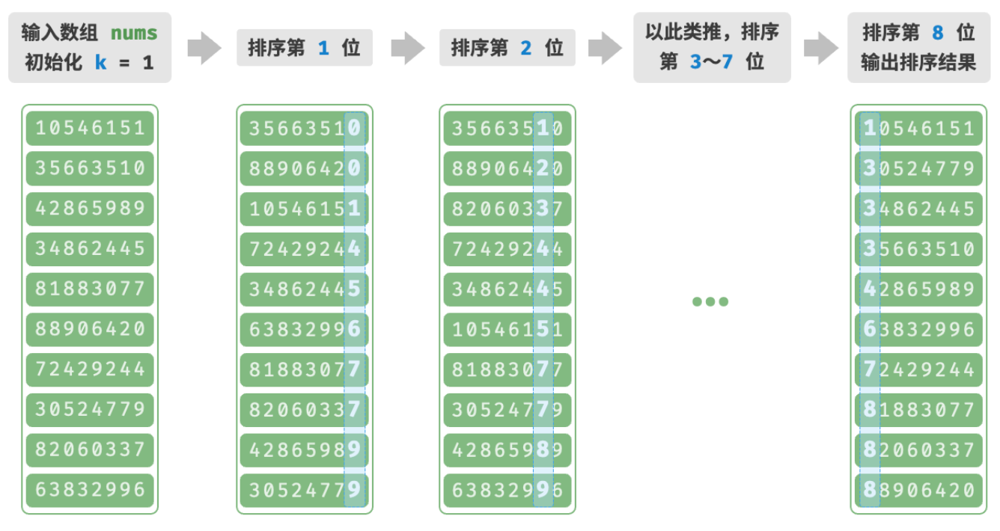

- > https://www.hello-algo.com/chapter_sorting/radix_sort/
-
- **「基数排序 Radix Sort」**的核心思想与计数排序一致，也通过统计个数来实现排序。在此基础上，基数排序利用数字各位之间的递进关系，依次对每一位进行排序，从而得到最终的排序结果。
- ##   算法流程
	- 以学号数据为例，假设数字的最低位是第 1 位，最高位是第 8 位，基数排序的步骤如下：
		- 1. 初始化位数 $k=1$ ；
		- 2. 对学号的第 $k$ 位执行「计数排序」。完成后，数据会根据第 $k$ 位从小到大排序；
		- 3. 将 $k$ 增加 1 ，然后返回步骤 `2.` 继续迭代，直到所有位都排序完成后结束；
	- 
	- 对于一个 $d$ 进制的数字 $x$ ，要获取其第 $k$ 位 $x_k$ ，可以使用以下计算公式：
	- $$x_k=\lfloor\frac{x}{d^{k-1}}\rfloor\mod{d}$$
	-